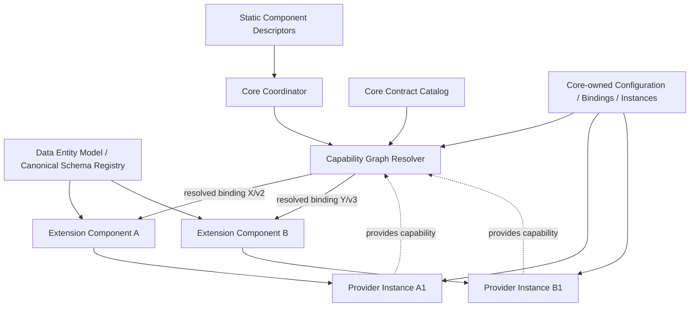

# Application Component Architecture Governance

**Status:** Draft public governance standard  
**Scope:** Applications composed from a coordinating Core and dynamically installable or replaceable components  
**Reference framework:** Algites Application Components (AAC), reserved public namespace `_AAC.*`  
**Audience:** Algites product teams, component authors, plugin authors, integration developers, and third-party implementers  
**Applicability:** Product- and implementation-language-independent  
**Companion documents:** `Application-Component-Architecture-Technical-Notes.md`, `Application-Component-Capability-Contract-Specification.md`, `Application-Component-Lifecycle-and-Provisioning-Specification.md`, `Application-Component-Upgrade-Transaction-Specification.md`

---

# I. Purpose and Scope

## I.1 Purpose

This document defines a reusable architecture for capability-based application component systems. The reference framework is **Algites Application Components (AAC)**, but the architectural model is product- and implementation-language-independent.

The term **component** is deliberately broader than **plugin**:

- **Core** is the coordinating platform component.
- A **plugin** is an installable extension component.
- A component may provide one or more capability implementations.
- A component may consume capabilities provided by Core or by other components.

The architecture is intentionally independent of any individual Algites product and implementation language.

The goals are to provide:

- long-lived compatibility between components;
- compatibility based on explicit functional contracts rather than primarily on release numbers;
- the possibility for an older extension component to remain usable with a newer Core when their contracts still overlap;
- the possibility for a newer extension component to run on an older Core when their contracts still overlap;
- deterministic composition of functionality provided by Core and extension components;
- Core-controlled selection of capability providers;
- dependency isolation between components;
- normalized Core-managed configuration;
- Core-managed provider instances;
- safe persistence and migration of component-owned semantic data;
- predictable behavior when VCS transports data to an installation with a different component version;
- controlled evolution, deprecation, and retirement of public contracts;
- reusable architectural rules applicable to desktop, web, server, CLI, headless, and other application hosts and implementation technologies.

## I.2 Normative terminology

The key words **MUST**, **MUST NOT**, **REQUIRED**, **SHOULD**, **SHOULD NOT**, and **MAY** are normative.

A product MAY impose additional restrictions, but it MUST NOT weaken a MUST from this document unless an explicitly documented profile defines an approved exception.

## I.3 Framework and product namespaces

The reference framework reserves the public identifier namespace:

```text
_AAC.*
```

for stable contracts and identities owned by **Algites Application Components** itself. Framework-owned identities MUST NOT be used for product-specific business capabilities.

Products using AAC SHOULD reserve a separate product namespace. For example, Algites Orchestrator reserves `_AO.*`; its product-specific rules belong to an Orchestrator profile rather than this generic specification. Third-party components MUST use their own stable namespaces.

Implementation package/module names are independent of contract identity. A Python package may be named `appcomponents` while the stable cross-language public contract identity remains `_AAC.*`.

## I.3 Primary responsibilities of Core

Core is the system coordinator.

Core MUST own or coordinate:

1. component discovery;
2. static descriptor loading;
3. the supported capability-contract catalog;
4. capability-provider graph resolution;
5. provider selection;
6. capability-version negotiation;
7. provider-instance identity and lifecycle;
8. component provisioning and activation-state coordination;
9. entitlement evaluation and enforcement;
10. persistent component configuration;
11. persistent capability binding configuration;
12. generic persistent Data Entities;
13. configuration and data migration orchestration;
14. dependency-isolation runtime creation;
15. component instantiation, wiring, and activation;
16. compatibility and lifecycle policy;
17. user-facing diagnostics.

A component declares what it needs and what it can provide. It does not independently redefine the resolved system topology.

## I.4 High-level compatibility rule

Product versions MAY be used as metadata, tested-version information, packaging constraints, or emergency restrictions, but they are not the primary compatibility contract.

Conceptually:

```text
Compatibility =
    compatible bootstrap
  + compatible execution environment
  + compliant dependency isolation
  + Core knowledge of the selected contract versions
  + valid provisioning/configuration state
  + applicable entitlement state
  + a resolvable provider graph
  + satisfiable mandatory capability contracts
  + compatible persisted configuration/data schemas
```


## I.5 Master architecture



The diagram intentionally separates:

- component/provider configuration;
- Core-owned provider bindings;
- Data Entity data;
- runtime capability implementations.

A consumer component receives resolved bindings from Core; it does not persist the binding as its own private configuration.

---

# II. Component Model

## II.1 Core component

Core is the coordinating component and authoritative runtime owner.

Core MAY also provide ordinary capabilities.

However:

> A capability does not become a Core capability merely because Core coordinates its binding.

Core can mediate a capability provided entirely by extension components.

## II.2 Extension component

An extension component is dynamically installable functionality.

A plugin package is one common distribution form for an extension component.

An extension component MAY:

- consume capabilities;
- provide capabilities;
- declare one or more provider definitions;
- declare component-level configuration;
- declare provider-instance configuration;
- declare supported Data Entity schemas and dependencies;
- declare migration support for its configuration and data.

## II.3 Component identity

Every component MUST have a stable logical identifier independent of its release version.

Conceptually:

```yaml
component:
  id: "eu.algites.component.git"
  version: "4.2.0"
  name: "Git Integration"
```

The identifier MUST remain stable across releases of the same logical component.

## II.4 Provider definition

A **provider definition** is a component-declared implementation role capable of exposing one or more capability contracts.

Example:

```text
Component:
    S3 Integration

Provider definition:
    s3-object-store

Provides:
    algites.object-store
    algites.object-store.health
```

Every provider definition is used through one or more **provider instances**.

The architecture does not distinguish `SINGLETON` and `MULTI_INSTANCE` provider-definition types. A provider definition is an implementation template; a provider instance is the concrete Core-managed, configured runtime entity that participates in bindings.

Conceptually:

```text
Provider definition / implementation
    -> provider instance A
    -> provider instance B
    -> ...
```

A provider definition MAY have one or more configured instances. Instance creation, initial/default-instance provisioning, readiness states, deletion, and unprovisioning are governed by `Application-Component-Lifecycle-and-Provisioning-Specification.md`.

`default`, when used as the initial instance name by a product, is not a reserved identity and has no binding semantics. It is only a user-visible name and MAY be changed.

## II.5 Provider instance

A **provider instance** is a Core-created configured instance of a provider definition and is the concrete provider identity used by the resolver and bindings.

Every persistent provider instance MUST have at least:

```text
id
name
description
component id
provider-definition id
configuration
configuration-schema version
```

The instance `id` MUST be a Core-generated, globally unique GUID/UUID-style identifier. It MUST be stable and immutable for the lifetime of the instance.

`name` and `description` SHOULD be user-editable. They are descriptive values only and MUST NOT be used as persistent identity.

Core is responsible for assigning and persisting instance identity. All persistent references to a provider instance, including capability bindings, MUST reference the stable instance `id`, never the instance `name`.

A component MUST NOT invent independent persistent instance identifiers outside the Core lifecycle.

## II.6 Consumer

A consumer is a component or component-owned logical runtime scope that consumes a capability.

A consumer does not select an implementation directly.

It declares the capability contract it can consume, and Core resolves the provider binding.

---

# III. Static Discovery and Descriptors

## III.1 Static descriptor

Every extension package MUST expose enough metadata for Core to understand its participation in the architecture **without executing arbitrary component implementation code**.

The descriptor SHOULD be able to declare:

- component identity and version;
- bootstrap versions;
- implementation/runtime profile;
- operating-system and architecture restrictions;
- consumed capabilities;
- provided capabilities;
- provider definitions;
- capability contract versions;
- mandatory/optional consumption;
- component-target configuration schemas;
- provider-instance-target configuration schemas;
- persistent Data Entity schemas;
- supported readable schema versions;
- writable/current schema versions;
- available migrations;
- provisioning declarations required by the lifecycle specification;
- per-provided-capability-version permission vocabulary, possible entitlement licensing scope types, and optional entitlement/remediation metadata where applicable;
- declarative conditions that affect availability.

## III.2 Descriptor completeness

All relevant installed component descriptors MUST be loaded before mandatory graph resolution begins.

The platform MUST NOT use the following pattern as its primary resolution mechanism:

```text
start A
discover A requirements
start B
discover B requirements
...
```

## III.3 Static resolvability

Information that affects mandatory provider graph resolution MUST be known before activation.

A component MUST NOT require arbitrary business logic to run merely to determine:

- whether it provides a mandatory capability;
- which contract versions it provides;
- whether it consumes a mandatory capability;
- which contract versions it consumes;
- which provider definitions and capability versions are statically available.

A descriptor MAY contain declarative conditions evaluable by Core, for example:

```text
OS
architecture
runtime version
entitlement state
Core configuration
presence of a supported optional runtime facility
```

## III.4 Runtime descriptors must not redefine resolved topology

After Core has resolved the graph, a component MAY report runtime health or availability changes.

However, a component MUST NOT silently replace the provider selected by Core or rewrite persistent binding policy.

Topology changes must be mediated by Core.

---

# IV. Capability Contracts

## IV.1 Capability identity

A **capability** is a stable, globally identified behavioral contract.

Recommended identifiers use a structured namespace:

```text
algites.vcs.status
algites.vcs.precommit
algites.configuration.read
algites.configuration.change-plan
algites.editor.command
algites.editor.panel
algites.secrets.store
algites.object-store
```

## IV.2 Independently versioned contracts

Each capability is versioned independently.

Example:

```text
algites.vcs.status / 1
algites.vcs.status / 2
algites.vcs.status / 3
```

A version represents a behavioral contract, not merely an implementation revision.

Where relevant, a contract SHOULD define:

- input structures;
- output structures;
- error semantics;
- ordering guarantees;
- concurrency/threading expectations;
- cancellation semantics;
- transaction semantics;
- mutability/ownership;
- resource lifetime;
- blocking/timeout behavior;
- compatibility expectations.

A breaking behavioral change requires a new capability version.

## IV.2.1 Capability operations

A capability contract contains one or more canonical **operations**.

Each operation MUST have a stable machine identifier within that capability contract version. Operation identifiers are scoped to the capability contract; they are not entries in one global operation namespace.

The canonical operation identity is:

```text
(capability id, capability version, operation id)
```

For example, two unrelated capabilities may both contain an operation named `commit` without collision.

The canonical capability contract, rather than implementation reflection or a Core-global enum, is authoritative for the available operations and their request/result/error schemas.

This is required for extensibility: a dynamically admitted third-party capability may introduce operation IDs that did not exist when the Core binary was built.

Where generic invocation tooling is supported, the contract SHOULD provide sufficient normalized schema metadata for Core to represent operation arguments, results, and structured failures without exposing provider-private runtime objects.

## IV.3 Explicit finite version support

A component MUST advertise only capability versions it actually knows and intentionally supports.

Valid:

```yaml
versions: [1, 2, 3]
```

A closed range MAY be used only if it expands to a finite set of known versions.

Invalid:

```text
>= 2
2+
```

A component released today cannot claim compatibility with a future contract whose semantics do not yet exist.

## IV.4 Built-in and active Core contract catalog

Core MUST maintain an **active contract catalog** containing every capability contract version that the current runtime can understand and mediate.

The active catalog MAY contain:

1. **built-in contracts** shipped with that Core release;
2. **dynamically admitted contract definitions** supplied by installed extension components or other trusted contract packages.

A contract being present in the active catalog does not imply that Core itself provides an implementation.

This distinction is fundamental:

```text
Core knows / mediates capability X/v4
```

does not imply:

```text
Core provides capability X/v4
```

## IV.5 Contract definitions may be distributed by extension components

An extension component MAY carry a canonical contract-definition bundle for a capability version that is newer than the contracts built into the installed Core.

Before that contract may participate in any cross-component binding, Core MUST:

1. discover the contract bundle before component activation;
2. validate its identity and integrity according to platform policy;
3. verify that it does not conflict with an already known definition of the same capability/version;
4. admit it into the Core-owned active contract catalog;
5. make its runtime binding/types available through the technology profile's shared Core-owned contract domain.

Only after admission does Core consider that contract version known.

## IV.6 One capability/version has one canonical contract definition

Within one resolved runtime, a given:

```text
(capability id, contract version)
```

MUST correspond to one canonical contract definition.

If two installed packages supply different definitions under the same capability ID and version, Core MUST treat the situation as a contract-definition conflict and MUST NOT silently choose one.

Components may carry duplicate copies of the same canonical contract bundle for packaging convenience, but Core MUST deduplicate them into one active contract identity.

## IV.7 Core-owned runtime contract identity

Any capability contract used across component boundaries MUST have one Core-owned runtime identity.

The exact meaning is technology-specific.

Examples:

- in Java, all participants must resolve the shared interface and DTO classes through a common Core-owned contract class-loader domain;
- in Python, Core must own the canonical schema/binding definition and the proxy/dispatch semantics used between isolated interpreters;
- in a process-based profile, Core must own the canonical wire/schema definition.

A component-private copy of a contract definition is not sufficient for cross-component interoperability.

## IV.8 Core knowledge is required for every cross-component binding

A capability version may be bound between two components only if that version is present in Core's active contract catalog.

Therefore a valid binding version is selected from:

```text
consumer supported versions
    ∩ provider supported versions
    ∩ Core active contract catalog versions
    ∩ lifecycle-allowed versions
```

Example without dynamic admission:

```text
Consumer: [3,4]
Provider: [3,4]
Core active catalog: [1,2,3]

Result:
    v3 may be used
    v4 may not be used
```

Example after Core admits the canonical v4 contract bundle:

```text
Consumer: [3,4]
Provider: [3,4]
Core active catalog: [1,2,3,4]

Result:
    v4 may be used
```

## IV.9 Why Core-owned contract identity is mandatory

This rule ensures that Core can consistently:

- validate the graph;
- establish one shared contract identity;
- provide language/runtime bindings;
- enforce lifecycle policy;
- show diagnostics;
- apply provider-selection policy;
- mediate isolated runtimes;
- guarantee a known semantic contract.

Components MUST NOT establish hidden cross-component capability bindings using contract versions outside the Core-owned active catalog.

## IV.10 Consumed capabilities

A consumed capability declaration means:

> This component can consume the capability if Core binds it to a provider through one of the explicitly listed supported versions.

Example:

```yaml
consumes:
  algites.configuration.change-plan:
    versions: [2, 3, 4]
    mandatory: true
```

## IV.11 Provided capabilities

A provided capability declaration means:

> This provider definition can implement this capability using one of the explicitly listed versions.

Example:

```yaml
provides:
  algites.vcs.status:
    versions: [1, 2, 3]
```

The provider may be Core or an extension component.

## IV.12 Mandatory and optional consumption

Consumed capabilities MUST be classified as mandatory or optional.

### Mandatory

If no valid provider binding exists, the relevant component/runtime scope cannot be activated.

### Optional

If no valid provider binding exists, the corresponding functionality MAY remain unavailable while the component otherwise activates.

## IV.13 Independent composability

Support for one capability version MUST NOT secretly depend on the negotiated version of an unrelated capability.

If two contracts cannot be independently composed, the architecture SHOULD:

1. redefine the capability boundary;
2. combine inseparable behavior;
3. define a more specific capability;
4. or declaratively expose only realizable combinations.

This keeps contract-version negotiation local and understandable.

## IV.14 Generic capability invocation observation

Generic capability invocation observation is itself a versioned capability. Its canonical event model, PRE/POST phases, operation selectors, normalization, sensitive-field handling, and read-only semantics are defined by `Application-Component-Capability-Contract-Specification.md`.

Observation bindings are Core-owned topology. Observation delivery MUST NOT modify the authoritative arguments, result, transaction status, or error semantics of the observed invocation.

The framework observation capability `_AAC.capability.observation` MUST be excluded from generic observation delivery. This exclusion remains an explicit meta-capability rule even though the resolved extension-instance binding graph is required to be acyclic.

---

# V. Provider Selection and Binding

## V.1 Provider candidates

For each consumed capability, Core discovers candidate **provider instances** from:

- instances of Core-provided implementations;
- instances of extension-component provider definitions.

Provider definitions themselves are not binding targets. A binding always resolves to one or more concrete provider instance IDs.

A candidate is usable only when it has a contract-version intersection allowed by IV.8.

## V.2 Provider selection and version negotiation are distinct

Provider identity MUST be selected independently from contract-version preference.

The sequence is:

```text
1. enumerate provider candidates
2. remove providers with no valid contract-version intersection
3. apply qualifiers and instance constraints
4. select provider according to Core binding policy
5. negotiate the highest valid common contract version with that selected provider
```

A provider MUST NOT win merely because it supports a numerically higher contract version.

## V.3 Consumer cardinality

A capability specification SHOULD define how a consumer binds providers.

Baseline cardinalities are:

### `SINGLE`

The consumer receives exactly one selected provider-instance binding.

`SINGLE` constrains the **consumer requirement/binding**, not the number of instances that the provider definition may have. Any number of compatible provider instances may exist in the system; Core selects or resolves exactly one for this requirement.

This is the normal model for operations that require one authoritative result or transactional outcome.

### `MULTIPLE`

The consumer receives the Core-resolved collection of selected compatible provider-instance bindings.

This is appropriate for capabilities whose contract intentionally defines fan-out semantics, such as notification, observation, tracing, auditing, or other cases where multiple independent recipients are meaningful.

The capability contract MUST define invocation, ordering, result aggregation, and failure semantics when `MULTIPLE` is allowed.

Provider-instance multiplicity and consumer cardinality are orthogonal: every provider definition supports multiple instances, while each consumer requirement independently declares whether it binds `SINGLE` or `MULTIPLE`.

## V.4 Resolved provider-instance graph must be acyclic

Core MUST resolve concrete extension provider-instance bindings into a **directed acyclic graph (DAG)**. A proposed binding MUST be rejected if adding it would create a directed cycle in the resolved extension-instance dependency graph.

Direct self-binding is therefore invalid as the degenerate cycle of length one:

```text
A1 -> A1                    INVALID
A1 -> B1                    potentially valid
A1 -> B1 -> A1              INVALID
A1 -> B1 -> A2              potentially valid
```

The rule is based on **concrete instance identity**, not merely component or provider-definition identity. Distinct instances of the same implementation are distinct graph nodes.

A declarative component/provider-definition graph MAY nevertheless contain apparent cycles. For example, component A may declare that it provides X and consumes Y while component B provides Y and consumes X. This is valid if concrete resolution chooses instances whose actual binding graph remains acyclic.

Core-owned foundational/platform facilities that a product profile explicitly places in the bootstrap infrastructure are not ordinary extension-instance nodes in this DAG; the profile MUST define their boundary explicitly.

## V.5 Binding configuration belongs to Core

Persistent provider selection MUST be stored in Core-owned architecture configuration.

It MUST NOT be stored as ordinary private configuration of the consuming component.

The consumer component can be shown the resolved binding, but it is not authoritative for persistence of that binding.

Every persisted provider reference in a binding MUST identify the target by provider instance `id`. Human-readable instance names MAY be stored or displayed as derived metadata, but MUST NOT be authoritative references.

## V.6 Binding-preference scopes

Binding preferences are Core-owned contextual topology and MAY be associated with explicit **binding-preference scopes**. Binding-preference scopes reuse stable contextual identities but remain distinct from configuration-scopes and entitlement licensing scopes.

AAC does not define a universal binding-preference-scope enum or precedence chain. A product/profile MAY derive its ordered binding-preference-scope chain from the active configuration profile when that is appropriate, or MAY define a separate binding-preference context.

For example, one deployment might resolve binding preferences through:

```text
consumer-instance override
    > USER(artur)
    > WORKSPACE(project-x)
    > CUSTOMER(acme)
    > SYSTEM
```

while another product uses a different chain. Names such as `CUSTOMER`, `ORGANIZATION`, or `TEAM` are product/deployment-defined contextual types, not AAC baseline enum values.

Automatic selection remains possible only when policy permits and resolution is unambiguous. Binding topology remains distinct from ordinary configuration values even when both reuse the same contextual identities.

## V.7 Ambiguous provider selection

If a `SINGLE` requirement has multiple valid provider instances and policy cannot deterministically select one, Core MUST NOT guess silently.

Core SHOULD ask the user or administrator to choose.

## V.8 Binding visibility

Core SHOULD expose the currently resolved provider in configuration/administration UI even when the binding is not editable in that context.

A consumer's configuration view should therefore be able to show:

```text
Consumed capability:
    algites.secrets.store

Resolved provider instance:
    Corporate Vault [id: 62c0d4c3-3209-4ba5-850e-6fcd0e758f54]

Contract:
    v2

Binding source:
    workspace default
```

The binding may be editable or read-only depending on permissions and product policy.

## V.9 Recommended binding precedence

Unless a product/profile defines otherwise:

```text
1. explicit consumer-specific binding
2. explicit contextual binding according to the product-defined binding-preference-scope chain
3. capability-specific qualifier rule
4. sole valid provider
5. explicitly declared platform default
6. ambiguity -> request selection
```

The contextual step is deterministic only after the active binding-preference-scope chain is known; AAC does not hard-code `ORGANIZATION`, `CUSTOMER`, `USER`, `WORKSPACE`, or another custom contextual type into this precedence.

### Entitlement trust boundary

Entitlement evidence is authoritative only after both evidence verification and issuer authorization. A valid signature from an arbitrary identity MUST NOT imply license authority. Workspace scope denotes a declared logical licensing subject and MUST NOT be represented as a cryptographic anti-cloning guarantee.

# VI. Capability Graph Resolution

## VI.1 Complete graph before activation

Core MUST build and resolve the capability graph before activation.

Edges are Core-resolved bindings:

```text
consumer
    -> capability/version
        -> selected provider instance
```

## VI.2 Plugin-to-plugin composition

Extension components SHOULD depend on functional capabilities rather than hard-coded provider component identities.

Preferred:

```yaml
consumes:
  algites.object-store:
    versions: [2,3]
    mandatory: true
```

Instead of:

```text
requires component eu.algites.s3
```

unless the identity itself is semantically required.

## VI.2.1 Mandatory Core invocation bridge

Cross-component calls MUST always pass through a Core-owned capability handle/proxy and invocation bridge, even when consumer and provider run in the same process/language. A consumer MUST NOT receive or discover the provider implementation/runtime object directly.

The bridge is responsible for resolved-binding enforcement, canonical contract identity, normalized validation, invocation identity, observation/redaction, isolation transport, standardized errors, entitlement remediation, retry policy, timeout/cancellation and diagnostics. Technology profiles may optimize dispatch but MUST preserve these semantics.

A provider endpoint address, socket, process handle, class-loader-local object, or interpreter-local implementation reference is never an alternative binding mechanism.

## VI.3 Version negotiation for a selected provider

For an already selected provider:

```text
valid versions =
    consumer versions
  ∩ provider versions
  ∩ Core catalog versions
  ∩ lifecycle-allowed versions
```

The default selected contract is the highest valid version.

## VI.4 Declarative cycles may exist; resolved instance cycles may not

At the component/provider-definition level a graph MAY contain relationships such as:

```text
Component A
    provides X
    consumes Y mandatory

Component B
    provides Y
    consumes X mandatory
```

This declaration does not itself imply a runtime cycle because provider definitions are not binding targets. Core resolves requirements to concrete provider instances.

For example:

```text
A1 --Y--> B1
B2 --X--> A2
```

is acyclic even though the component-level relationship appears cyclic.

By contrast:

```text
A1 --Y--> B1
B1 --X--> A1
```

MUST be rejected during resolution.

## VI.5 DAG validation precedes activation

Core MUST validate the resolved extension-instance graph for cycles before normal runtime activation. Failure diagnostics SHOULD report the concrete cycle path and the requirements/bindings that created it.

The staged lifecycle remains useful for contract admission, construction, wiring, readiness, activation, suspension, and diagnostics even though resolved extension-instance cycles are not admitted.

## VI.6 Resolution diagnostics

When resolution fails, Core SHOULD identify:

- consumer;
- capability;
- mandatory/optional status;
- Core-known contract versions;
- consumer versions;
- provider candidates and versions;
- lifecycle-retired versions;
- binding configuration;
- ambiguity reason;
- missing provider instance if relevant.

---

# VII. Configuration Governance

## VII.1 Core owns contextual configuration

Persistent component/provider configuration is Core-managed. Components declare normalized schemas and accepted **configuration-scope types**; they do not own filesystem paths, database tables, VCS layout, or remote configuration endpoints.

The normative configuration-scope/configuration-provider/bootstrap/profile model is defined by `Application-Component-Context-Configuration-and-Entitlement-Specification.md`.

AAC defines well-known configuration-scope types `SYSTEM`, `USER`, and `WORKSPACE` but does **not** define a closed enum. Product/deployment profiles may define additional types such as `ORGANIZATION`, `TEAM`, `CUSTOMER`, `CUSTOMER_GROUP`, `TENANT`, `ENVIRONMENT`, or domain-specific equivalents.

`REMOTE` is not a configuration-scope. It describes storage/transport of a configuration-provider. A `USER` configuration-scope can be supplied by a remote profile service, and a `WORKSPACE` configuration-scope can be supplied by a remote project service rather than Git/local files.

## VII.2 Configuration profiles are bootstrap-governed

The ordered configuration-scope chain is defined by an active **configuration profile**, not by AAC and not by a fixed product enum. The same product may select different configuration profiles for different workspaces/usages.

Bootstrap structures used to discover/select configuration profiles, configuration-scope resolvers, and trusted configuration-providers MUST conform to fixed schemas supplied with the product and MUST be available through a non-recursive bootstrap path.

A lower bootstrap authority (including a workspace) MUST NOT remove mandatory trusted configuration-scopes, configuration-providers, or policy authority imposed by a higher trusted bootstrap authority.

## VII.3 Components declare allowed configuration-scopes

A configuration schema SHOULD declare the configuration-scope types in which each property or fragment may be defined. AAC baseline configuration targets are `COMPONENT` and `PROVIDER_INSTANCE`. A component target is component-global; a provider-instance target is identified by the immutable provider-instance ID. Component and provider-instance configuration use separate schemas where both exist, and Core MUST NOT implicitly inherit component-target values or policy into provider-instance-target configuration.

Core computes effective configuration and retains provenance for effective values and policy contributions.

## VII.4 Configuration-providers and deterministic ordering

Configuration contributions are obtained through typed Core-managed **configuration-providers**. Configuration-providers may be local or remote. If several configuration-providers contribute within one concrete configuration-scope, their ordering/merge behavior MUST be explicit and deterministic; accidental discovery order MUST NOT decide conflicts. Writable providers expose normalized mutation capabilities, but all mutations pass through Core authorization and are confined to the selected component namespace/configuration target. Change sets MAY contain multiple logical value/policy mutations and SHOULD support atomic application plus optimistic concurrency.

Before a contribution participates in policy/value resolution, Core determines whether the active component can interpret it directly, through an explicit in-memory transformation, or not at all (`DIRECT / TRANSFORMED / UNSUPPORTED`). An unsupported contribution is preserved but unavailable: neither its values nor its policy directives participate in effective resolution.

## VII.5 Monotonic configuration policy

A property may receive one or more policy-modes such as `LOCK`, `MIN`, `MAX`, `IN_SET`, `NOT_IN_SET`, and `DEFAULT`.

Restricting policy is evaluated from less-specific toward more-specific configuration-scopes and composes monotonically: later policy may tighten but MUST NOT broaden an existing restriction. `DEFAULT` is a policy-owned fallback candidate and does not itself restrict the allowed domain.

After policy is resolved, ordinary values are selected from most-specific toward least-specific configuration-scope. The first explicit value from a usable contribution is authoritative only if it satisfies effective policy; an invalid explicit value produces a policy/configuration error rather than silently falling back.

If no usable explicit value exists, policy defaults and then the component-schema `default` may supply a fallback. AAC treats the schema default as a runtime-resolution annotation, not an instruction to persist the value. If no usable value/default exists, Core resolves the property as `UNDEFINED`. Components MUST define safe readiness/behavior for `UNDEFINED` context-dependent values rather than assuming that every value is always present.

## VII.6 Configuration is not binding policy

Provider-instance configuration answers:

```text
How is this provider instance configured in this context?
```

Capability binding answers:

```text
Which provider instance does this consumer use?
```

They remain separately persisted and governed.

## VII.7 Normalized delivery and secrets

Core delivers normalized effective configuration to provider instances. Secret material SHOULD use secret references/facilities when available. A logical `WORKSPACE` configuration-scope does not imply that secret bytes are stored in the workspace or in VCS.

## VII.8 Configuration schema identity

Configuration schemas and bootstrap/profile schemas MUST use explicit version identity according to the applicable product/framework compatibility policy.

## VII.9 Authentication, secret storage, and authorization

Remote configuration-providers and other AAC facilities MUST use the common separation defined by `Application-Component-Context-Configuration-and-Entitlement-Specification.md`:

- authentication establishes transport/service identity;
- secret providers resolve credential material;
- Core/product authorization decides whether an application principal may perform an AAC operation.

A provider MUST NOT infer Core authorization merely from successful remote authentication or from filesystem write access. Portable configuration SHOULD contain secret references rather than secret bytes. Authentication profiles SHOULD be reusable across configuration-providers, entitlement-providers, package repositories, licensing services, and other remote facilities.

# VIII. Provider Instance Lifecycle Ownership

## VIII.1 Core owns provider-instance lifecycle

Provider instances are Core-managed persistent/runtime identities. Their creation, initial provisioning, readiness, suspension, deletion, unprovisioning, and interaction with entitlement state are defined normatively by `Application-Component-Lifecycle-and-Provisioning-Specification.md`.

The architecture-level invariants retained here are:

- every binding target is a concrete provider instance;
- every persistent provider instance has a Core-generated stable immutable ID;
- instance `name` is descriptive and mutable and MUST NOT be used as identity;
- component implementation code MUST NOT create hidden persistent instances outside Core state;
- deleting or unprovisioning an instance MUST account for Core-owned bindings and persistent references.

## VIII.2 Uniform instance model

There is no singleton-provider lifecycle. A provider definition with one instance and a provider definition with many instances use the same model.

The lifecycle specification defines how an initial instance may be provisioned and how an incomplete instance remains unavailable until its configuration and entitlement conditions permit use.

---

# IX. Persistent Data and Data Entity Model

## IX.1 Data categories

AAC distinguishes at least:

```text
configuration
Data Entities
runtime state/cache
secrets
```

These categories MUST NOT be conflated merely because more than one of them is persistent or schema-versioned.

Configuration expresses component/provider intent and participates in configuration-scope/provider/policy resolution. Data Entities represent persistent domain/system data with logical identity and references. Runtime state/cache is operational and normally rebuildable. Secrets remain governed by their own protection and access model.

## IX.2 Data Entity is a Core AAC concept

AAC defines **Data Entity** as a first-class framework concept rather than as a special component-extension mechanism. A Data Entity is a logical, schema-identified item of system data that may be understood, produced or consumed by Core or by any component. Core-defined and component-defined data use the same compatibility model.

The logical identity of a Data Entity is:

```text
(schema_id, uid)
```

The current stored representation additionally has a schema version, persistence revision, state and payload. Schema version is semantic data-format versioning; `record_revision` is persistence concurrency metadata. They MUST NOT be conflated.

AAC does not require one physical storage layout. A filesystem, relational database, document database or remote service may represent the same logical Data Entity model differently.

## IX.3 Data Entity envelope

The normalized AAC envelope contains at least:

```text
uid
schema_id
schema_version
record_revision
state
payload
```

`state` is one of:

```text
ACTIVE
TOMBSTONE
```

`ACTIVE` is an ordinary live Data Entity. `TOMBSTONE` means that the entity has been logically removed but its logical identity and stored representation are retained, for example because existing references or historical context still require it. A tombstone is still a record. Physical deletion is a different storage operation and is not implied by `TOMBSTONE`.

The payload is validated by the canonical schema identified by `(schema_id, schema_version)`. Envelope metadata is AAC-owned and MUST NOT be redundantly redefined as domain payload fields unless the domain has an independent semantic reason to do so.

## IX.4 Canonical schema identity and registry

Every canonical AAC JSON Schema MUST explicitly declare:

```text
x-aac-schema-id
x-aac-schema-version
```

Schema identity MUST NOT be inferred from filename, resource path, repository path or package layout. A filename such as `site-data_3.json` is only a technical resource location.

Core maintains a canonical schema registry keyed by:

```text
(schema_id, schema_version)
```

The registry may retain all technical source/resource locations from which an identical canonical definition was discovered for diagnostics. Duplicate identities with different canonical definitions MUST be rejected. AAC does not require one component to be designated as the owner of a shared canonical schema merely because it carries a copy of that definition.

A descriptor that points to a concrete configuration-schema resource MUST be consistent with the identity declared inside that resource. Data Entity support declarations refer to canonical schema identities/versions; they do not redefine the schema contents.

## IX.5 Component Data Entity support

A component declares the Data Entity schemas it can semantically interpret or produce through `data_entity_support`.

Conceptually:

```yaml
data_entity_support:
  - schema_id: eu.algites.monitoring.site-data
    readable_versions: [2, 3]
    writable_versions: [2, 3]
    preferred_write_version: 3
    migrations:
      - from: 2
        to: 3
        migrator: eu.algites.monitoring:migrate_site_data_2_to_3
    data_entity_requirements:
      - schema_id: _AO.entity.site
        access: [READ]
        readable_versions: [4, 5]
        required: true
```

`readable_versions` declares representations that the component can consume directly. `writable_versions` declares representations that the component is capable of producing. Multiple writable versions are intentional and permit coordinated rolling rollouts in which a newer component temporarily continues writing an older common version. `preferred_write_version` is the component's preferred target when policy permits it; it MUST be one of `writable_versions`.

A component may declare read-only support by leaving `writable_versions` empty. Semantic support does not imply exclusive schema ownership. Multiple components may understand or produce the same canonical Data Entity schema when they agree on exactly the same `(schema_id, schema_version)` definition.

## IX.6 Data Entity requirements

A `data_entity_requirement` is a type-level compatibility dependency. It declares that functionality associated with one supported Data Entity needs system support for another schema/version set.

A requirement may declare READ and/or WRITE access together with the corresponding readable/writable versions and whether the requirement is mandatory.

This is distinct from a concrete reference between two records. Requirements answer:

```text
"Which Data Entity types/versions must the target system support?"
```

whereas references answer:

```text
"Which concrete Data Entity does this field point to?"
```

Core may build a compatibility graph from component `data_entity_support` declarations. If a required entity schema/version cannot be supplied by the target component set, the affected target state or capability cannot be considered fully satisfiable.

## IX.7 Field-level Data Entity references

Concrete Data Entity relationships are declared in the canonical schema at the field that contains the target UID. AAC uses the schema annotation:

```json
{
  "site_uid": {
    "type": "string",
    "x-aac-data-entity-reference": {
      "schema_id": "_AO.entity.site"
    }
  }
}
```

The reference identifies the target logical Data Entity type, not a particular storage table/file and not a target schema version. The target identity is `(target schema_id, uid)`. Version compatibility belongs to `data_entity_requirements` and active component support.

Reference declarations MUST NOT be duplicated in the component descriptor. Canonical schema is the source of truth for payload structure and field-level relationships.

A storage implementation may use these declarations to build indexes, foreign keys or reverse-reference indexes. Such physical mechanisms are provider-specific and MUST NOT leak into the generic AAC Data Entity contract.

## IX.8 Tombstones and reference semantics

Existing references may continue to resolve to a `TOMBSTONE` Data Entity when preservation is required. By default, creation of a new reference SHOULD require the target to be `ACTIVE`; a product/schema profile may define a stronger or explicitly different rule when justified.

`TOMBSTONE` is persistent record state. It MUST NOT be used to encode runtime conditions such as "component missing", "schema unsupported" or "migration in progress". Those conditions are derived from the active component/schema environment and may change without changing the record.

## IX.9 Migration, runtime interpretation, and persistence convergence

Data Entity schema migration is owned semantically by Core/the component that knows the canonical schema transition, not by a physical storage backend. A migration transforms one normalized payload version to another without directly mutating persistence.

Configuration and Data Entities share the following runtime-interpretation outcomes:

```text
DIRECT
    the active component understands the stored representation directly

TRANSFORMED
    an explicit side-effect-free transformation produces a valid
    in-memory representation

UNSUPPORTED
    the active component cannot safely interpret the contribution/record
```

Schema identity/version, runtime interpretation, migration-path availability, and persistence convergence are separate concerns. A stored representation may remain indefinitely at a non-preferred write version when it is `DIRECT` or safely `TRANSFORMED`. An available migration path does not make persistence migration mandatory for runtime use.

`UNSUPPORTED` data MUST be preserved without guessing, partial interpretation, implicit downgrade, truncation, or overwrite. For configuration, the unsupported contribution is unavailable and ordinary resolution continues through other usable contributions/defaults/`UNDEFINED`. For Data Entities, incompatible component functionality observes the record as semantically unavailable while the stored record remains intact.

A component replacement transaction classifies persisted inputs and evaluates the resulting target runtime/readiness, but MUST NOT require distributed atomic rewrite/rollback of independent persistence providers. Physical schema write-back is a separate convergence operation after successful cutover. Configuration transformation preserves values and policy modes when it is actually performed. Data Entity transformation preserves logical identity and lifecycle state; physical revision advancement belongs to the storage layer.

Complex domain transformations such as entity split, merge, replacement, generated IDs, or structural reorganization remain product/domain-specific semantic migrations. AAC MUST NOT infer such transformations merely from schema shape.

## IX.10 Component absence, incompatibility, and entitlement

Persisted Data Entities may exist while a component that normally interprets them is missing, incompatible, unable to read/transform their schema version, temporarily unavailable, or currently unentitled.

In such cases:

```text
Core/storage preserves the record losslessly
Core does not guess unknown semantics
Core does not drop or rewrite the record merely because support is absent
Core may expose diagnostics/read-only metadata
absence of semantic support does not change ACTIVE/TOMBSTONE state
the unsupported record does not by itself make Core invalid
```

The same architectural principle applies to context-dependent/configuration input: absence and unavailability are legitimate runtime states. Components MUST NOT assume that every contextual/configuration value is present. When no usable contribution/default exists, Core may resolve a value as `UNDEFINED`, and the component MUST define safe behavior for that outcome.

`UNDEFINED` or unavailable Data Entity semantics may reduce readiness of a specific operation/capability/provider instance, but Core/component activation SHOULD fail only when a genuine declared readiness invariant cannot be satisfied. Product profiles may choose stricter operational policies.

Loss of entitlement does not itself authorize destructive migration, tombstoning, deletion, or purge of configuration or Data Entity records.

## IX.11 Portability, preservation, runtime state, and cache

Data Entities that belong to project/workspace meaning SHOULD travel with the logical project/workspace through VCS or equivalent replication when the product's chosen storage representation supports such portability. The generic AAC Data Entity model does not require filesystem/VCS storage, but a file-oriented provider SHOULD preserve the same semantics when data are version-controlled.

A receiving installation MUST inspect schema/component compatibility before allowing semantic interpretation or editing. Preservation of unsupported canonical records does not require every interpreting component to be installed.

Rebuildable cache, process state, temporary discovery results, local telemetry buffers, and similar operational state are not Data Entities merely because they contain structured data. Such state SHOULD remain outside version-controlled project semantics unless a product explicitly defines otherwise.

## IX.12 Rolling compatibility

`writable_versions` is a set rather than one write version so a fleet can coordinate schema rollout. A newer client may understand versions `[3, 4]` and still write version `3` while older required clients remain. A higher-level rollout policy may later switch the effective write version to `4`, after which old records may converge lazily or by an explicit migration process.

AAC Core therefore distinguishes:

```text
component semantic support
active-fleet effective policy
physical storage support/inventory
```

This revision defines the first category. Generic storage capabilities and fleet-rollout coordination are specified separately/later.

## IX.13 Relationship to configuration

Configuration remains its own Core model because it has configuration targets, scopes, provider contribution semantics and policy modes. Data Entities and configuration share the principles that schema identity/version is independent from component version, migrations are explicit, unsupported newer data are not guessed at, and persistence revision is independent from schema version.

They MUST NOT, however, be collapsed into one payload type merely because both are versioned persistent data.

# X. Instantiation, Wiring, and Activation

## X.1 Lifecycle ownership

The normative component runtime lifecycle, including discovery, verification, contract admission, provisioning, configuration validation, entitlement evaluation, graph resolution, instantiation, wiring, readiness, activation, suspension, deactivation, unprovisioning, and uninstall behavior, is defined by `Application-Component-Lifecycle-and-Provisioning-Specification.md`.

Governance requires that these concerns remain distinct enough for Core to diagnose why a component or provider instance is unavailable.

## X.2 Core-supplied bindings

A consuming component MUST receive resolved capability bindings from Core and MUST NOT silently substitute another provider. Every resolved binding MUST preserve the acyclic extension-instance graph invariant.

## X.3 Activation barrier and runtime failure

Core MUST NOT cross the lifecycle activation barrier before mandatory bindings are wired and the lifecycle `ACTIVATABLE` barrier has been satisfied. This lifecycle barrier is distinct from operational readiness (`READY` / `DEGRADED` / `NOT_READY`), which may be evaluated after the instance is safely active. Failures after successful static graph resolution MUST be reported as provisioning/instantiation/wiring/activation/runtime failures according to the lifecycle stage in which they occur, rather than being collapsed into a generic contract-resolution error.

---

# XI. Bootstrap

## XI.1 Small stable bootstrap

The bootstrap contract MUST remain deliberately small and long-lived.

It SHOULD contain only what is required to:

- initialize a component runtime;
- expose provider endpoints selected from static declarations;
- receive Core-owned capability bindings;
- receive normalized configuration;
- receive supported semantic data contexts;
- report lifecycle events;
- shut down.

## XI.2 Bootstrap is not product functionality

Product business functionality belongs in capability contracts. The component-runtime bootstrap exists only to make the component graph operational.

## XI.3 Configuration bootstrap is a separate fixed-schema concern

The component runtime bootstrap contract above is distinct from the **configuration bootstrap structures** defined by `Application-Component-Context-Configuration-and-Entitlement-Specification.md`.

Configuration bootstrap structures determine trusted configuration profiles, configuration-scope resolvers, configuration-provider registrations, entitlement-provider registrations/trust where applicable, and profile-selection rules. Their schema MUST be fixed and supplied with the product so Core can validate them before ordinary component configuration is available.

A workspace may select or parameterize an allowed configuration profile, but it MUST NOT use ordinary workspace configuration to redefine the trusted bootstrap rules that decide which higher-authority configuration-scopes or policy authorities apply.

---

# XII. Dependency Isolation

## XII.1 Mandatory isolation outcome

Each extension component MUST be capable of using its own private implementation dependency universe without forcing its third-party libraries into the dependency namespace of:

- Core;
- other extension components.

Conceptually:

```text
Core:
    Core libraries

Component A:
    Library L v1

Component B:
    Library L v2
```

## XII.2 Shared contract boundary

Only the Algites contract/bootstrap surface is logically shared.

Private implementation libraries MUST remain private to the component runtime.

## XII.3 Technology-specific mechanism

The mechanism MAY differ by technology:

```text
class loaders
subinterpreters
processes
other runtime isolation facilities
```

A technology profile MUST document the exact constraints.

## XII.4 Unsupported libraries

If a library cannot operate correctly under the selected isolation profile, a component using it is incompatible with that profile.

The platform MUST NOT silently weaken isolation to make the component load.

## XII.5 Runtime profiles are realized per provider instance

A runtime/isolation profile is selected by a provider definition but is **realized for each concrete Core-managed provider instance**. Provider instances remain the unit of configuration, lifecycle, binding identity and runtime ownership.

For the baseline `PROCESS` profile, Core MUST create and own one persistent child process per active provider instance. Two instances of the same provider definition therefore have independent processes, configuration state and lifecycle even when they execute the same implementation code. A future profile MAY explicitly define safe process sharing, but such sharing is not part of the baseline `PROCESS` semantics.

Core MUST retain the runtime handle required to control each instance and MUST be able to terminate/restart that runtime independently. A process-hosted provider MAY consume already-resolved capabilities only through Core-provided handles/proxies; it MUST NOT bypass the resolved binding graph by discovering or directly addressing peer processes.

---

# XIII. Compatibility Lifecycle

## XIII.1 Bidirectional compatibility

The architecture SHOULD support:

```text
old extension component -> newer Core
newer extension component -> older Core
```

when:

- the runtime profile remains compatible;
- persisted schemas are compatible or migratable;
- Core's contract catalog contains a mutually supported contract version;
- mandatory provider bindings resolve.

## XIII.2 Contract lifecycle

A capability contract MAY move through:

```text
ACTIVE
DEPRECATED
RETIRED
```

A retired version MUST NOT participate in new binding resolution.

## XIII.3 Deprecation policy

Products SHOULD publish predictable minimum deprecation periods.

A product MAY support a deprecated contract longer than the minimum.

## XIII.4 Compatibility adapters

Core or provider components MAY adapt older public contracts to current internals.

Direct adapters to current internals are generally preferable to arbitrarily long adapter chains.

## XIII.5 Security retirement

A contract MAY be retired early for security reasons.

The resolver MUST NOT use a lifecycle-forbidden version merely to obtain a non-empty intersection.

---

# XIV. UI Governance

## XIV.1 Core-owned configuration UI

Because configuration, instances, and bindings are Core-managed, Core SHOULD provide a consistent administration/configuration view.

For a component it should be possible to display:

```text
component configuration
provided provider definitions
provider instances
instance configuration
consumed capabilities
resolved providers
selected contract versions
binding source
compatibility/migration state
```

## XIV.2 Declarative UI contributions

Where practical, extension components SHOULD contribute UI through capability contracts and normalized descriptors rather than private GUI runtime objects.

Examples:

```text
commands
menus
forms
tables
panels
notifications
```

## XIV.3 Reusable UI contract

Technology-neutral administration UI semantics are defined by `Application-Component-UI-Specification.md`. The baseline UI contract represents components, provider instances, configuration forms, unresolved requirements, binding preferences and observation topology without toolkit-native objects. A concrete renderer MUST submit mutations back through Core-owned administration APIs.

## XIV.4 Native widget profiles

Products MAY support native-widget capabilities, but a technology profile must explicitly define:

```text
toolkit ownership
thread/event-loop rules
dependency sharing
object identity
lifecycle
compatibility restrictions
```

---

# XIV.A. Built-in Product Components and Capability Authorization

## XIV.A.1 Host product participates as AAC components

The host/Core product SHOULD register one or more **built-in components** through the same component/contract domain used by extension components. A built-in component differs in provenance/admission: it is supplied by trusted product/bootstrap code rather than installed from an extension package. After admission it uses the same configuration, entitlement, provider-instance, capability, binding, observation and Core-bridge semantics.

Ordinary host-product settings and licensing SHOULD therefore use the same AAC mechanisms as other components. Only the minimal bootstrap/trust root required to create AAC infrastructure remains outside ordinary scoped configuration.

## XIV.A.2 Core/domain/UI services are capabilities

Core-owned domain mutation, query, and reusable UI actions SHOULD be exposed to modular consumers as versioned capabilities rather than direct database, filesystem, YAML, widget, or private-object access. A component changing Core-owned data MUST do so through product-defined Core capabilities so product validation, current-principal authorization, revision control, persistence, and observation remain authoritative.

A built-in component MAY publish a UI capability such as opening a standard editor. External components may consume such a capability to reuse product behavior without linking to toolkit-private classes.

## XIV.A.3 Authorization vocabulary belongs to the canonical capability

A capability version MAY define named authorization permissions. Operations MAY require flat `all_of` and/or `any_of` sets of those permissions. Consumer requirements MAY request a subset. Admission/product policy grants a subset, and the Core bridge enforces the operation requirement before provider execution.

Authorization permission identity and operation mapping are canonical contract material. They are not provider-private strings and are distinct from entitlement permissions.

## XIV.A.4 Generated bindings avoid duplicate security declarations

Technology bindings SHOULD be generated from canonical capability contracts. Generated Algites program types use the normal type letter followed by `g` and MUST carry a `_N` suffix for the version of the canonical definition that directly defines that type. The optional `d` marker is reserved for explicit data-object/DTO types (for example `AIcgd..._N`); ordinary generated behavioral classes use `AIcg..._N`. Generated Java interfaces use `AIig..._N` and `AIa...` annotations; generated Python interfaces use `AIig..._N` plus generated DTO/decorator metadata.

Every generated type MUST retain machine-readable canonical source ID/version provenance and SHOULD retain its canonical resource path; the same information MUST be visible in generated Javadoc/docstrings. The canonical source kind is not part of the required provenance identity. Implementations do not manually restate an authorization mapping already defined by the canonical contract.

## XIV.A.5 Presentation metadata

Stable technical IDs are not display labels. Any definition expected to appear in user/admin UI SHOULD provide `name` and `description` display metadata. Display metadata MAY include direct fallback text, an opaque localization resource key, or both. AAC v1 preserves these keys but does not mandate a localization engine.

# XIV.B Package Store and Workspace Resolution

## XIV.B.1 Product-owned physical layout

AAC MUST NOT hardcode a global `plugins` path. The host product supplies a package-store root/layout. `plugins/downloaded`, `plugins/installed`, and `plugins/obsolete` are the recommended baseline names and therefore a **SHOULD**, not a **MUST**. Products may override them without changing logical package identity.

## XIV.B.2 Installed does not mean concurrently active

The package store MAY temporarily hold multiple immutable versions/digests of one component concurrently, for example while a replacement candidate is staged beside the currently active artifact. Physical presence under `installed` therefore does not itself mean runtime activation.

Within one Core-managed runtime/package-selection domain, however, **at most one artifact version of a component identity may be active/selected at a time**. A new version replaces the old active version; two versions of the same component are not simultaneously admitted as active participants in one resolved AAC runtime graph. Products that require different active versions for different workspaces must isolate them into separate runtime/package-selection domains rather than activating both in one domain.

After a successful replacement, the superseded artifact is non-active. The recommended baseline moves a superseded unselected artifact to `obsolete` while retaining it according to product retention policy. `obsolete` artifacts are excluded from ordinary automatic resolution until explicitly selected as candidates for a later replacement transaction. The prior replacement transaction is closed after commit; retaining the old artifact does not keep that transaction open. During a failed, not-yet-committed replacement, Core restores the previous artifact/state rather than leaving both versions active.

## XIV.B.3 Catalog discovery and artifact retrieval

AAC Catalog discovery is a separate concern from artifact/package retrieval. Every catalog query is scoped by mandatory `product_id` and `technology_id`; equal component IDs/versions in different technology scopes are independent releases. Catalog providers expose query-oriented metadata as defined by `Application-Component-Catalog-Specification.md`. Baseline filesystem/HTTP providers may load one complete versioned document and filter locally, while a future service may filter server-side behind the same SPI.

Catalog metadata is suitable for browsing and target-state solving but is not artifact authority. After retrieval, Core MUST verify the actual artifact/descriptor and reject a candidate whose authoritative component contract metadata conflicts with the catalog entry. Catalog authentication, artifact repository/download authorization, and runtime entitlement are independent mechanisms.

## XIV.B.4 Requirements, locks, and source provenance

Workspace requirements specify acceptable component identities/versions. A workspace lock records the exact resolved artifact, including a cryptographic digest and source/artifact provenance. Package source identity and URI are not trust; every artifact is independently verified according to package policy.

Different workspaces MAY carry requirements/locks for different versions of the same component. Such locks do not authorize those versions to be active concurrently in one Core-managed runtime/package-selection domain. Activating a workspace whose resolved lock differs from the current active component version requires a validated replacement transaction (or a separately isolated runtime domain).

Remote package sources reuse AAC authentication profiles and secret references. Entitlement-to-use and repository/download authorization remain independent.

## XIV.B.5 Verification and safe promotion

Core MAY verify on download and MUST verify the exact temporary install bytes immediately before atomic promotion to the immutable installed store. Detached evidence required by the verifier travels alongside the artifact. Descriptor inspection SHOULD occur without executing/importing arbitrary component implementation code. Promotion/staging of package bytes is not runtime activation and MUST NOT bypass target-state validation.

## XIV.B.6 Automatic update is explicit policy

`MANUAL`, `NOTIFY`, `AUTO_COMPATIBLE`, and `AUTO_LOCKED` are baseline product policies. Entitlement MAY be used as an additional gate for unattended installation of paid-only components, but absence of entitlement does not universally prohibit package installation because a component may legitimately support free/degraded operation. Every automatic replacement MUST pass through the same complete target-state validator and transaction machinery as a manually requested replacement; automation MUST NOT create a weaker compatibility path.

# XIV.C Transactional Component Replacement

## XIV.C.1 Replacement is a complete-state transformation

An AAC component upgrade is a **replacement transaction** from one complete active component state to another complete active component state. The transaction MAY replace one component or many components. A single-component upgrade is merely the one-replacement case of the same primitive.

Compatibility MUST be evaluated against the complete target state after applying every requested replacement. Intermediate states produced by an arbitrary sequential installation order do not need to be valid and MUST NOT be used to reject an otherwise valid atomic target state.

## XIV.C.2 Target active contract catalog is rebuilt

Before mutation of the live runtime, Core MUST construct the hypothetical target component set and rebuild the target active contract catalog from built-in contracts plus contract bundles supplied by that target set. The target catalog is not produced by merely adding candidate contracts to the current catalog: a contract definition supplied only by a component being replaced/removed disappears unless another target component or Core still supplies it. Canonical conflict and contract-admission rules remain unchanged.

Core then resolves the complete target provider/consumer graph using the ordinary authoritative resolver and the ordinary version intersection:

```text
consumer supported versions
    ∩ provider supported versions
    ∩ target Core active contract catalog versions
    ∩ lifecycle-allowed versions
```

The preflight checker MUST NOT be a second, weaker compatibility model. It SHOULD use the same resolver/rules that will govern activation of the committed target state.

## XIV.C.3 Preflight is side-effect-free with respect to live state and persisted data

Before deactivating the current runtime, Core MUST validate as much of the target state as static/declarative metadata permits.

Persisted configuration contributions and relevant Data Entity representations are classified as `DIRECT`, `TRANSFORMED`, or `UNSUPPORTED` without writing providers/stores. For `TRANSFORMED`, Core runs the declared transformation in memory and validates the result. `UNSUPPORTED` contributions are preserved and treated as unavailable inputs rather than automatically rejecting the component target.

For configuration composed from multiple scopes/providers, Core resolves the complete effective target configuration from usable contributions only. Unsupported contributions—including any policy directives whose semantics cannot be interpreted—are not applied. Resolution continues through remaining providers, policy/default candidates, schema defaults, and `UNDEFINED`. Core SHOULD evaluate and report the resulting target readiness/degradation.

Read-only persistence does not itself block replacement. The current active state remains authoritative if the target graph/cutover/readiness policy is genuinely invalid. Diagnostics SHOULD identify every known affected component, unsatisfied mandatory requirement, missing provider, incompatible capability version, contract conflict, provider-instance incompatibility, unsupported persisted contribution, fallback/default/`UNDEFINED` result, or readiness degradation rather than stopping at the first issue when practical.

A user or automated planner MAY add further component replacements, upgrade/repair persisted data through its owning authority, add usable fallback configuration, or resubmit the complete target state. AAC does not require an automatic dependency solver, but any solver that proposes additional versions MUST submit the resulting set through the same target-state validator.

## XIV.C.4 Staging is not activation

Candidate artifacts MAY be downloaded, verified, unpacked, promoted into a non-active installed/staging position, and statically inspected before commit. Such physical preparation MUST NOT make the candidate an active graph participant.

## XIV.C.5 Component transaction excludes persistence convergence

The replacement transaction covers the active component/runtime state and Core-owned topology. It MUST NOT depend on a distributed atomic transaction across independent configuration providers or Data Entity stores. During tentative target activation, automatic migration write-back MUST be suppressed; target runtime may consume validated on-the-fly normalized representations only.

The component transaction boundary encompasses, as applicable:

```text
package selection / package lifecycle
admitted descriptors, contracts and schemas
provider-instance reconciliation
Core-owned binding topology
runtime instances and wiring
technology-profile module/classloader/runtime cutover state
```

Components MAY supply migration transformations, but those transformations answer target interpretability during preflight and MUST NOT directly mutate persistence as an upgrade side channel.

## XIV.C.6 Durable commit and crash recovery

A persistent package/component replacement MUST NOT rely only on in-process exception rollback. It participates in the generic AAC persistence/transaction contract: mutable records carry persistence-owned `record_revision` tokens, transaction planning records a complete read set and write set, and Core revalidates the read set after acquiring the short-lived mutation lock and before the first authoritative mutation.

Core SHOULD maintain the generic durable transaction journal in a product-supplied Core state area and SHOULD represent the complete active package/component selection with one atomically replaceable authoritative persisted record. The active-set `record_revision` is the ordinary AAC concurrency revision; the transaction identity may be a UUID/GUID and is only a correlation identity.

The atomic replacement of the complete active-set record is the crash-recovery commit boundary. On startup:

- if the source `record_revision`/selection is still authoritative, the interrupted target was not committed and Core restores required source Core-owned state;
- if the target `record_revision` and transaction identity are authoritative, the replacement remains committed and Core completes cleanup forward, including artifact retirement as necessary.

Core MUST NOT infer commit merely from a mutable journal phase if the authoritative active-set record proves otherwise. Generic journal phases are coarse/idempotent (`PREPARED`, `COMMIT_STARTED`, `COMMITTED`, `CLEANUP_COMPLETED`, `ABORTED`). A crash between active-set commit and journal-phase update is recovered from the active-set record revision/transaction identity.

Technology profiles SHOULD use durable temp-write + flush + atomic-replace primitives available on their host platform and document weaker guarantees where exact filesystem durability is unavailable. Recovery-only snapshots that may contain Core-owned sensitive state SHOULD be removed after rollback recovery is no longer needed.

## XIV.C.7 Commit, rollback, and later convergence

Once preflight succeeds, Core MAY perform sequential implementation steps internally, but the replacement is logically atomic from the managed runtime's perspective. The target state becomes authoritative only when the component transaction commits successfully.

If component cutover fails before commit, Core MUST attempt rollback of the previous complete component/runtime state. Configuration/Data Entity providers normally require no rollback because the replacement transaction did not rewrite them.

After successful cutover, Core MAY independently converge non-target persisted representations toward current writable schemas when an explicit transformation and safe conditional write are available. Failure to converge one payload MUST NOT roll back the committed component set or already successful convergence of another payload. Runtime reads continue through `DIRECT` or validated `TRANSFORMED` interpretation; unsupported inputs remain preserved/unavailable.

After successful commit, the prior replacement transaction is closed. A later request to restore an older component version is simply a new replacement transaction. The older target is evaluated against then-current state using the same `DIRECT / TRANSFORMED / UNSUPPORTED`, fallback/default/`UNDEFINED`, and readiness rules. Newer unsupported configuration may therefore cause degraded operation rather than automatically forbidding the downgrade.

# XV. Licensing and Entitlements

## XV.1 Capability-version permission model

Technical compatibility and commercial entitlement are separate concerns. Entitlement is modeled as Core-validated contextual grants over component-owned permissions. Permission identity includes:

```text
component id
+ provided capability id
+ provided capability version
+ permission id
```

It is not merely a boolean licensed flag. A component MAY remain installed and active with an empty/minimal permission set and provide free, configuration, diagnostic, or degraded functionality.

## XV.2 Component-declared entitlement licensing scopes

Entitlement licensing-scope types are an open component contract, not a Core enum and not the customizable ordered configuration-scope chain. Each component descriptor declares the licensing-scope types used by that component, including a stable type identifier and optional localized/display name, description, and metadata. Permission declarations then reference those types through `possible_licensing_scopes`.

A permission with no `possible_licensing_scopes` requires no external entitlement evidence. Every non-empty scope reference in the current descriptor MUST resolve to a licensing-scope declaration in that descriptor. Examples such as `USER`, `WORKSPACE`, `SOURCE_REPOSITORY`, `ORGANIZATION`, `CUSTOMER`, or `TENANT` are ordinary identifiers rather than a closed AAC list.

A declaration describes the scope's meaning and presentation; it does not establish a concrete subject. Product/bootstrap wiring registers entitlement licensing-scope resolvers that derive trusted subjects from current state. The declaring component and the resolver MAY be different components. Product policy may restrict a declared scope but cannot invent an undeclared scope for a permission.

Entitlement-providers may be local or remote. `REMOTE` is not itself an entitlement licensing scope.

## XV.3 Signed/verified evidence, licensing-scope resolvers, and subjects

Core is authoritative for validating entitlement evidence, including issuer/trust, signature/tamper evidence, every component identity carried by the evidence document, provided capability ID/version, permission identity, entitlement licensing-scope type, stable subject ID, validity interval, constraints, and revocation/refresh state. A single entitlement document MAY bundle grants for multiple components when they share the same issuer, entitlement licensing scope, and subject; Core validates each component/capability-version/permission entry independently.

The registered licensing-scope resolver defines how a concrete subject is derived and which transformations preserve its identity. A `WORKSPACE` resolver may use product/database state; a `SOURCE_REPOSITORY` resolver may use VCS-specific repository-lineage evidence. AAC does not require one universal identity algorithm and does not treat `SYSTEM`, `USER`, or `WORKSPACE` as privileged licensing values.

Human-readable subject names/addresses are signed metadata; stable resolved subject IDs are normative for matching. Evidence verification is pluggable; detached Sigstore evidence is a valid reference mechanism but not the only permitted technology. One signed entitlement evidence document may contain `components[]` entries for multiple plugins/components sharing the same issuer, entitlement licensing scope, and subject. Component entries are semantically validated independently so an absent/unadmitted bundled component does not suppress otherwise valid grants for another bundled component.

## XV.4 Multiple grants and dynamic effective rights

Valid applicable grants normally accumulate per `(component, capability, capability-version, permission)`, regardless of whether those grants arrived in separate evidence documents or as component entries inside one multi-component entitlement bundle. Core computes effective current rights and effective validity/expiry from the temporal union of applicable trusted grants and supplies that capability-version-grouped context to the provider instance.

Core re-evaluates entitlement at expiration/lease boundaries, provider refresh/revocation, and context changes and delivers entitlement-context updates to running providers. Providers do not need to maintain independent license-expiry timers.

The component interprets its own permission strings. Consumers do not declare or need to know another provider's commercial permission tiers.

## XV.5 Capability bindings survive ordinary permission changes

A provider that advertises capability `X/v1` implements that canonical contract. The consumer binds to `X/v1`; it does not bind to a commercial tier or an entitlement-specific operation subset.

A particular operation may reject execution at runtime with standardized `PERMISSION_DENIED` according to the provider's effective permissions for `X/v1`. Ordinary permission changes therefore SHOULD NOT force graph re-resolution by themselves.

## XV.6 Central remediation through the Core bridge

Because every cross-component invocation passes through Core, Core may intercept standardized permission failures, refresh/acquire entitlement through product policy/UI, update the provider instance's entitlement context, and—when retry safety is explicitly established—retry the same operation transparently.

Core MUST NOT transparently retry an operation after entitlement remediation unless the provider/contract failure semantics establish that no externally visible side effect occurred or that the operation is otherwise safe to repeat.

The detailed normative model is defined by `Application-Component-Context-Configuration-and-Entitlement-Specification.md` and lifecycle delivery semantics by `Application-Component-Lifecycle-and-Provisioning-Specification.md`.

# XVI. Conformance

## XVI.1 Capability conformance

Public capability versions SHOULD have reusable behavioral conformance suites.

## XVI.2 Provider conformance

Different providers of the same capability version SHOULD be testable against the same provider-neutral behavioral contract.

## XVI.3 Component conformance

SDK tooling SHOULD test:

- static descriptor validity;
- provider definitions;
- universal provider-instance rules and stable instance identity;
- configuration schemas;
- configuration migrations;
- Data Entity schemas;
- data migrations;
- Core active contract catalog compatibility;
- provider binding scenarios;
- rejection of direct provider-instance self-binding as a length-one cycle;
- mandatory/optional resolution;
- provisioning and entitlement lifecycle scenarios;
- rejection of resolved provider-instance cycles while permitting declarative component-level cycles;
- runtime isolation;
- activation/deactivation;
- diagnostics.

---

# XVII. Technology Profiles

## XVII.1 Purpose

Technology profiles define how the language-neutral rules are implemented.

A profile SHOULD specify:

1. runtime baseline;
2. static discovery;
3. private dependency isolation;
4. shared contract boundary;
5. Core active contract catalog and contract-admission representation;
6. capability-binding mechanism;
8. configuration delivery;
9. provider-instance creation;
10. Data Entity delivery;
11. native-library restrictions;
12. UI restrictions;
13. graph wiring;
14. conformance testing.

## XVII.2 Cross-language invariant

Regardless of technology, every governed binding conceptually remains:

```text
consumer
    -> Core-selected provider instance
        -> Core-supported capability contract version
```

---

# XVIII. Worked Examples

## XVIII.1 Binding configuration is not component configuration

Provider instance:

```text
id:
    62c0d4c3-3209-4ba5-850e-6fcd0e758f54

name:
    Corporate Vault

provider definition:
    hashicorp-vault

instance configuration:
    endpoint = https://...
    namespace = production
```

Consumer component:

```text
Git Integration
```

Core binding:

```text
Git Integration
    consumes algites.secrets.store
    -> provider instance id 62c0d4c3-3209-4ba5-850e-6fcd0e758f54
    -> contract v2
```

The Git component's own configuration does not persist the provider selection as private plugin state. Core persists the binding by provider instance ID, while the display name may change independently.

Core persists the binding.

## XVIII.2 Multiple instances of one provider definition

S3 component descriptor:

```text
provider definition:
    s3-object-store
```

Core may create multiple instances of the same definition:

```text
id: 1ac7e346-88ce-4bc7-8b68-a3a671352ed8
name: Production Object Store

id: 7c5dca76-c35a-4cc5-9f44-1cb2d4878908
name: Backup Object Store
```

A deployment component may bind to the first instance ID, while a backup component binds to the second. Renaming either instance does not change those bindings.

If only one instance existed initially, it would use the same model; there is no singleton/multi-instance provider-definition switch.

## XVIII.3 Declarative cycle with acyclic instance resolution

Component declarations:

```text
A provides X/v2 and consumes Y/[1,2]
B provides Y/v1 and consumes X/[2]
```

are allowed. Suppose Core has instances `A1`, `A2`, `B1`, and `B2` and resolves:

```text
A1 -> B1/Y/v1
B2 -> A2/X/v2
```

The concrete instance graph is acyclic and valid.

The following resolution is invalid and MUST be rejected:

```text
A1 -> B1/Y/v1
B1 -> A1/X/v2
```

The diagnostic should identify the concrete cycle `A1 -> B1 -> A1`.

## XVIII.4 Two plugins know a contract version that is not yet active in Core

```text
Consumer:
    object-store [3,4]

Provider:
    object-store [3,4]

Core built-in contracts:
    object-store [1,2,3]
```

If no canonical v4 contract bundle is admitted:

```text
Core active catalog:
    object-store [1,2,3]

Result:
    v3 selected
```

The two components MUST NOT privately establish `object-store/v4` using separate local contract definitions.

## XVIII.5 Extension-supplied contract becomes Core-owned before use

Assume one or both components distribute the same canonical:

```text
algites.object-store / v4 contract bundle
```

Core discovers and validates it before component activation, admits it into the shared contract domain, and updates:

```text
Core active catalog:
    object-store [1,2,3,4]
```

Now the graph may resolve:

```text
Consumer -> Provider / object-store/v4
```

The important invariant is that v4 became **Core-owned/shared at runtime before binding**. It is not a private contract passed directly from one extension component to another.

## XVIII.6 VCS introduces newer component data

Repository contains:

```text
owner:
    eu.algites.component.git

data type:
    repository-metadata

schema:
    5
```

Installed Git component reads:

```text
[2,3,4]
```

Core:

```text
preserves schema 5 data
does not pass it to the old Git component
reports incompatibility
keeps affected functionality unavailable
```

No silent downgrade or destructive rewrite occurs.

---

# XIX. Public Architectural Invariants

## XIX.1 Normative summary

1. **Core and plugins are components in one capability-based architecture.**
2. **Plugins are installable extension components, not the only architectural actors.**
3. **Core is the authoritative coordinator and resolver.**
4. **All relevant descriptors are discovered before mandatory graph resolution.**
5. **Every component has stable identity.**
6. **Capabilities are small, independently versioned behavioral contracts.**
7. **Capability support is a finite explicit set of known versions.**
8. **Core maintains an active contract catalog containing built-in and admitted contract definitions.**
9. **A contract definition may be distributed by an extension component, but it must become Core-owned/shared before cross-component use.**
10. **A given capability ID/version has one canonical active contract definition. Conflicting definitions are errors.**
11. **Every cross-component contract version must be present in Core's active contract catalog.**
12. **Where the runtime has type identity, all participants must resolve the contract through one Core-owned shared contract domain.**
13. **A contract being known by Core does not mean Core provides it.**
14. **Core and extension components may both provide capabilities.**
15. **Components should depend on capabilities rather than provider implementation identities.**
16. **Provider selection is separate from contract-version negotiation.**
17. **Core owns persistent provider bindings.**
18. **Consumers do not independently select concrete providers.**
19. **A provider-instance-scoped consumer requirement must never resolve to that same provider instance.**
20. **Binding preferences may use product-defined binding-preference scopes and consumer-instance-specific overrides; AAC does not hard-code a contextual scope enum or universal precedence chain.**
21. **The resolved provider should be visible in administration/configuration UI.**
22. **Every provider definition is used through Core-managed provider instances; there is no singleton/multi-instance provider-definition type split.**
23. **A provider definition may have multiple instances; when enabled, it participates through Core-created provider instances rather than a singleton special case.**
24. **Persistent provider-instance identity uses immutable Core-generated GUID/UUID-style IDs; names, including the initial name `default`, are mutable display values only.**
25. **Persistent configuration is Core-managed for explicit `COMPONENT` or `PROVIDER_INSTANCE` targets through configuration-scopes/configuration-providers, bootstrap-selected configuration profiles, monotonic policy resolution, authorized normalized mutation, and effective delivery with provenance. There is no implicit component-to-instance configuration inheritance.**
26. **Provider-instance configuration and consumer binding configuration are separate.**
27. **Configuration schemas are explicitly versioned.**
28. **Configuration compatibility/migration policy must be explicit once a compatibility baseline is declared; pre-baseline development may use breaking schema changes.**
29. **Data Entity data is distinct from configuration and runtime cache.**
30. **Data Entities may be semantically owned by Core or components while physical persistence remains provider-controlled and storage-neutral.**
31. **Unknown or unsupported Data Entity schema versions are preserved, not silently interpreted or deleted.**
32. **Every Data Entity carries explicit canonical schema identity/version; concrete cross-entity relationships are field-level schema references and unsupported payloads are preserved.**
33. **Declarative component/provider-definition dependency cycles may exist, but the resolved extension provider-instance binding graph MUST be acyclic.**
34. **Resolution, contract admission, instantiation, wiring, readiness, and activation are distinct stages.**
35. **Plugin-private dependencies are isolated from Core and other extension components.**
36. **Technology profiles define how isolation and shared contract identity are implemented.**
37. **The highest common allowed version is chosen only after provider selection.**
38. **Contract lifecycle may explicitly deprecate and retire versions.**
39. **Commercial entitlement is separate from technical compatibility and is represented as capability-version-scoped permission/constraint grants, not merely a boolean.**
40. **Provisioning, entitlement, graph resolution, and activation are distinct lifecycle concerns governed by the lifecycle specification.**
41. **Provided capability versions declare permission vocabulary/possible entitlement licensing scope types; one trusted entitlement document may bundle grants for multiple components, while Core independently validates/temporally aggregates each component/capability-version permission identity and the component interprets its own effective permission strings.**
42. **All cross-component invocations pass through a Core-owned capability bridge; direct provider implementation references are forbidden.**
43. **A standardized permission failure may be centrally remediated by Core; transparent retry requires explicit retry safety.**
44. **UI integration should preserve Core ownership of configuration, entitlement, topology, and isolation boundaries.**
45. **Capability implementations should be conformance-testable.**
46. **Newer components may work with older Core versions when newer contract bundles can be admitted or older shared contracts remain available.**
47. **Older components may work with newer Core versions through preserved contracts.**
48. **The architecture enables long compatibility but does not promise eternal compatibility.**
49. **A capability version owns its operation set; operation IDs are scoped to `(capability id, version)` rather than one global operation registry.**
50. **Dynamically admitted capability contracts may introduce new operations unknown when the Core binary was built.**
51. **Generic invocation observation is an independently versioned capability with Core-owned observer bindings.**
52. **Generic observers are read-only with respect to the observed invocation and do not replace its authoritative provider result.**
53. **The observation capability must be excluded from generic observation delivery, and sensitive contract data must be redacted according to Core policy.**
54. **Host products may register trusted built-in components; after admission, built-in and extension components share the same AAC configuration, entitlement, capability and Core-bridge model.**
55. **Core/domain/UI data access across component boundaries is performed through versioned capabilities, not direct access to Core persistence/private objects.**
56. **Authorization vocabularies and operation authorization mappings are canonical capability-contract material; entitlement permission vocabularies remain distinct.**
57. **Runtime authorization is Core-mediated and may require both a consumer-component grant and current-principal authorization.**
58. **Canonical capability contracts are the source of truth for generated language interfaces, DTOs, operation identity and authorization annotations/metadata.**
59. **User-visible definitions carry stable ID plus presentation metadata; localization resource keys are optional metadata, not identity.**
60. **Within one Core-managed runtime/package-selection domain, at most one artifact version of a component identity is active/selected at a time.**
61. **A component upgrade is a complete-state replacement transaction; a one-component upgrade is only the one-item case.**
62. **Multi-component replacement is validated against the complete target state; sequential intermediate states need not be valid.**
63. **The target active contract catalog is rebuilt from the complete target component set before target graph resolution.**
64. **Target-state preflight uses the ordinary authoritative graph/contract rules and does not establish a weaker compatibility path.**
65. **Persisted contributions are classified independently as `DIRECT`, `TRANSFORMED`, or `UNSUPPORTED`; unsupported inputs are preserved and treated as unavailable rather than automatically invalidating Core/component activation.**
66. **Configuration resolution proceeds through usable contributions, applicable defaults, schema defaults, and `UNDEFINED`; components must define safe behavior/readiness for unavailable context-dependent values.**
67. **Stored schema relation, runtime interpretation, migration availability, and persistence convergence are independent properties; a directly readable non-target representation need not be migrated.**
68. **Component replacement does not perform distributed persistence migration: schema write-back is an independent, retryable post-cutover convergence process whose failure does not roll back a committed component set.**
69. **A failed component cutover restores the previous complete component/runtime state as far as possible; tentative activation suppresses automatic persistence convergence so external payload rollback is normally unnecessary.**
70. **After commit, a later downgrade is another replacement transaction evaluated against current graph, resolved inputs, and readiness; the prior transaction is not retained as a long-lived rollback state.**
71. **Persistent replacement uses one authoritative complete active-set commit marker; crash recovery restores source state before that marker or completes target cleanup after it.**
72. **Durable transactions use unique transaction identities, complete revisioned read sets/write sets and idempotent coarse phases; the authoritative commit record revision/transaction identity decides commit if journal and commit-marker writes were interrupted between durability points.**
77. **Every mutable persisted AAC record exposes a persistence-owned `record_revision`; revision representation is declared by the schema/provider contract and is treated as an opaque concurrency token by generic AAC.**
78. **Core-owned mutations revalidate the complete transaction read set after acquiring the short-lived inter-process mutation lock and before the first authoritative write; stale state causes conflict rather than silent overwrite.**
79. **Persistence domains declare the strongest semantics they genuinely guarantee (`READ`, `SINGLE_RECORD_CAS`, `MULTI_RECORD_TRANSACTION`); AAC does not invent distributed atomicity across independent providers.**
73. **Lifecycle activation and operational readiness are independent; an ACTIVE component/provider may be READY, DEGRADED, or NOT_READY at the narrowest affected provider/capability scope.**
74. **Non-READY readiness is represented by structured reasons; configuration/context absence uses effective resolved values, so fallback/default values satisfy a requirement while UNDEFINED does not.**
75. **Declarative/Core-computable readiness participates in replacement preflight as diagnostics; AAC baseline treats DEGRADED/NOT_READY as non-blocking unless an explicit product minimum-readiness policy promotes the condition to a blocker.**
76. **Dynamic runtime readiness is combined conservatively with declarative readiness and may recover without reinstalling or reactivating the whole component.**

## XIX.2 Companion specifications

This governance standard is intended to be complemented by:

- **Application Component Descriptor Specification**
- **Application Component Capability Contract Specification** (`Application-Component-Capability-Contract-Specification.md`)
- **Application Component Context, Configuration, and Entitlement Specification** (`Application-Component-Context-Configuration-and-Entitlement-Specification.md`)
- **Application Component Lifecycle and Provisioning Specification** (`Application-Component-Lifecycle-and-Provisioning-Specification.md`)
- **Application Component Readiness Specification** (`Application-Component-Readiness-Specification.md`)
- **Application Component Persistence and Transaction Specification** (`Application-Component-Persistence-and-Transaction-Specification.md`)
- **Application Component Upgrade Transaction Specification** (`Application-Component-Upgrade-Transaction-Specification.md`)
- **Application Component Catalog Specification** (`Application-Component-Catalog-Specification.md`)
- **Application Component Target-State Solver Specification** (`Application-Component-Target-State-Solver-Specification.md`)
- **Application Component UI Specification** (`Application-Component-UI-Specification.md`)
- **Application Component Python Runtime Profile**
- **Application Component Java Runtime Profile**
- product-specific SDK documentation


## Automatic target-state solver governance

An automatic target-state solver is a planning layer over the ordinary replacement model. It MUST NOT define independent compatibility or activation semantics. Explicit user/workspace constraints are hard constraints; non-requested version changes are limited to the causal mandatory-capability closure and must be explainable.

A solver MUST NOT recommend a downgrade. It may expose a downgrade only as an explicit alternative when relevant component/provider configuration and Data Entity schema-support summaries are unchanged. Entitlement and readiness diagnostics remain separate from generic technical compatibility unless a product profile explicitly defines a stricter deployment rule.
