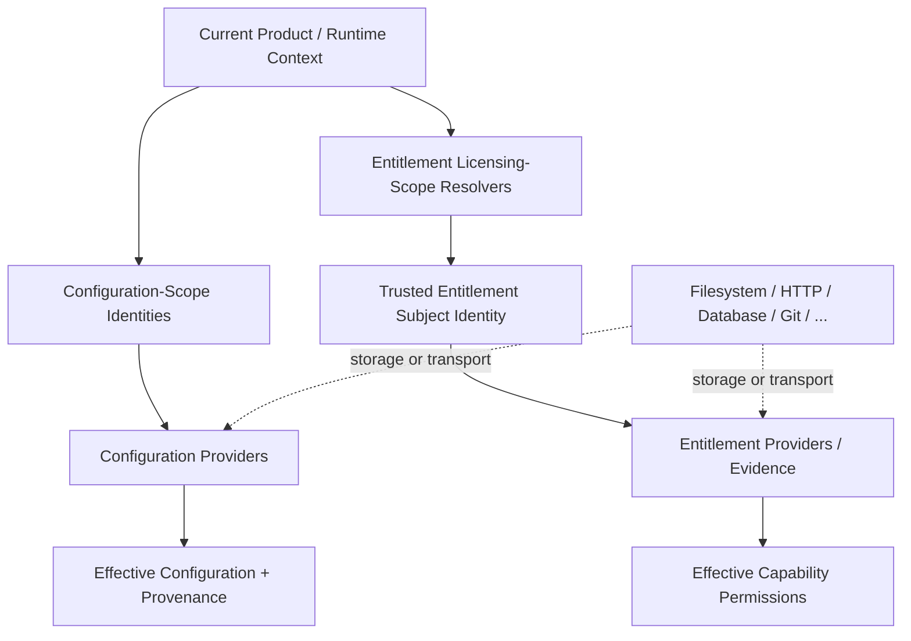

# Application Component Context, Configuration, and Entitlement Specification

**Status:** Generic, technology-neutral Application Component specification
**Scope:** Context identities, configuration scopes/providers, generic Data Entity support and references, entitlement licensing scopes/providers, permission grants, runtime entitlement context, and package-management integration with component replacement
**Audience:** Core implementers, component authors, product architects, UI authors, entitlement/configuration-provider authors, and technology-profile authors

---

# I. Purpose and Architectural Position

## I.1 Purpose

Application components execute inside a product context that may contain system-wide, organization-wide, user-specific, and workspace/project-specific information. This specification defines how those contextual inputs are represented without coupling a component to a particular filesystem layout, database, VCS implementation, license server, or UI toolkit.

The same context model is shared by configuration and entitlement evaluation, but configuration and entitlement remain separate typed concerns because their trust and enforcement semantics differ.

## I.2 Relationship to other specifications

`Application-Component-Architecture-Governance.md` defines the architectural invariants. `Application-Component-Lifecycle-and-Provisioning-Specification.md` defines when configuration and entitlement are evaluated and delivered. `Application-Component-Upgrade-Transaction-Specification.md` defines complete target-state replacement preflight, side-effect-free persisted-contribution classification/resolution, component cutover, rollback, and independent post-upgrade persistence convergence. `Application-Component-Capability-Contract-Specification.md` defines invocation semantics and Core mediation. `Application-Component-UI-Specification.md` defines how contextual values, entitlement state, and package/replacement state are represented to users.

## I.3 Physical storage is product-owned

AAC defines logical configuration scopes, entitlement licensing scopes, normalized values, provenance, policies, and the generic Data Entity envelope. It does **not** prescribe that system configuration lives under `/etc`, user configuration under a particular home directory, or Data Entities in a particular filesystem/database layout.

The Core application/product profile owns the physical mapping. A product may persist the same logical model in files, a relational database, a document database, a remote configuration service, or a combination of these.

---

# II. Context Identity and Extensible Scope Model

## II.1 Stable contextual identities

A Core invocation/configuration context may contain stable identities such as:

```text
application/product identity
system/installation identity
user identity (optional)
workspace/project identity (optional)
organization identity (optional, product/deployment-defined)
team identity (optional, product/deployment-defined)
customer identity (optional, product/deployment-defined)
customer-group identity (optional, product/deployment-defined)
tenant/environment/region identity (optional, product/deployment-defined)
provider-instance identity (when applicable)
Core-domain entity identity (when applicable)
```

A workspace/project MAY expose a stable logical identity when needed by configuration or Data Entity semantics. Entitlement does not require every workspace to have one universal AAC workspace identifier: each entitlement licensing scope defines its own identity-continuity semantics through its registered licensing-scope resolver.

## II.2 Configuration-scope types are extensible

AAC does **not** define a closed configuration-scope enum. It defines well-known configuration-scope types and an extensible identity mechanism.

The well-known configuration-scope types are:

```text
SYSTEM
USER
WORKSPACE
```

Products, deployments, or application profiles MAY define additional configuration-scope types such as:

```text
ORGANIZATION
TEAM
CUSTOMER
CUSTOMER_GROUP
TENANT
PROJECT_GROUP
ENVIRONMENT
REGION
```

These examples are deliberately not reserved as universal hierarchy levels. `CUSTOMER`, for example, may be useful when all projects for one customer share deployment infrastructure, URLs, credentials references, or other customer-specific configuration. `TEAM` may represent a shared engineering-team profile. `ORGANIZATION` may represent company-wide configuration. Another deployment may use none of these and define different configuration-scope types.

A concrete configuration-scope is an identity, conceptually:

```text
configuration-scope type + optional stable configuration-scope id
```

Examples:

```text
SYSTEM
USER(artur)
WORKSPACE(project-x)
CUSTOMER(acme)
CUSTOMER_GROUP(europe)
ORGANIZATION(algites)
```

The same product may use a different ordered configuration-scope chain for different workspaces or application usages.

A concrete configuration-scope instance SHOULD occur only once in one active configuration-scope chain. Multiple configuration-providers bound to that configuration-scope are resolved *inside that one chain position*; they MUST NOT cause the same configuration-scope to be interleaved at several precedence positions (for example `SYSTEM-provider-A -> WORKSPACE -> SYSTEM-provider-B`).

## II.3 Entitlement licensing scopes are extensible licensing-contract identities

Entitlement evaluation uses **entitlement licensing scopes**, not the ordered configuration-scope chain. A licensing scope describes the kind of logical subject to which an entitlement can be bound, for example `USER`, `WORKSPACE`, `SOURCE_REPOSITORY`, `CUSTOMER`, or a component-defined type.

AAC Core MUST NOT define a closed entitlement licensing-scope enum. A component that exposes externally licensable permissions declares the licensing-scope types it uses as first-class component metadata. Each declaration contains at least the scope `type` and MAY contain localized `name` and `description` display text plus metadata. Display text MAY provide literal fallback text and/or resource keys.

Conceptually:

```yaml
entitlement_licensing_scopes:
  - type: SOURCE_REPOSITORY
    name:
      text: Source repository
      resource_key: entitlement.licensing_scope.source_repository.name
    description:
      text: One logical source-control repository lineage.
      resource_key: entitlement.licensing_scope.source_repository.description
```

The declaration explains the licensing scope and allows Core/UI/catalog tooling to present it. It does **not** itself determine the current concrete subject. A registered entitlement licensing-scope resolver is responsible for deriving a trusted concrete subject identity from the current product state and for defining which state transformations preserve that identity.

The component that declares a licensing scope need not implement its resolver. For example, many plugins may declare `SOURCE_REPOSITORY`, while a VCS/infrastructure component or the product supplies the resolver. Similarly, a `WORKSPACE` resolver may derive identity from a database-backed workspace even when no VCS exists.

A user/deployment may define additional configuration-scope types without thereby creating licensing scopes, and a licensing-scope resolver does not add that scope to a capability permission that did not declare it as possible.

## II.4 Context identity availability is contextual

Not every runtime context has every configuration-scope or entitlement licensing-scope identity. A headless service may have no current user or workspace. A desktop project editor may have both. A source-oriented product may expose repository-lineage identities, while another product may identify logical workspaces exclusively from database state.

A licensing scope is usable only when the current product/runtime has a registered resolver capable of deriving a trusted concrete subject identity for that scope. Components MUST NOT assume that declaring a licensing-scope type makes such a subject available.

## II.5 Configuration scope, entitlement licensing scope, and provider transport are orthogonal

`REMOTE` is **not** a configuration-scope and is **not** an entitlement licensing scope. Local/remote/filesystem/HTTP/database/Git/etc. describe storage, transport, or identity-resolution technologies rather than the logical scope governed by a configuration value or entitlement grant.

For example:

```text
SYSTEM configuration-scope
    -> local /etc-style configuration-provider

WORKSPACE(project-x) configuration-scope
    -> Git-backed or database-backed configuration-provider

WORKSPACE(project-x) entitlement licensing scope
    -> subject identity derived by a product workspace resolver
    -> grant supplied by a local or remote entitlement-provider

SOURCE_REPOSITORY(<repository-lineage-subject>) entitlement licensing scope
    -> identity derived by a VCS-aware licensing-scope resolver
    -> grant supplied by an unrelated local or remote entitlement-provider
```

A renderer, component, or Core subsystem MUST NOT infer physical location, transport, or identity algorithm merely from a configuration-scope or licensing-scope type.

The separation of these concepts can be summarized as follows:



The same contextual facts may participate in both branches, but provider technology is not a scope identity and configuration precedence does not define entitlement precedence.

# III. Scoped Configuration

## III.1 Product-defined bootstrap schema

The bootstrap structures that establish contextual configuration MUST have a **fixed schema supplied with the product**. They are not ordinary component configuration and MUST be readable before ordinary scoped configuration is resolved.

A product MUST provide at least:

```text
an embedded/bootstrap schema version
bootstrap validation logic
bootstrap discovery rules
at least one safe built-in/default configuration profile
trusted bootstrap/profile-source rules
```

A product MAY use a platform-specific installation bootstrap location (for example an installation file, registry entry, container/platform injection, or equivalent) and MAY reference trusted remote bootstrap/profile registries. The bootstrap discovery path MUST NOT recursively depend on the scoped configuration that it is responsible for constructing.

Command-line or environment values MAY be used by a product as bootstrap locators/overrides when the product explicitly supports them, but AAC does not require command-line bootstrap.

## III.2 Configuration profiles and ordered configuration-scope chains

A **configuration profile** defines how the configuration context for one product usage is constructed. It may be selected differently for different workspaces/projects.

A configuration profile defines, at minimum:

```text
profile id and version
ordered configuration-scope definitions
configuration-scope resolvers
configuration-provider bindings for each configuration-scope
configuration-provider precedence within a configuration-scope
which configuration-scopes may contribute policy
workspace/profile customization rules
```

The ordered configuration-scope chain is written from **most specific/highest ordinary-value precedence** to **least specific/lowest ordinary-value precedence**.

Example only:

```text
USER(artur)
WORKSPACE(project-x)
CUSTOMER(acme)
CUSTOMER_GROUP(europe)
ORGANIZATION(algites)
SYSTEM
```

This ordering is not an AAC universal. Another workspace may select a profile such as:

```text
WORKSPACE(project-y)
TENANT(customer-42)
USER(artur)
SYSTEM
```

or may use only the three well-known configuration-scope types.

The product supplies a default configuration profile. A trusted installation bootstrap may select, replace, constrain, or extend available profiles according to the product bootstrap schema. A workspace MAY select a named configuration profile and MAY provide configuration-scope identity hints (for example its customer identity) when allowed by the trusted bootstrap policy.

A workspace MUST NOT be able to remove or weaken mandatory configuration-scopes, trusted configuration-providers, or policy authorities imposed by a higher bootstrap authority. A product MAY permit workspace-defined configuration profiles only when its bootstrap policy says `ALLOWED`, `ALLOWED_IF_SIGNED`, or an equivalent trusted rule.

## III.3 Component-declared placement rules

A component configuration schema SHOULD declare which **configuration-scope types** are valid for each persistent property or configuration fragment.

Conceptually:

```yaml
timeout:
  type: integer
  configuration_scopes: [SYSTEM, USER, WORKSPACE, CUSTOMER, ORGANIZATION]

repository_url:
  type: string
  configuration_scopes: [WORKSPACE, CUSTOMER]

local_cache_directory:
  type: string
  configuration_scopes: [USER]
```

The names outside the well-known `SYSTEM`, `USER`, and `WORKSPACE` set are configuration-profile/deployment-defined strings rather than AAC enum members.

This declaration states where a value is meaningful. It does not grant a component direct access to configuration stores; Core remains authoritative for loading, normalization, validation, persistence, configuration-policy evaluation, authorization, and provenance.

A component MAY additionally restrict which accepted configuration-scope types are allowed to contribute policy for a property. The active configuration profile may restrict policy authority further, but MUST NOT grant a component placement that the component schema itself forbids.

## III.4 Configuration targets

Persistent configuration is attached to an explicit **configuration target**. The baseline target kinds are:

```text
COMPONENT
PROVIDER_INSTANCE
```

`COMPONENT` is configuration owned by the component as a whole and shared independently of any one provider instance. Typical examples include component-wide presentation preferences, diagnostics settings, or other plugin-global behavior.

`PROVIDER_INSTANCE` is configuration owned by one concrete Core-managed provider instance and is identified by the component identity plus the immutable provider-instance ID.

Conceptually:

```yaml
configuration_target:
  kind: COMPONENT
  component_id: com.vendor.foo
```

or:

```yaml
configuration_target:
  kind: PROVIDER_INSTANCE
  component_id: com.vendor.foo
  provider_instance_id: 92c6...immutable-guid...
```

A component SHOULD declare separate schemas for component configuration and provider-instance configuration when it uses both target kinds.

There is **no implicit inheritance** from `COMPONENT` configuration into `PROVIDER_INSTANCE` configuration in the baseline AAC model. A component may interpret a component-level property as a default for its own instances, but that is component semantics rather than Core configuration-layer inheritance.

Component version is not part of configuration-target identity. Configuration SHOULD survive a compatible component upgrade. Persistence and provenance SHOULD instead record the configuration schema identity/version and the component version that last wrote the contribution, for example:

```text
configuration_schema_id
configuration_schema_version
written_by_component_version
```

## III.5 Configuration-provider mutation and authorization

A component or UI MUST NOT write a configuration-provider directly. Mutations are submitted to Core, which validates schema, effective policy, configuration-target ownership, current-actor authorization, and provider capability before invoking the configuration-provider write contract.

A configuration-provider exposes its technical mutation capabilities for the current concrete configuration-scope/context. Baseline capabilities SHOULD distinguish at least:

```text
READ
WRITE_VALUE
DELETE_VALUE
WRITE_POLICY
DELETE_POLICY
```

`WRITE_POLICY`/`DELETE_POLICY` are distinct because changing policy can constrain lower configuration-scopes and therefore commonly requires stronger authorization than changing an ordinary value.

Provider write capability is not sufficient authorization by itself. Core/product authorization separately determines whether the current application principal may perform a requested mutation against the selected configuration-scope, configuration-provider, component namespace, and configuration target.

A component is implicitly confined to its own configuration namespace unless an explicit Core/product capability grants broader administration authority. It MUST NOT be able to mutate another component's configuration or platform-owned settings merely because a backing provider is writable.

Mutations SHOULD be expressed as normalized logical change sets rather than serialized YAML/JSON documents. One mutation request targets one concrete configuration-scope, one configuration-provider, and one configuration target, and MAY contain multiple changes that MUST be applied atomically by a writable provider when the provider advertises atomic-write support.

Conceptually:

```yaml
configuration_scope:
  type: WORKSPACE
  id: project-x

configuration_provider: workspace-config

configuration_target:
  kind: PROVIDER_INSTANCE
  component_id: com.vendor.foo
  provider_instance_id: 92c6...

expected_record_revision: 184

changes:
  - property: repository_url
    operation: SET_VALUE
    value: https://example.invalid/repository

  - property: timeout
    operation: SET_POLICY
    policy_modes:
      MIN: 20
      MAX: 60
```

Writable providers that permit mutation MUST participate in the generic AAC persistence contract. A mutation prepared from a persisted snapshot carries that snapshot's `record_revision`; a stale `expected_record_revision` MUST yield a conflict rather than silently overwriting a concurrent change. The concrete revision representation is declared by the provider/schema contract and may be a monotonic integer or an opaque token such as an HTTP ETag.

## III.6 Configuration-providers

Core obtains configuration contributions through typed **configuration-providers**, conceptually through an interface equivalent to:

```text
AIiConfigurationProvider
```

A configuration-provider may be local or remote and may contribute values for one or more concrete configuration-scopes when the active configuration profile binds it there.

Examples include:

```text
SYSTEM configuration-provider backed by an installation file
USER configuration-provider backed by a local user directory
USER configuration-provider backed by an intranet profile service
WORKSPACE configuration-provider backed by Git/project files
WORKSPACE configuration-provider backed by a remote project service for secrets/references
CUSTOMER configuration-provider backed by a shared disk or customer portal
ORGANIZATION configuration-provider backed by a central configuration service
```

A remote configuration-provider SHOULD expose a validated/cached snapshot when continuous network availability is not guaranteed and product policy permits offline use.

If multiple configuration-providers contribute to the same concrete configuration-scope, their precedence MUST be explicit and deterministic in the configuration profile. Equal-precedence conflicting scalar contributions MUST NOT be resolved by accidental discovery order; Core MUST report a configuration conflict unless the property schema/profile defines an explicit merge rule.

A configuration-provider priority is local to its bound concrete configuration-scope. It does not compete directly with configuration-providers bound to another configuration-scope; the configuration-scope chain determines cross-scope precedence.

## III.6.1 Contribution interpretability precedes policy/value resolution

A configuration-provider contribution is versioned component-owned data. Before any ordinary value or policy mode from that contribution participates in resolution, Core classifies its runtime interpretation for the active component:

```text
DIRECT
    the stored representation is directly readable

TRANSFORMED
    an explicit side-effect-free transformation produces a valid
    in-memory representation

UNSUPPORTED
    no safe interpretation is available
```

An `UNSUPPORTED` contribution MUST be preserved unchanged and treated as **unavailable input**. Core MUST NOT partially parse it, guess its semantics, implicitly downgrade it, or apply any ordinary values or policy modes contained in it.

This rule deliberately does not make configuration policy a security boundary. If a newer organization/workspace/provider contribution is unsupported by an older component, that contribution—including policy directives it may contain—is simply not part of that older component's effective configuration. Core SHOULD emit a stable forward-compatibility diagnostic so users can see that the older component is running with fallback/degraded configuration.

Resolution then continues with other interpretable providers/scopes, applicable defaults, schema defaults, and ultimately `UNDEFINED`.

## III.7 Configuration policy is represented by composable policy-modes

A configuration contribution may contain an ordinary value and/or one or more policy-modes. Baseline policy-modes are:

```text
LOCK(value)
MIN(value)
MAX(value)
IN_SET(values)
NOT_IN_SET(values)
DEFAULT(value)
```

Multiple policy-modes MAY be defined for one property at one configuration-scope, for example `MIN(20)` together with `MAX(50)`.

Policy is evaluated for the same configuration target as the property being resolved. Baseline AAC does not implicitly apply component-target policy to provider-instance-target configuration or vice versa.

The restriction modes have these baseline semantics:

```text
LOCK(x)        allowed domain becomes intersection with {x}
MIN(x)         values below x are excluded
MAX(x)         values above x are excluded
IN_SET(S)      allowed domain becomes intersection with S
NOT_IN_SET(S)  values in S are excluded
```

`DEFAULT(x)` is different: it does **not** widen or narrow the allowed domain. It supplies a policy-owned fallback candidate when no ordinary configuration value is defined at any applicable configuration-scope. Its provenance MUST remain distinguishable from an explicitly configured value and from a component-schema default.

`LOCK(x)` is both a restriction to one value and an effective forced policy value. If an ordinary contribution explicitly defines another value, the configuration is invalid rather than silently falling back.

Policy-modes MUST be compatible with the property schema/type. For example, `MIN`/`MAX` require an ordered domain and set modes require comparable normalized values.

Additional policy-modes MAY be standardized later or introduced by a product profile when their merge semantics are deterministic and machine-validatable.

## III.8 Policy resolution is monotonic; ordinary value resolution is specificity-first

For each property and configuration target Core performs policy and value resolution as separate phases **over usable (`DIRECT` or successfully `TRANSFORMED`) contributions only**. `UNSUPPORTED` contributions have already been removed from semantic resolution while their provenance/diagnostics remain visible.

Assume an active configuration-scope chain from most specific to least specific:

```text
USER(artur)
WORKSPACE(project-x)
CUSTOMER(acme)
CUSTOMER_GROUP(europe)
ORGANIZATION(algites)
SYSTEM
```

### III.8.1 Policy phase

Core evaluates restricting policy-modes from the **least specific** configuration-scope toward the **most specific**, considering only interpretable contributions:

```text
SYSTEM
-> ORGANIZATION
-> CUSTOMER_GROUP
-> CUSTOMER
-> WORKSPACE
-> USER
```

Each later policy contribution may only preserve or **tighten** the effective policy. It MUST NOT broaden permissions established by a less-specific configuration-scope.

Examples:

```text
SYSTEM MIN(10)
ORGANIZATION MIN(20)
WORKSPACE MIN(15)

=> effective MIN = 20
```

The workspace contribution cannot relax the organization restriction.

For common baseline modes:

```text
effective MIN        = maximum of all applicable MIN values
effective MAX        = minimum of all applicable MAX values
effective IN_SET     = intersection of all applicable IN_SET values
effective NOT_IN_SET = union of all applicable NOT_IN_SET values
LOCK                  = intersection with the locked singleton value
```

Constraints compose across modes. For example:

```text
ORGANIZATION: MIN(20), MAX(50)
WORKSPACE:    IN_SET([10, 30, 40, 80])

=> effective allowed values = [30, 40]
```

A more-specific configuration-scope may then tighten this further, for example `NOT_IN_SET([40])`, yielding only `30`.

If combined restrictions yield an empty/unsatisfiable domain, Core MUST report a policy conflict with provenance identifying the contributing configuration-scopes and configuration-providers.

A policy contribution that merely attempts to relax an existing restriction has no broadening effect. Core SHOULD retain provenance/diagnostics showing that the contribution was non-effective or redundant.

### III.8.2 Ordinary value phase

After effective policy is known, Core evaluates ordinary values from the **most specific** configuration-scope toward the **least specific** and selects the first explicitly defined value from an interpretable contribution for the same configuration target.

The selected explicit value MUST satisfy the effective policy. If it violates policy, Core MUST report a configuration-policy violation; it MUST NOT silently ignore that explicit value and fall back to a less-specific value.

If no ordinary value is explicitly defined, Core evaluates policy `DEFAULT` candidates from most specific to least specific and chooses the first candidate permitted by the effective policy. A policy default that contradicts effective policy is a configuration/policy-definition diagnostic and is not silently presented as an explicit value.

If no applicable policy default exists, Core MAY use the component-schema `default`, which MUST also satisfy effective policy. AAC treats the schema `default` annotation as a runtime-resolution fallback; selecting it MUST NOT by itself persist that value into any provider.

If no usable explicit value or applicable default exists, Core resolves the property as `UNDEFINED`.

`UNDEFINED` is a Core-level resolution state, not a persisted scalar and not equivalent to `null`. A component MUST define safe behavior when a context-dependent/configuration value is `UNDEFINED`. The result may be reduced functionality or `NOT_READY` status for an affected operation/capability/provider instance.

A component MUST NOT assume runtime availability solely because a concrete payload schema marks a property `required`. `required` remains useful for validating the internal structure of a contribution that is present, but contextual runtime availability is determined by multi-provider resolution. Operational requiredness belongs to lifecycle/readiness semantics.

## III.9 Effective configuration and provenance

Core resolves effective configuration for a concrete configuration target and current application context. For every property Core SHOULD expose enough provenance to explain the result, including:

```text
configuration target kind/id
effective value
value source kind: EXPLICIT / POLICY_LOCK / POLICY_DEFAULT / SCHEMA_DEFAULT / UNDEFINED
source configuration-scope type and id
source configuration-provider
all effective policy-modes and their provenance
shadowed ordinary contributions
non-effective/redundant policy contributions
provider mutation capabilities for the current actor/context
Core authorization for value/policy mutation
configuration-policy violation/conflict diagnostics
unsupported/unavailable provider contributions and schema versions
fallback/default/UNDEFINED diagnostics
revision/ETag where applicable
```

Components receive normalized effective configuration; they SHOULD NOT open configuration files or query configuration services directly unless a product-specific capability explicitly delegates that responsibility.

## III.10 Component and provider-instance configuration may combine many configuration-scopes

A configuration target is not limited to a single configuration-scope. Different properties may originate from different configuration-scopes and different configuration-providers.

For example, a provider-instance target may obtain a repository URL from `WORKSPACE`, a local executable path from `USER`, a deployment endpoint from `CUSTOMER`, and a TLS restriction from `ORGANIZATION`/`SYSTEM`.

A component target may independently obtain presentation or diagnostics settings from its own applicable configuration-scopes.

Core computes effective configuration separately for each target. It MUST NOT silently copy component-target values into provider-instance-target values.

## III.11 Secrets

Secret values SHOULD be represented by secret references rather than ordinary configuration values when a secret-store facility exists. Configuration-scope/provenance applies to the reference; access to the referenced secret remains governed by the secret facility.

A `WORKSPACE` configuration-scope therefore does not imply that a secret must be stored in Git. A workspace property may be supplied by a remote project configuration-provider or may contain only a secret reference resolved elsewhere.

## III.12 Authentication, secret storage, and authorization are separate layers

AAC distinguishes three security concerns that MUST NOT be collapsed into one provider-specific username/password field:

```text
authentication
    how a caller proves an identity to a remote service

secret / credential storage
    where passwords, bearer tokens, private-key passwords, and other secret material are resolved

authorization
    whether the current application principal may perform a Core operation
```

Authentication success does not imply AAC authorization. Conversely, AAC authorization does not create credentials for a remote service. A writable filesystem may be writable to the operating-system process while Core still denies `WRITE_POLICY` to the current application principal.

## III.13 Authentication profiles and secret references

Remote facilities SHOULD refer to an authentication profile rather than embedding authentication fields ad hoc. AAC baseline well-known authentication mechanisms are:

```text
NONE
BASIC
BEARER
CLIENT_CERTIFICATE
```

The mechanism vocabulary is extensible. A product or technology profile MAY register additional handlers such as OAuth2, API-key, SSH-agent, Kerberos, or platform-specific mechanisms without changing configuration-provider contracts.

An authentication profile contains non-secret parameters directly and secret material through typed secret references. Conceptually:

```yaml
authentication_profile:
  id: company-api
  mechanism: BEARER
  parameters:
    token:
      secret_reference:
        secret_provider_id: os-keyring
        key: company-api-token
```

A configuration-provider, entitlement-provider, package repository, licensing service, bootstrap/profile source, or other remote facility MAY reference the same authentication profile model. The remote facility MUST NOT need to know how the referenced secret is physically stored.

Secret providers are separately registered facilities. Baseline implementations may include environment, operating-system keyring, protected filesystem, vault/service, hardware-backed store, or product-specific equivalents. Secret bytes MUST NOT be copied into portable workspace configuration merely to satisfy a remote provider.

## III.14 Core authorization remains independent

Provider transport capability and remote authentication are not sufficient to authorize a configuration mutation. Core evaluates application authorization for the concrete operation, configuration-scope, configuration-provider, configuration target, component namespace, and current principal/context.

At minimum the configuration mutation surface distinguishes:

```text
READ
WRITE_VALUE
DELETE_VALUE
WRITE_POLICY
DELETE_POLICY
```

The UI may expose a provider as technically read-write while still showing it as read-only for the current principal. Policy mutation commonly requires stronger authorization than ordinary value mutation.

## III.15 Writable provider transport semantics

The AAC write contract is the normalized atomic change set. Physical transport is provider-specific. A filesystem configuration-provider may implement a change set as read/compare/apply/temp-file/fsync/atomic-rename. An HTTP provider may use a server-side change-set endpoint, `PATCH`, or a full-resource `PUT`. AAC does not require one HTTP verb.

Optimistic concurrency follows the generic AAC persistence contract. Every mutable persisted provider record exposes a persistence-owned `record_revision`; the provider/schema contract declares its representation. A stale `expected_record_revision` MUST produce a conflict and MUST NOT silently overwrite a newer document. Providers MUST also declare the strongest persistence capability they genuinely guarantee (`READ`, `SINGLE_RECORD_CAS`, or `MULTI_RECORD_TRANSACTION`).

A reference HTTP mapping is therefore conceptually:

```text
GET resource -> normalized versioned document + opaque record_revision (for example ETag)
PATCH change-set + conditional token (for example If-Match) -> atomic server-side mutation

or

GET resource + opaque record_revision
apply change-set locally
PUT complete normalized document + matching conditional token
```

Both mappings implement the same AAC logical contract.

## III.16 Fixed-schema security bootstrap and bootstrap-safe dependencies

Authentication needed to obtain the ordinary configuration graph cannot recursively depend on that graph. Products therefore supply a fixed-schema **security bootstrap** before ordinary configuration-provider resolution. It may register bootstrap-safe secret providers and authentication profiles used by configuration bootstrap/profile sources or other early remote facilities.

A startup argument or URI is only a locator. It does not become a trusted authority merely because a user supplied it. The product/installation decides which bootstrap source, installation file, embedded default, remote endpoint, trust root, or signed object is authoritative. Lower-trust workspace configuration MUST NOT replace a mandatory higher-authority bootstrap.

If a local administrator fully controls the executable, startup arguments, and machine trust roots, AAC cannot cryptographically force that administrator to use a particular bootstrap. Enterprise enforcement may additionally rely on protected installation state and/or remote services that refuse untrusted contexts.

# IV. Data Entity Context and Compatibility

## IV.1 General model

AAC components interact with persistent/domain data through the generic **Data Entity** model. The model does not distinguish "Core entities" from "plugin entities" for compatibility purposes. Any component may support canonical schemas and may require schemas understood or produced elsewhere in the target system.

A Data Entity is identified logically by:

```text
(schema_id, uid)
```

Its concrete representation is carried in a Data Entity envelope with `schema_version`, `record_revision`, `state` and `payload`.

Data Entities are distinct from component/provider configuration and from runtime cache/state. Configuration participates in configuration scopes, providers and policy modes; Data Entities represent persistent domain/system semantics and explicit inter-entity relationships.

## IV.2 Data Entity support declarations

A component descriptor may declare:

```yaml
data_entity_support:
  - schema_id: eu.algites.monitoring.site-data
    readable_versions: [2, 3]
    writable_versions: [2, 3]
    preferred_write_version: 3
    migrations:
      - from: 2
        to: 3
        migrator: eu.algites.monitoring:migrate_site_data_2_to_3
    data_entity_requirements:
      - schema_id: _AO.entity.site
        access: [READ]
        readable_versions: [4, 5]
        required: true
      - schema_id: eu.algites.inventory.asset
        access: [READ]
        readable_versions: [1, 2]
        required: false
```

The declaration describes semantic capability of the component, not physical storage placement and not ownership of the canonical schema.

`readable_versions` and `writable_versions` are independent sets. Multiple writable versions support coordinated rolling rollout. `preferred_write_version` is required whenever writing is supported and indicates the component's preferred representation, not an unconditional global write policy.

A component may support a schema read-only, write-only where explicitly allowed by the schema/profile, or read/write. Multiple components may support the same `(schema_id, schema_version)` when the canonical definition is identical.

## IV.3 Data Entity requirements are type-level dependencies

`data_entity_requirements` declares what other Data Entity schemas/versions are needed for the surrounding supported entity functionality. A required dependency that cannot be resolved in the target component/schema environment makes that functionality unavailable/incompatible according to product policy.

Requirements are intentionally named specifically because components may have other kinds of requirements as well.

A requirement does not identify one concrete target record. Concrete record relationships are schema-level references.

## IV.4 Data Entity references are canonical-schema annotations

A field that stores the UID of another Data Entity declares that relation directly in the canonical JSON Schema:

```json
{
  "properties": {
    "site_uid": {
      "type": "string",
      "x-aac-data-entity-reference": {
        "schema_id": "_AO.entity.site"
      }
    }
  }
}
```

The schema annotation is the single source of truth for the structural relationship. It is not repeated in `data_entity_support`.

The reference targets `(schema_id, uid)` rather than a target schema version. This allows the referenced entity to migrate from one schema version to another without rewriting every incoming reference. The active component compatibility graph determines which target versions are semantically usable.

AAC Core's schema registry can inspect these annotations for validation, indexing metadata and storage-provider provisioning. Referential existence/state checks require access to the concrete Data Entity datasource and are therefore performed by the data-access/storage layer rather than by JSON Schema syntax alone.

## IV.5 Canonical schema identity and duplicate definitions

Every canonical JSON Schema MUST explicitly contain non-empty `x-aac-schema-id` and integer `x-aac-schema-version >= 1` metadata.

The resource filename is not an identity mechanism. Core registers schemas by `(schema_id, schema_version)` and rejects conflicting canonical definitions for the same identity. Identical copies supplied by multiple artifacts/components may be deduplicated; no schema-owner field is required merely to arbitrate identical definitions.

A configuration descriptor that names a concrete resource must agree with the identity declared by that resource.

## IV.6 Data Entity envelope and states

The normalized envelope is conceptually:

```yaml
uid: ...
schema_id: _AO.entity.site
schema_version: 4
record_revision: ...
state: ACTIVE
payload:
  ...
```

`record_revision` is persistence concurrency metadata and may be an integer or opaque provider token. `schema_version` describes the physically stored payload semantics. The generic `payload` itself is always a JSON object; its actual properties are defined by the canonical schema identified by `(schema_id, schema_version)`.

`state` is:

```text
ACTIVE
TOMBSTONE
```

A tombstone is logically removed but retained. Existing references may remain resolvable; new references SHOULD by default target only ACTIVE entities. `TOMBSTONE` does not mean that the current component set lacks support for the schema. Runtime support is calculated independently.

Physical deletion is distinct from tombstoning.

## IV.7 Runtime interpretation and migration

For stored configuration contributions and Data Entities, runtime interpretation is classified independently from persistence convergence:

```text
DIRECT
    the active component consumes the stored representation directly

TRANSFORMED
    an explicit side-effect-free transformation produces a valid
    in-memory representation

UNSUPPORTED
    no safe interpretation is available to the active component
```

A component may declare explicit Data Entity migration steps. The Core migration service may normalize an older representation in memory while preserving logical UID, persistence revision as concurrency context, and `ACTIVE`/`TOMBSTONE` state.

If a stored schema is older and directly readable, no migration is required for runtime use even when a path to the preferred write version exists. If direct reading is not supported but an explicit transformation succeeds, Core may use the transformed in-memory representation.

If a stored schema is newer than the installed component understands, or otherwise unsupported, Core/storage MUST preserve the record without loss, prevent incompatible semantic interpretation/editing, and report a compatibility diagnostic. The record does not thereby become a tombstone.

Physical write-back is separate convergence and is attempted only when the relevant provider/storage contract can perform it safely. Semantic migration code MUST NOT directly manipulate product files, SQL tables, remote documents, or other physical storage.

## IV.8 Relationship to configuration migration

Configuration and Data Entities are two specializations of the same architectural principle: versioned persisted semantics under Core-controlled interpretation and compatibility rules.

They share these rules:

```text
schema identity/version is separate from component version
Core owns interpretation/migration invocation and validation
stored data may remain at any version that is directly readable or safely transformable in memory
runtime interpretation is DIRECT / TRANSFORMED / UNSUPPORTED
physical migration write-back is independent convergence
newer unsupported data are preserved, unavailable to incompatible semantics, and never guessed at or downgraded implicitly
```

They remain distinct models. Configuration transformation operates on configuration values, policy modes and configuration targets/scopes. Data Entity transformation operates on Data Entity payload semantics and preserves Data Entity identity/state. A configuration transformation MUST preserve policy modes as well as ordinary values.

When a configuration contribution is `UNSUPPORTED`, its values and policy modes are excluded from effective resolution. Resolution continues through other usable contributions/defaults/schema defaults and may yield `UNDEFINED`.

## IV.9 Component absence, incompatibility, entitlement, and downgrade

A datasource/workspace may contain Data Entities for which a relevant component is:

```text
not installed
not currently entitled
installed at an incompatible component version
unable to read/transform the stored schema version
temporarily unavailable
```

Core/storage MUST preserve those records. Generic UI may expose unavailable/incompatible diagnostics, but MUST NOT rewrite, tombstone, truncate or delete a record merely because a component is absent or incompatible.

Unsupported data by itself does not make Core or the whole component invalid. Functionality that genuinely depends on that semantic data may be degraded or `NOT_READY`; product policy decides whether a particular operation remains editable, read-only, or unavailable.

A later downgrade uses the same `DIRECT` / `TRANSFORMED` / `UNSUPPORTED` rules as any other target-state replacement. Newer stored data therefore do not automatically make downgrade impossible. They may instead become unavailable to the older component while remaining preserved.

Loss of entitlement is not a data migration and does not authorize destructive data modification or purge.

## IV.10 Product/domain migration and preservation

AAC does not define a universal transformation language for arbitrary domain restructuring such as entity split, merge, replacement, generated IDs or storage reorganization. Those transformations belong to the concrete product/domain migration subsystem.

The generic invariant is preservation: unknown or unsupported Data Entities MUST NOT be silently lost merely because the current component set cannot interpret them. Complex migrations that intentionally transform or remove records must do so explicitly through `_AAC.data-entity.apply-direct-record-changes` (or a future explicitly defined indirect mutation capability) rather than through component-private physical storage access.

## IV.11 Portability and UI implications

Data Entities that belong to workspace/project meaning SHOULD travel with that logical project/workspace through VCS or equivalent replication when the selected storage provider supports such portability. Preservation of unsupported records does not require every interpreting component to be installed on the receiving system.

A product UI may derive Data Entity sections/actions from component support and canonical schema metadata, but baseline AAC does not permit arbitrary component-owned toolkit widgets merely because a component supports a Data Entity. Product UI governance remains authoritative.

Unsupported records MUST be preserved and exposed as unavailable/read-only where relevant rather than offered for unsafe semantic editing. A `TOMBSTONE` may be displayed as historical/removed data according to product policy.

## IV.12 Generic Data Entity storage capabilities

Physical Data Entity access is expressed through framework capability contracts rather than through product-specific filesystem, SQL, ORM, or document-store APIs. Version 1 defines six direct capabilities:

| Capability | Operation | Group | Semantics |
| --- | --- | --- | --- |
| `_AAC.data-entity.get-record/1` | `get` | `_AAC.data-entity.loading` | Load one record by `(schema_id, uid)`; a missing record yields `record: null`. |
| `_AAC.data-entity.query-records/1` | `query` | `_AAC.data-entity.loading` | Query records using portable technical selectors. |
| `_AAC.data-entity.apply-direct-record-changes/1` | `apply` | `_AAC.data-entity.storing` | Atomically apply a direct record changeset. |
| `_AAC.data-entity.inspect-storage-support/1` | `inspect` | `_AAC.data-entity.storage-management` | Inspect physical support for one canonical schema/version. |
| `_AAC.data-entity.ensure-storage-support/1` | `ensure` | `_AAC.data-entity.storage-management` | Idempotently provision/reconcile physical support. |
| `_AAC.data-entity.retire-storage-support/1` | `retire` | `_AAC.data-entity.storage-management` | Retire support for future writes without implying destructive purge. |

Core owns semantic validation, schema-version compatibility, migration selection/invocation, authorization/policy and construction of valid storage requests. The selected storage provider owns physical representation, record-revision generation, compare-and-swap enforcement, atomic application of the direct changeset, query execution, and schema-support provisioning.

No component migration or business capability may bypass this split by writing the provider's physical files/tables/documents directly.

### IV.12.1 Get and query

`get` uses logical Data Entity identity only. It returns the stored envelope exactly at its stored schema version/state; Core may then interpret or transform it according to the compatibility rules above.

`query` v1 intentionally exposes a small provider-independent selector surface rather than a general query language. The request selects one `schema_id` and may further constrain:

- optional finite `stored_schema_version_filter` values, which filter the physical schema versions actually stored by that provider;
- entity `states` (`ACTIVE` by default);
- explicit `uids`;
- one or more canonical Data Entity reference targets, optionally restricted to a canonical schema path;
- `ALL`/`ANY` matching for several reference selectors.

Results are ordered by logical UID (`UID_ASC` by default, with `UID_DESC` available), use a bounded `limit`, and may return an opaque `continuation_token`. The continuation token is provider-owned pagination state and MUST NOT be interpreted by consumers. AAC v1 deliberately does not define arbitrary payload predicates, joins, aggregation, or provider-specific SQL/document query syntax.

### IV.12.2 Atomic direct record changes

`apply` accepts one non-empty ordered changeset and is atomic at the provider boundary: either every direct change is committed or none is committed. The supported change types are:

```text
CREATE_RECORD
REPLACE_RECORD
DELETE_RECORD
```

`CREATE_RECORD` receives the logical UID from caller/Core; the storage provider does not generate Data Entity identity. Successful create returns the provider-generated `record_revision`. Creating an already existing `(schema_id, uid)` is a conflict.

`REPLACE_RECORD` carries `expected_record_revision` and the complete replacement semantic representation (`schema_version`, `state`, `payload`). A stale expected revision is a conflict and MUST NOT overwrite newer data. Replacing an `ACTIVE` record with a `TOMBSTONE` envelope is the normal logical-tombstoning path.

`DELETE_RECORD` also requires `expected_record_revision` and physically removes the stored record. Physical deletion is therefore explicit and remains distinct from the logical `TOMBSTONE` state.

The result contains one entry per input `change_id`. Successful create/replace entries return the new provider `record_revision`; delete has no resulting record revision. If any precondition/conflict prevents the complete changeset, the invocation fails rather than returning a partially committed result.

### IV.12.3 Storage-support lifecycle

Storage support is tracked per canonical `(schema_id, schema_version)`. `inspect` reports one of:

```text
NOT_PROVISIONED
READY
RETIRED
INCOMPATIBLE
```

`ensure` receives the canonical JSON Schema and normalized Data Entity reference definitions known to Core. It is idempotent: repeated application to already compatible support returns `READY` without requiring a physical change. A provider may create/reconcile tables, collections, indexes, directories or equivalent backend-specific structures, but those structures are outside the AAC contract.

`retire` means that support is no longer required for future writes. It MAY mark or de-prioritize physical structures for later provider/product cleanup, but MUST NOT by itself physically delete stored Data Entities, drop authoritative tables/collections, or otherwise purge data. Destructive purge remains a separate explicit product/domain lifecycle action with its own safety policy.

## IV.13 Provider-bound Data Entity facades and access mode

A Data Entity provider instance is one concrete configured datasource/runtime identity. One instance may implement any subset of the six Data Entity capability interfaces and may implement multiple capability-contract versions on the same runtime object. A provider instance is not created once per capability.

Every Data Entity facade invocation is bound to one explicit provider instance. Core does not automatically search, merge, fan out, or route `get`, `query`, `apply`, `inspect`, `ensure`, or `retire` between provider instances. This keeps provider identity and transaction domain explicit.

A provider instance may be configured with:

```text
READ_ONLY
READ_WRITE
```

The access mode constrains Core usage of the instance independently from the capabilities technically implemented by the provider class. `READ_ONLY` permits non-mutating access such as `get`, `query`, and `inspect`, but Core MUST reject mutating Data Entity operations such as `apply`, `ensure`, or `retire` through that instance. `READ_WRITE` permits those operations when the corresponding capability is implemented.

A product may designate a particular `READ_WRITE` provider instance as its canonical/authoritative store. Additional provider instances may be used explicitly for imports, external libraries, caches, or other product workflows. This designation does not change invocation routing: an operation is still made against one concrete instance selected by the caller/Core facade.

AAC v1 does not define distributed atomic transactions across provider instances. An `apply-direct-record-changes` invocation is one atomic changeset inside exactly one selected provider's transaction domain.

## IV.14 Runtime Data Entity views, codecs, and typed envelopes

The schema version requested by a consumer is not a storage query parameter. `get` takes only `(schema_id, uid)`. The provider returns the record's actual stored `schema_version`; Core uses that version to choose the persistence codec. `query` likewise returns whatever stored versions match its selectors. `stored_schema_version_filter` exists specifically as an optional physical-inventory selector for migration, diagnostics, and convergence tooling.

For runtime use, AAC distinguishes three independent versions:

```text
stored schema version
    selects the codec used to decode the returned physical payload

canonical implementation/storage version
    selects the codec used when the current implementation is saved

consumer view version
    selects the interface through which the consumer is allowed to access the current object
```

For one `(schema_id, version)`, code generation may produce a versioned Data Entity view interface and a version-specific codec. Versioned field-access methods carry the schema-version suffix, for example `getName_2()` / `setName_2(...)` in Java or `get_name_2()` / `set_name_2(...)` in Python. One current implementation object may explicitly implement several historical view interfaces and translate each view's semantics into one current internal state.

Core maintains separate schema, view/codec, and current-implementation registries. A storage envelope is validated against its stored canonical schema, then its stored-version codec applies the payload to a newly created current implementation object. Core may return that same object through any explicitly supported consumer view interface. On save, Core serializes the current object with its canonical codec rather than with the consumer's historical view codec.

Typed technology APIs SHOULD preserve this distinction. For Java, a facade may return an `Envelope<T>`/equivalent where `T` is the requested view interface, eliminating consumer casts while leaving physical/canonical version metadata independent. The runtime `T` does not choose the persistence representation.

Generated/shared Data Entity view interfaces and codecs are contract types and require shared runtime identity. In Java they MUST follow the shared class-loader rules; plugin-private duplicate copies of the same generated interface are not interchangeable classes. Python runtimes likewise use the shared registered model package rather than dynamically importing an arbitrary class name derived from stored data.

Normal same-identity evolution SHOULD prefer polymorphic view compatibility. Existing explicit migration mechanisms remain valid for physical convergence and for breaking structural changes such as entity split/merge, which cannot in general be represented by one polymorphic object.

### IV.12.4 Reserved future computation capabilities

The following capability roles are reserved conceptually but have no v1 capability contracts or empty placeholder definitions:

```text
EXECUTE_READ_COMPUTATION
EXECUTE_INDIRECT_RECORD_CHANGES
```

Their semantics are intentionally deferred because stored procedures, provider-defined computations and indirect mutations need a separate model for computation identity, input/output typing, side effects, authorization, determinism and transaction participation. AAC capability contracts require at least one real operation, so future-only empty contracts MUST NOT be created merely to reserve a name.

# V. Entitlement as Capability-Version Permission Grants

## V.1 Entitlement is not a boolean license flag

Entitlement is represented as Core-validated grants over **component-owned permissions in the namespace of a provided capability version**, rather than one boolean `licensed` state.

The minimum logical identity of an entitlement permission is:

```text
component id
+ provided capability id
+ provided capability version
+ permission id
```

The same permission string used by another capability or another capability version is a different entitlement permission unless an explicit future compatibility rule says otherwise.

A component may remain installed and active with an empty/minimal permission set and provide free, diagnostic, configuration, read-only, or degraded functionality.

## V.2 Component-declared entitlement licensing scopes and capability permission vocabulary

Entitlement licensing-scope types are an **open component contract**, not a Core enum and not the customizable ordered configuration-scope chain. The component descriptor declares every licensing-scope type referenced by the component's current provided-capability entitlement metadata.

A licensing-scope declaration contains:

```text
type
optional localized/display name
optional localized/display description
optional metadata
```

`name` and `description` use the normal AAC display-text model and may therefore contain literal fallback text and/or localization resource keys.

Conceptually:

```yaml
entitlement_licensing_scopes:
  - type: USER
    name:
      text: User
      resource_key: entitlement.licensing_scope.user.name
    description:
      text: One resolved user identity.
      resource_key: entitlement.licensing_scope.user.description

  - type: SOURCE_REPOSITORY
    name:
      text: Source repository
      resource_key: entitlement.licensing_scope.source_repository.name
    description:
      text: One logical source-control repository lineage.
      resource_key: entitlement.licensing_scope.source_repository.description

provided_capability_entitlements:
  - capability:
      id: com.vendor.foo.document
      version: 1
    permissions:
      - id: view
      - id: edit
        possible_licensing_scopes: [USER, SOURCE_REPOSITORY]
```

A permission with no `possible_licensing_scopes` is available without external entitlement evidence. A non-empty list identifies the licensing-scope types through which that permission may be granted. Every type referenced by `possible_licensing_scopes` in the current component descriptor MUST have a corresponding `entitlement_licensing_scopes` declaration.

The component descriptor defines **what the scope means and how it is presented**. It does not define the concrete subject-resolution implementation. Product/bootstrap wiring binds supported licensing-scope types to registered licensing-scope resolvers and entitlement-providers. Product policy MAY restrict an otherwise possible scope but MUST NOT silently add licensing scopes the capability contract does not declare.

For a licensing-scope type to be usable in a concrete product run, all of the following are needed:

```text
component-declared licensing-scope definition
permission-declared possible_licensing_scopes reference
registered/product-supported licensing-scope resolver
trusted concrete subject derived by that resolver
applicable entitlement-provider/evidence and product policy
```

The declaring component and the resolver MAY be different components. Core does not need to understand the business meaning of either the licensing-scope type or component-owned permission strings.

## V.3 Entitlement licensing-scope subject identity

Every external entitlement grant MUST identify the **entitlement licensing scope** and the concrete subject to which it applies. Permissions with no `possible_licensing_scopes` require no external entitlement grant.

Conceptually:

```yaml
licensing_scope:
  type: SOURCE_REPOSITORY
  id: 0b5c...resolved-lineage-subject...

subject:
  id: 0b5c...resolved-lineage-subject...
  display_name: Application source repository
  attributes: ...
```

The concrete licensing-scope ID and entitlement subject ID identify the same resolved subject. Grant matching MUST rely on the stable subject identity, licensing-scope type, issuer/trust domain, and other normative signed fields. Human-readable names, addresses, and similar attributes are signed audit/display metadata and MUST NOT replace the stable subject ID.

The **licensing-scope resolver defines identity continuity**. AAC does not impose one universal identity algorithm for every scope. Examples include:

```text
USER
    -> identity/enrollment/account mechanism defined by the product

WORKSPACE
    -> logical workspace identity derived from product/database state

SOURCE_REPOSITORY
    -> repository-lineage identity/evidence derived by a VCS-aware resolver

CUSTOMER / TENANT / another custom type
    -> resolver-defined stable business/domain subject
```

A scope resolver MUST be able to derive the concrete subject from current state strongly enough for the product's licensing policy. It also defines which transformations preserve that identity. For example, a database-backed `WORKSPACE` may survive backup/restore, while a `SOURCE_REPOSITORY` resolver may regard ordinary clones as the same lineage and use VCS-specific historical evidence to tolerate legitimate history rewrites. AAC does not require all such algorithms to be identical.

For offline/manual issuance, AAC MAY define a normalized entitlement-issuing request containing one or more requested components, their capability-version permissions, and the resolved target subject identity. A single request may therefore request a plugin bundle for one licensing-scope/subject.

Conceptually:

```yaml
entitlement_request:
  format_version: 1
  request_id: ...

  requested_licensing_scope:
    type: SOURCE_REPOSITORY
    id: 0b5c...resolved-lineage-subject...

  subject:
    id: 0b5c...resolved-lineage-subject...
    display_name: Application source repository

  components:
    - id: com.vendor.foo
      requested_grants:
        - capability:
            id: com.vendor.foo.document
            version: 1
          permissions: [view, edit]

  generated_at: ...
  request_digest: sha256:...
```

A product MAY bind a returned entitlement to an exact issuing request by carrying both the stable `request_id` and a digest of the normalized request. The entitlement issuer remains authoritative: subject-generated request material proves request provenance/identity only and MUST NOT itself authorize rights. A valid entitlement still requires evidence from an issuer trusted for the affected component(s).

Possession of copied identity material is not by itself an anti-cloning guarantee. The strength of subject continuity is determined by the resolver and evidence scheme used for that licensing scope.

## V.4 Entitlement evidence and grant structure

Trusted entitlement evidence SHOULD be technology-neutral at the Core model layer and MAY be represented by a signed local license document, remote subscription response, offline lease, or another verified evidence type.

A normalized signed entitlement document may conceptually contain:

```yaml
entitlement:
  format_version: 1
  entitlement_id: ...

  issuer:
    id: vendor.example

  issued_for_request:
    request_id: ...
    request_digest: sha256:...

  licensing_scope:
    type: SOURCE_REPOSITORY
    id: 0b5c...resolved-lineage-subject...

  subject:
    id: 0b5c...resolved-lineage-subject...
    display_name: Application source repository
    attributes: ...

  components:
    - id: com.vendor.foo
      grants:
        - capability:
            id: com.vendor.foo.document
            version: 1
          permissions:
            - id: view
              valid_from: ...
              valid_until: ...
            - id: edit
              valid_from: ...
              valid_until: ...

    - id: com.vendor.bar
      grants:
        - capability:
            id: com.vendor.bar.export
            version: 2
          permissions:
            - id: export-pdf
              valid_from: ...
              valid_until: ...

  issued_at: ...
```

One entitlement document therefore MAY carry grants for any number of components, which enables a product/plugin bundle to be licensed and signed as one evidence object. The document-level issuer, entitlement licensing scope, subject, and signature/trust evidence apply to every component entry in that document. Components that must be licensed for a different subject or entitlement licensing scope belong in a different entitlement document.

Within one entitlement document, each component ID MUST be unique; within a component entry, each `(capability_id, capability_version)` grant MUST be unique; and within a capability-version grant, each permission ID MUST be unique. Duplicates inside one document are invalid rather than implicitly merged. Aggregation/union occurs across independently valid entitlement evidence/documents.

Cryptographic/evidence validation applies to the entitlement document as one signed object, while semantic applicability is evaluated per component entry. An entitlement document MAY therefore be cryptographically valid even when one referenced component is not currently installed/admitted. Core MUST preserve such unknown component entries and MUST NOT let their temporary absence invalidate otherwise applicable entries for other components in the same bundle.

When the corresponding component descriptor is available, Core MUST validate that component entry independently. A component grant that references a capability/version not declared as provided by that component, or a permission identifier not declared for that exact provided capability version, is not effective. Product policy decides whether such a semantic defect invalidates only that component entry or escalates the whole evidence document, but the baseline SHOULD isolate the defect to the affected component entry so multi-component bundles remain independently consumable. Issuer/trust policy MAY additionally restrict which component IDs or capability namespaces a given issuer is authorized to license.

The evidence-verification mechanism is pluggable through an interface equivalent to `AIiEntitlementEvidenceVerifier`. Detached Sigstore evidence is a suitable reference implementation (for example `bundle.entitlement.yml` plus `bundle.entitlement.yml.sigstore.json`) but AAC MUST NOT make Sigstore the only possible evidence technology.

Cryptographic validity and issuer authorization are separate checks. A cryptographically valid signature from an arbitrary signer MUST NOT establish entitlement authority. Product/bootstrap trust policy MUST identify which issuer/signing identities are trusted for which component IDs (or explicitly broader namespaces) and evidence types. Multi-component bundles may therefore be accepted for some component entries and ignored for others if issuer policy differs.

## V.5 Entitlement-providers

Trusted **entitlement-providers** supply entitlement evidence. Evidence may come from:

```text
signed local license files
multi-component plugin-bundle licenses
user grants
workspace/project grants
organization/customer/tenant grants
subscription services
offline lease caches
test/development entitlement-providers
```

An entitlement-provider may be local or remote. Entitlement-provider transport and storage are orthogonal to entitlement licensing scope. A remote service may produce a `WORKSPACE(project-x)` grant; a locally stored signed file may produce an `ORGANIZATION(acme)` grant.

A baseline file entitlement-provider MAY discover normalized entitlement documents from a configured directory/pattern and expose the exact document path plus detached evidence sidecar path to the verifier. The file provider itself MUST NOT treat file readability as proof of entitlement authority.

Entitlement-providers participate through a trusted bootstrap path that does not recursively depend on the entitlement result being produced. Product bootstrap structures MAY register trusted entitlement-providers, entitlement licensing-scope resolvers/enrollment sources, issuers, and trust roots using product-supplied fixed bootstrap schemas.

## V.6 Core validation remains authoritative

Core validates entitlement evidence according to product policy, including as applicable:

```text
issuer/trust
signature or equivalent tamper evidence
component identities contained in the entitlement document
provided capability id/version for each component grant
permission identifiers for that exact capability version
entitlement licensing scope type
stable concrete subject identity
validity interval / expiry / lease
constraints
revocation/refresh state
```

Component code MUST NOT convert an editable configuration field such as `licensed: true` into authoritative entitlement.

## V.7 Multiple grants, temporal union, and effective rights

Entitlement resolution is not ordinary configuration override resolution. A single verified entitlement document may contribute grants for several components, and valid applicable grants from all verified documents/providers normally **accumulate** rights for the current context.

Core aggregates independently for each permission identity:

```text
(component_id, capability_id, capability_version, permission_id)
```

If several valid grants cover the same permission, Core computes the effective validity from their union according to product entitlement policy. At a given instant the permission is effective when at least one applicable trusted grant covers that instant.

For example, for capability `X/v1`:

```text
ORGANIZATION grant:
    view   valid through 2027-03-31
    edit   valid through 2027-03-31

USER grant:
    view   valid through 2027-06-30
    export valid through 2027-06-30
```

then, before 2027-03-31, effective permission metadata can be reported as:

```text
X/v1 view   effective through 2027-06-30
X/v1 edit   effective through 2027-03-31
X/v1 export effective through 2027-06-30
```

Core SHOULD expose effective validity/expiry and grant provenance for each effective permission to the provider runtime and administration UI.

The ordered configuration-scope chain defined for configuration does not define entitlement precedence.

## V.8 Licensing-scope identity continuity is resolver-defined

AAC does not privilege `WORKSPACE`, `USER`, or any other licensing-scope type in Core. These are ordinary identifiers when declared by components and supported by the current product.

A `WORKSPACE` licensing scope may be appropriate when the product can derive a stable logical workspace from database or other product-owned state. Such a workspace need not be stored in VCS.

A `SOURCE_REPOSITORY` licensing scope may instead represent one logical source-control repository lineage. Its resolver may use VCS-native evidence such as commit/changeset identities, snapshot/tree/manifest fingerprints, repository UUIDs, or another deterministic history-continuity mechanism. Git, Mercurial, Subversion, Fossil, and future VCS technologies therefore need not expose identical evidence; the licensing-scope resolver owns those details while presenting one stable concrete subject to Core.

Identity continuity is a licensing rule, not a claim of mathematically perfect DRM. Ordinary clones/checkouts may intentionally preserve a repository-lineage identity, while deliberate history construction or copied credentials may be difficult or impossible to distinguish offline. Products MAY strengthen enforcement through online leases, account/device enrollment, installation limits, or audits when their licensing policy requires it.

The entitlement-provider that supplies a grant is independent of the resolver that derives its subject. Use entitlement and package-download authorization are likewise distinct; possession of an entitlement does not automatically authorize artifact download.

## V.9 Entitlement does not redefine the capability graph

A consumer declares that it requires a capability contract/version; it does **not** declare the provider's commercial permission tiers.

A provider that advertises capability `X/v1` still implements the canonical operations of `X/v1`. Whether a particular operation is currently permitted is provider-owned runtime semantics based on the Core-validated effective permissions for `X/v1`.

Therefore ordinary entitlement changes SHOULD NOT require capability graph re-resolution solely because the permission set changed.

## V.10 Standard permission denial

AAC defines a standardized normalized invocation failure category equivalent to:

```text
PERMISSION_DENIED
```

A language binding may expose an exception such as `AIxPermissionDenied`. The provider may include diagnostic metadata identifying the missing permission **within the invoked capability/version namespace** and a remediation/offer hint, but the consumer is not required to understand the permission vocabulary.

Components SHOULD perform entitlement checks before business side effects whenever practical.

## V.11 Dynamic entitlement updates

Core MUST schedule/re-evaluate effective entitlement at validity boundaries and on provider refresh/revocation/context changes while a provider instance is running.

The provider instance receives an updated entitlement context through a Core-controlled lifecycle/context update path. That context SHOULD include, per provided capability version, the effective permission IDs, effective validity/expiry, relevant normalized constraints, and provenance needed for diagnostics.

Using the earlier example, when the organization `edit` grant expires on 2027-03-31 and no other applicable grant supplies `edit`, Core removes `edit` from the next effective context and delivers the update without requiring the provider to maintain its own license timer.

A provider may then immediately alter which operations/features it permits without being destroyed and recreated, unless its own implementation requires restart and declares that requirement.

Core SHOULD compute the earliest known future entitlement transition (`next_transition_at` or equivalent) from grant validity intervals. A runtime scheduler/service may use that instant to trigger re-evaluation without polling every operation. Explicit provider refresh, evidence changes, revocation signals, and application-context changes may trigger earlier revalidation.

# VI. Mandatory Core Invocation Mediation

## VI.1 No direct cross-component calls

A consumer component MUST NOT receive or retain a direct reference to another component's provider implementation/runtime object, even when both happen to execute in the same language, interpreter, class loader, or process.

Core supplies consumer-side capability handles/proxies. Every cross-component invocation flows through the Core invocation bridge/dispatcher.

Conceptually:

```text
consumer
  -> Core capability handle
      -> Core invocation bridge
          -> resolved provider instance endpoint
```

This rule is technology-neutral. An in-process profile may optimize the final dispatch to a local call, but it MUST preserve Core mediation semantics.

## VI.2 Why mediation is mandatory

The Core bridge is the architectural point for cross-cutting behavior including:

```text
resolved binding enforcement
contract/version identity
normalized input/output validation
invocation and parent-invocation identity
observation/tracing/redaction
runtime isolation transport
standardized errors
entitlement remediation
retry policy
timeouts/cancellation/diagnostics
```

A component MUST NOT bypass the bridge by discovering provider implementation objects, process addresses, sockets, class-loader-local instances, or other private runtime endpoints.

## VI.3 Permission remediation

When a provider returns `PERMISSION_DENIED`, Core may apply a product policy/remediation handler before exposing that failure to the consumer.

Possible remediation includes:

```text
showing entitlement/licensing UI
refreshing a remote entitlement provider
accepting or purchasing an entitlement
installing/activating a valid grant
updating the provider instance entitlement context
```

The provider component itself SHOULD NOT implement product-specific purchasing UI or repository/account workflows. It may provide normalized permission metadata, offer/remediation hints, or documentation identifiers for Core/UI to present.

## VI.4 Transparent retry after remediation

Core MAY transparently retry the original invocation after successful entitlement remediation only when retry safety is established.

The normalized permission failure SHOULD carry a retry disposition such as:

```text
SAFE_AFTER_ENTITLEMENT_CHANGE
DO_NOT_RETRY
```

`SAFE_AFTER_ENTITLEMENT_CHANGE` asserts that the permission check failed before the business operation produced externally visible side effects, or that the operation/contract is otherwise safe to repeat under the applicable idempotency semantics.

If retry safety is not established, Core MUST NOT silently repeat the invocation. It may return a standardized remediation-completed-but-retry-required result/error to the consumer/UI.

## VI.5 Consumer transparency

When remediation succeeds and safe retry succeeds, the original consumer may receive the successful operation result without observing the intermediate permission failure. When remediation is unavailable, declined, fails, or cannot be safely retried, the standardized permission failure propagates through the normal capability error model.

---

## VI.6 Capability authorization is separate from entitlement and configuration authorization

AAC uses the word authorization in several deliberately separate contexts:

- **configuration mutation authorization** controls who may change scoped configuration/policy through a configuration-provider;
- **capability authorization** controls which canonical operations a consumer component/current principal may invoke through a capability binding;
- **entitlement** is the provider-side commercial/use permission context and may use provider-owned permission identifiers whose business meaning Core does not interpret.

Capability authorization permissions are canonical capability-contract identifiers because Core must enforce them before dispatch. Entitlement permissions remain capability/provider business vocabulary evaluated through trusted grants and delivered to the provider.

## VI.7 Built-in product configuration and entitlement

Once bootstrap has established the AAC infrastructure, ordinary host-product configuration and entitlement SHOULD be represented by one or more trusted built-in product components and resolved through the same configuration-scopes/configuration-providers and entitlement mechanisms as extension components.

The bootstrap/trust root itself is the unavoidable exception: it cannot depend on ordinary scoped configuration that it is responsible for making available.

# VII. UI Requirements

## VII.1 Configuration-scope-aware UI

A generic administration UI SHOULD expose effective values together with configuration-scope/configuration-provider provenance and allowed edit targets. It SHOULD distinguish changes that affect workspace/project semantics from user-local, system, customer, organization, or other contextual settings.

For a layered property the UI may show, according to the active configuration profile:

```text
Effective value
USER(artur) contribution
WORKSPACE(project-x) contribution
CUSTOMER(acme) contribution/policy
ORGANIZATION(algites) contribution/policy
SYSTEM contribution
schema default
```

The renderer MUST NOT assume these particular custom configuration-scopes exist and MUST NOT infer filesystem paths, remote URLs, or VCS behavior from a configuration-scope type.

## VII.2 Policy, defaults, and inheritance

The UI SHOULD expose:

```text
active configuration profile
ordered configuration-scope chain
configuration-provider provenance
explicit vs inherited value
POLICY_LOCK vs POLICY_DEFAULT vs SCHEMA_DEFAULT provenance
effective MIN/MAX/IN_SET/NOT_IN_SET/LOCK restrictions
which configuration-scopes may be edited
configuration-policy conflicts/violations
```

Removing an override at one configuration-scope SHOULD reveal the next effective ordinary contribution or default rather than copying an inherited value into that configuration-scope.

A value produced by `DEFAULT` policy MUST be visibly distinguishable from a value explicitly configured by a user/project/administrator.

## VII.3 Entitlement UI

The UI SHOULD be able to show:

```text
effective permissions grouped by provided capability id/version
permission display metadata supplied by the component/capability contract
entitlement licensing scope subject provenance
entitlement-provider/grant provenance
per-permission effective expiry/validity
missing permission diagnostics
available Core-managed remediation/upgrade actions
```

The UI does not become the authority for entitlement validity.

## VII.4 Data Entity UI

A product MAY render normalized sections/actions for Data Entities supported by admitted components. Applicability is derived from `data_entity_support`, canonical schema metadata and concrete Data Entity references rather than from a special Core-entity extension mechanism.

The product remains responsible for authorization, readiness, reference/state checks and physical persistence mediation. Baseline AAC does not grant a component arbitrary toolkit-level UI injection or direct storage access merely because it supports a Data Entity.

If a stored Data Entity schema is unsupported, UI MUST preserve the record and expose an appropriate unavailable/read-only diagnostic rather than offering an unsafe edit. A `TOMBSTONE` may be displayed as historical/removed data according to product policy.

# VIII. Package-Management Integration Principles

## VIII.1 Product-owned package-store root and recommended layout

AAC does not own a universal filesystem root. The host product supplies a package-store layout rooted in product/application storage. The baseline layout **SHOULD** use the relative structure:

```text
<product-root>/
  plugins/
    downloaded/
    installed/
    obsolete/
```

`plugins`, `downloaded`, `installed`, and `obsolete` are recommended names, not mandatory identities. A product MAY override the package-store subdirectory and each state-directory name. Package identity MUST NOT depend on those physical names.

The three physical states have distinct meaning:

- `downloaded` contains acquired artifacts that have not yet been promoted/prepared for installation;
- `installed` contains immutable artifacts eligible for selection and MAY temporarily contain both the active artifact and one or more staged replacement candidates;
- `obsolete` contains retained but non-active retired/superseded artifacts that are excluded from ordinary automatic selection.

Within one Core-managed runtime/package-selection domain, only one artifact version of a component identity may be active/selected. Physical coexistence during staging does not authorize simultaneous runtime activation. After a successful replacement, the superseded artifact SHOULD be moved to `obsolete` according to product retention policy. Rollback MAY explicitly restore it. Products needing different active versions for different workspaces use separate isolated runtime/package-selection domains.

## VIII.2 Immutable artifact identity and selection metadata

An installed package artifact is identified at least by:

```text
component id
component version
artifact digest
```

The artifact bytes under `installed` are immutable. Whether an installed artifact is currently active/selected is Core-owned metadata separate from the physical package state. Selection changes MUST preserve the one-active-version-per-component invariant for the Core-managed runtime/package-selection domain.

An obsolete artifact MAY be restored to the installed store by an explicit controlled rollback/recovery action. Normal resolution MUST NOT silently select an obsolete artifact. Core MUST NOT retire the currently active artifact before the replacement transaction has either committed a new valid target state or established recoverable rollback material.

## VIII.3 Workspace requirements and exact locks

A workspace may declare **component requirements** independently of what is currently installed on one machine. Requirements express component identity, acceptable component versions, optional preferred/allowed discovery or artifact sources, and whether the component is required.

A workspace lock is distinct from requirements. A lock SHOULD identify an exact resolved artifact including:

```text
component id/version
artifact SHA-256 or equivalent cryptographic digest
package source id
exact artifact URI
package format / descriptor location required by the technology binding
verification profile when portability permits it
```

The requirement answers *what is acceptable*; the lock answers *which exact artifact was resolved*. `AUTO_LOCKED` behavior requires an exact lock entry rather than silently resolving a different artifact.

Locks are portable workspace intent, not permission for simultaneous runtime versions. Two workspaces may lock different versions of one component, but one Core-managed runtime/package-selection domain still has only one active version. Entering/activating a workspace whose resolved lock differs from the current active version therefore requires the ordinary validated replacement transaction, unless the product launches that workspace in a separate isolated runtime domain.

## VIII.4 Catalog discovery, artifact sources, provenance, and authentication

AAC separates **catalog discovery** from **artifact/package retrieval**. Catalog providers expose query-oriented discovery metadata under mandatory product/technology scope as specified by `Application-Component-Catalog-Specification.md`. Artifact locators returned by the catalog may point to direct files or to technology-specific repositories/adapters (for example Python package indexes or Maven repositories). Direct/legacy package-source adapters may still exist, but they are not the AAC catalog contract.

Remote catalog providers, repository adapters, and artifact downloads SHOULD reuse the common AAC authentication-profile / secret-reference mechanism. Catalog access authorization and repository/download authorization are independent of entitlement-to-use.

Package management persists provenance sufficient to explain and repeat resolution, including where available:

```text
logical package-source id / source URI
exact downloaded artifact URI
artifact digest
verification profile/verifier
verified signer/publisher identity
verification metadata
```

A source URI is provenance, not trust.

## VIII.5 Download and install verification

An artifact MAY be verified immediately after download. Download-time verification is useful for early failure and provenance, but it does not replace install-time verification.

Immediately before atomic promotion into the installed store, Core MUST verify the exact bytes in the temporary install destination according to the applicable package-verification policy. Detached sidecars needed by that verifier MUST be copied alongside the exact bytes being verified. After successful verification, Core atomically promotes those same bytes into the immutable installed location.

If expected digest, detached evidence, signer policy, or verifier result does not match, installation MUST fail closed. Core MUST NOT execute/import arbitrary component implementation code merely to inspect a downloaded descriptor; technology bindings SHOULD extract static descriptors directly from the package/archive format when possible.

## VIII.6 Automatic resolution and entitlement-aware policy

Automatic package installation/update is policy-driven. Baseline update modes are:

```text
MANUAL
NOTIFY
AUTO_COMPATIBLE
AUTO_LOCKED
```

`MANUAL` and `NOTIFY` do not perform an unattended install. `AUTO_COMPATIBLE` may select a compatible candidate according to product/source policy. `AUTO_LOCKED` may automatically install only the exact locked artifact.

Absence of commercial entitlement MUST NOT generally make installation impossible. AAC explicitly permits included/scope-free permissions and free/degraded component behavior with no external entitlement evidence. A product MAY, however, adopt a conservative automation policy under which a component whose useful permissions all declare non-empty `possible_licensing_scopes` is not installed automatically unless applicable effective entitlement exists. Manual installation remains a separate policy decision.

## VIII.7 Transactional component replacement, rollback, and persistence convergence

A component upgrade is not defined as an isolated package-selection change. It is a Core-controlled replacement transaction from one complete active component state to another. The transaction MAY replace multiple components together; compatibility is evaluated against the complete target state, so invalid sequential intermediate combinations do not invalidate an otherwise valid atomic target.

Before commit, Core rebuilds the target active contract catalog from the target component set, resolves the complete capability/provider/consumer graph with the ordinary resolver, and verifies provider-instance compatibility. Persisted configuration/extension contributions are classified independently as `DIRECT`, `TRANSFORMED`, or `UNSUPPORTED`.

For configuration spread across multiple providers/scopes, only usable contributions participate in target resolution. Unsupported contributions are preserved and treated as unavailable; resolution continues through other providers, policy/default candidates, schema defaults, and `UNDEFINED`. Preflight SHOULD report expected degraded/not-ready functionality but MUST NOT reject the target merely because one contribution is unsupported.

During tentative target activation, automatic persistence convergence is suppressed. The component transaction therefore rolls back package/component selection, admitted contracts/schemas, Core-owned topology, and runtime state without depending on distributed rollback of independent configuration providers/stores.

After successful cutover, non-target persisted representations MAY converge independently toward the active component's target write schemas when an explicit transformation and safe provider/store write are available. A convergence failure leaves the provider state in place, is retryable, and does not roll back the committed component set.

A later return to an older package is simply a new replacement transaction. The earlier transaction is closed after commit. The older target evaluates then-current contributions using the same interpretation/fallback rules; newer unsupported data may cause degradation rather than automatically preventing the downgrade. The complete rules are defined by `Application-Component-Upgrade-Transaction-Specification.md`.

# IX. Conformance Invariants

1. Configuration and entitlement may reuse contextual identities but use separate typed concepts: **configuration-scopes/configuration-providers** and **entitlement licensing scopes/licensing-scope resolvers/entitlement-providers**.
2. Configuration-scope types are extensible and profile/deployment-defined; `SYSTEM`, `USER`, and `WORKSPACE` are well-known configuration-scope types. Entitlement licensing-scope types form a separate open component contract: Core has no closed licensing-scope enum, components declare the types they use, and permissions reference those declarations through `possible_licensing_scopes`.
3. `REMOTE` is neither a configuration-scope nor an entitlement licensing scope; local/remote/filesystem/HTTP/database/Git/etc. describe configuration-provider or entitlement-provider storage/transport.
4. Configuration bootstrap structures have fixed product-supplied schemas and are resolved through a non-recursive trusted bootstrap path before ordinary scoped configuration.
5. An active configuration profile defines the ordered configuration-scope chain, configuration-scope resolvers, configuration-provider bindings/precedence, and permitted policy authority for the current product usage/workspace.
6. A lower bootstrap authority may select or extend profiles only as permitted by higher trusted bootstrap policy and MUST NOT remove/relax mandatory trusted configuration-scopes, configuration-providers, or policy authorities.
7. Components declare the configuration-scope types in which their configuration properties are meaningful; component descriptors separately declare entitlement licensing-scope metadata, and capability permissions reference the applicable declared types through `possible_licensing_scopes`.
8. Configuration policy is monotonic: more-specific policy may tighten but MUST NOT broaden restrictions already established by less-specific policy.
9. Baseline policy-modes are `LOCK`, `MIN`, `MAX`, `IN_SET`, `NOT_IN_SET`, and `DEFAULT`; multiple policy-modes may apply to one property.
10. `DEFAULT` is a provenance-aware fallback and not a restriction. `LOCK` restricts the property to one value and therefore acts as a forced policy value.
11. Ordinary configuration values resolve from most-specific to least-specific configuration-scope only after effective policy is known; an explicit value violating policy is an error and MUST NOT be silently skipped.
12. Core retains configuration-scope/configuration-provider/policy provenance sufficient to explain every effective value and conflict.
13. Core owns validation and temporal aggregation of entitlement evidence, including multi-component entitlement documents; components interpret only the Core-validated effective permission strings/constraints for their own provided capability versions.
14. Entitlement is a capability-version permission/constraint set, not merely a boolean licensed flag; permission identity includes component, capability ID/version, and permission ID, and valid grants normally accumulate rather than use configuration override precedence.
15. A component may remain active with an empty/minimal entitlement set and provide free/degraded functionality.
16. Consumer requirements do not encode another provider's commercial permission tiers.
17. Permission denial is a runtime invocation outcome and does not by itself invalidate the capability binding.
18. All cross-component invocations pass through a Core-owned capability bridge/handle, including in-process invocations.
19. Core may remediate `PERMISSION_DENIED` centrally, but transparent retry requires explicit retry safety.
20. AAC does not dictate physical storage of Data Entities; concrete storage providers own the mapping while Core owns generic semantics.
21. Unknown or unsupported Data Entity records are preserved across product/domain migrations unless an explicit migration deliberately transforms or removes them.
22. Every externally licensed entitlement licensing scope requires a registered resolver capable of deriving a trusted concrete subject from current state; identity-continuity semantics are resolver-specific, so `WORKSPACE`, `SOURCE_REPOSITORY`, and custom scopes may use different evidence mechanisms.
23. Package source/provenance is distinct from artifact trust and entitlement-to-use.
24. Authentication, secret storage, and application authorization are separate typed layers; successful authentication never implies Core authorization.
25. Remote facilities SHOULD reuse authentication profiles and secret references instead of embedding provider-specific credential fields.
26. Bootstrap authentication may use only bootstrap-safe dependencies available before ordinary scoped configuration; bootstrap source location is not itself trust authority.
27. Writable configuration-provider transport MUST preserve atomic change-set and optimistic-concurrency semantics regardless of whether the backend uses filesystem replacement, HTTP PATCH, HTTP PUT, database transactions, or another mechanism.
28. Package-store filesystem layout is product-owned; `plugins/downloaded`, `plugins/installed`, and `plugins/obsolete` are recommended defaults rather than fixed AAC paths.
29. Installed package artifacts are immutable and identified by component/version/digest; active/inactive selection is metadata distinct from physical package presence, and only one version per component identity may be active/selected in one Core-managed runtime/package-selection domain.
30. Download verification does not replace mandatory verification of the exact temporary installation bytes immediately before atomic promotion.
31. Workspace component requirements and exact artifact locks are distinct; automatic resolution MUST respect the selected update policy and exact locks where required.
32. Commercial entitlement may restrict unattended remediation by product policy but does not inherently prohibit manual installation or free/degraded component operation.
33. Component replacement validates the complete target component set, target active contract catalog, and target capability graph before live-state mutation.
34. One replacement transaction may include multiple component versions; intermediate sequential states need not be valid.
35. Replacement preflight classifies configuration/extension contributions as DIRECT / TRANSFORMED / UNSUPPORTED without provider writes; unsupported contributions are preserved and treated as unavailable inputs, while physical schema convergence is independent best-effort work after successful cutover.
36. Unsupported configuration contributions are preserved and excluded from semantic resolution; their values and policy directives are not applied, and resolution continues through usable contributions/defaults/`UNDEFINED`.
37. Schema `default` is an AAC runtime fallback annotation and is not automatically persisted merely because it supplies an effective value.
38. Components MUST define safe behavior for unavailable/`UNDEFINED` context-dependent values; operational requiredness/readiness is distinct from JSON Schema `required` inside a concrete contribution.
39. A later downgrade is a new replacement transaction; the prior replacement does not remain open as a long-lived rollback state after successful commit.
