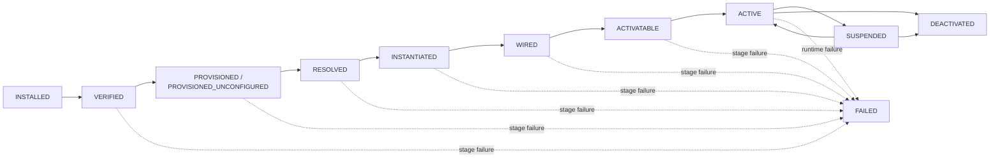

# Application Component Lifecycle and Provisioning Specification

**Status:** Draft public specification  
**Scope:** Technology-neutral lifecycle, provisioning, entitlement, graph eligibility, activation, suspension, unprovisioning, and uninstall semantics for application component architectures  
**Audience:** Core implementers, component/plugin authors, SDK authors, product architects, entitlement-provider authors, and technology-profile authors  
**Companion documents:** `Application-Component-Architecture-Governance.md`, `Application-Component-Architecture-Technical-Notes.md`, `Application-Component-Capability-Contract-Specification.md`, `Application-Component-Upgrade-Transaction-Specification.md`

---

# I. Purpose and Architectural Position

## I.1 Purpose

This specification defines the lifecycle of components and provider instances independently of implementation language or UI technology. It separates package presence, Core-owned provisioning, configuration validity, entitlement, capability graph eligibility, runtime construction, activation, suspension, and removal.

The goal is that Core can always explain *which stage* prevents a component or provider instance from being usable.

## I.2 Relationship to Governance

`Application-Component-Architecture-Governance.md` defines the architectural invariants. This document owns the detailed lifecycle semantics. `Application-Component-Upgrade-Transaction-Specification.md` specializes lifecycle behavior for complete target-state component replacement and rollback. Governance documents SHOULD reference these specifications instead of duplicating lifecycle state machines.

## I.3 Relationship to capability contracts

`Application-Component-Capability-Contract-Specification.md` defines what a capability invocation means after a valid binding exists. This document defines when a provider instance is eligible to become such a binding target and when new invocations may be accepted.

## I.4 Technology neutrality

A Java class-loader profile, Python interpreter profile, process/RPC profile, desktop host, web host, or headless service MAY realize lifecycle stages differently, but MUST preserve the logical ordering and invariants defined here.

---

# II. Lifecycle Domains

## II.1 Package state, persistent state, and runtime state are distinct

Core MUST distinguish at least:

```text
package/distribution state
Core-owned persistent provisioning state
runtime activation state
```

Installing a package MUST NOT imply that it is configured, entitled, resolved, or active. Removing a package MUST NOT by itself imply destructive deletion of preserved semantic data.

## II.2 Component state and provider-instance state

A component package may declare one or more capability provider definitions. Concrete capability bindings target provider instances, not capability provider definitions. Provider-instance lifecycle is therefore independently diagnosable even when all instances originate from one component package.

A capability provider definition may advertise multiple capability/version sets. Provisioning one provider instance creates one configured runtime identity that exposes that whole declared set; Core MUST NOT provision a synthetic provider instance per capability. A concrete instance may also carry an access mode such as `READ_ONLY` or `READ_WRITE`. Access mode is persistent instance configuration and may restrict usable mutation operations without changing the implementation's declared capability interfaces.

## II.3 Core is authoritative

Core owns or coordinates lifecycle transitions that affect persistent identity, graph topology, entitlement eligibility, activation, and destructive removal. Component code may participate through declared schemas, migration/provisioning hooks, and lifecycle callbacks, but MUST NOT silently create an alternative persistent lifecycle outside Core state.

---

# III. Baseline Lifecycle Pipeline

## III.1 Logical stages

The baseline pipeline is:

```text
PACKAGE PRESENT / INSTALLED
        |
        v
DISCOVER
        |
        v
VERIFY
        |
        v
ADMIT CONTRACTS
        |
        v
PROVISION
        |
        v
VALIDATE CONFIGURATION / DATA
        |
        v
EVALUATE ENTITLEMENT
        |
        v
RESOLVE GRAPH
        |
        v
INSTANTIATE
        |
        v
WIRE
        |
        v
ACTIVATABLE
        |
        v
ACTIVATE
        |
        v
RUNNING
```

Shutdown/removal paths add:

```text
SUSPEND -> DEACTIVATE -> optionally UNPROVISION -> optionally UNINSTALL
```

A product may combine implementation steps internally, but diagnostics and conformance MUST preserve the distinction whenever the difference affects correctness.

## III.2 Discovery

Core reads static descriptors without executing arbitrary component business logic. Discovery identifies component identity, capability provider definitions, consumed/provided capabilities, contract bundles, component/provider-instance configuration schemas, Data Entity support declarations/canonical schemas, provisioning declarations, per-provided-capability-version permission vocabulary/possible entitlement licensing scope types, runtime profile, and package provenance metadata when present.

## III.3 Verification

Verification covers package integrity, signatures/trust policy where applicable, descriptor validity, runtime-profile compatibility, and other install-time safety checks. For downloaded packages, the exact bytes that will become installed/admitted MUST be verified immediately before atomic installation/admission; an earlier download-time verification is useful but not sufficient by itself. Verification failure blocks later runtime stages.


### III.3.1 Package-store states

Package storage distinguishes `DOWNLOADED`, `INSTALLED`, and `OBSOLETE`. `INSTALLED` does not mean active: multiple immutable artifacts may coexist physically while replacement candidates are staged, but within one Core-managed runtime/package-selection domain at most one artifact version of a component identity is active/selected. After a successful replacement, the superseded unselected artifact SHOULD move to `OBSOLETE` according to retention policy; rollback/recovery may explicitly restore it.

The host product supplies the filesystem root/layout. AAC recommends `plugins/downloaded`, `plugins/installed`, and `plugins/obsolete` below the product root, but products MAY override those relative names. Durable replacement metadata SHOULD live in a separate Core-owned state area rather than inside immutable package artifact directories.

Immediately before install promotion, the exact temporary-destination artifact bytes MUST be re-verified and then atomically promoted unchanged. An obsolete artifact MUST NOT participate in ordinary automatic selection unless it is explicitly restored first.

## III.4 Contract admission

Any canonical capability contract used across component boundaries MUST be admitted to the Core-owned active contract catalog before implementation classes/endpoints requiring that contract are used. Contract admission is not provider activation.

## III.5 Provisioning

Provisioning creates or reconciles Core-owned persistent state required for the component and its capability provider definitions to participate in the system. Provisioning does not require a non-empty commercial permission set unless the product/component explicitly declares a hard provisioning prerequisite.

## III.6 Validation

Core validates interpretable configuration contributions, normalized effective values, persistent Data Entity compatibility, and component-specific readiness conditions. Unsupported provider contributions are treated as unavailable inputs rather than automatically invalidating the component.

A missing/`UNDEFINED` contextual value does not by itself invalidate an entire component/provider instance. The component/lifecycle contract determines whether that value is optional, whether only one operation/capability becomes `NOT_READY`, or whether the provider instance genuinely cannot become usable.

## III.7 Entitlement evaluation

Core evaluates contextual entitlement before/around activation so the provider receives a validated effective permission context. Ordinary permission sets do not normally participate in provider selection or graph validity; a provider may remain active in free/degraded mode. Explicit hard activation prerequisites, when declared, are evaluated separately.

## III.8 Graph resolution

Core computes provider candidates, applies compatibility, lifecycle/configuration validity and binding policy, selects provider instances, negotiates contract versions, and validates the resulting concrete extension-instance binding graph. Ordinary component-owned permission tiers are not provider-selection criteria. Resolution MUST fail if the concrete graph contains any directed cycle; direct self-binding is the one-node special case of that rule.

## III.9 Runtime construction and activation

Core instantiates runtimes/endpoints only after enough static state is known to do so safely, wires Core-selected bindings, crosses the activation-preparation barrier, then activates the runtime scope. Constructor/bootstrap code SHOULD NOT perform mandatory peer business calls before wiring/readiness is complete.

---

# IV. Lifecycle Entry Points and Bootstrap Hooks

## IV.1 Why lifecycle hooks are not ordinary business capabilities

Provisioning, migration, and early validation may occur before the ordinary capability graph is fully resolved. A component lifecycle hook MUST therefore be reachable through the stable bootstrap/lifecycle interface defined by the active technology profile, not by assuming that arbitrary business capabilities are already callable.

## IV.2 Technology-neutral logical hooks

A technology profile MAY expose logical hooks equivalent to:

```text
provision(context)
validate(context)
instantiate(context)
wire(bindings)
prepare_activation()
activate()
suspend(reason)
deactivate(reason)
unprovision(context)
```

Migration hooks are defined alongside configuration/data schema migration support. Not every component needs every hook. Static declarative schemas and defaults SHOULD be preferred when they are sufficient.

The hook list is intentionally **not** a one-to-one restatement of the complete lifecycle pipeline in III.1. Several stages are authoritative Core operations and therefore do not have an ordinary component callback. In particular, `validate(context)` concerns configuration/data validity and component-specific semantic validation; it MUST NOT be treated as an entitlement decision. Entitlement evaluation is a separate Core-authoritative stage.

### IV.2.1 Relationship between lifecycle stages and hooks

The baseline stages map to technology-neutral hooks as follows:

| Lifecycle stage | Component hook | Meaning |
| --- | --- | --- |
| `PACKAGE PRESENT / INSTALLED` | none | The component distribution is physically available to the application. Installation is package/distribution management, not runtime activation. |
| `DISCOVER` | none | Core reads static descriptors, schemas, capability declarations, capability provider definitions, provisioning declarations, Data Entity support declarations, per-provided-capability-version permission vocabulary/possible entitlement licensing scope types, and entitlement metadata without running arbitrary component business code. |
| `VERIFY` | none | Core verifies descriptor validity, integrity/trust policy, runtime-profile compatibility, signatures where applicable, and other package-level prerequisites. |
| `ADMIT CONTRACTS` | none | Core validates and admits canonical capability contracts into the active Core-owned contract catalog. This stage establishes contract identity; it does not instantiate providers. |
| `PROVISION` | optional `provision(context)` | Core creates or reconciles persistent Core-owned component/provider state. Declarative provisioning is preferred; a hook is used only when additional component-specific initialization is required. |
| `VALIDATE CONFIGURATION / DATA` | optional `validate(context)` | Core performs generic schema/version validation and may invoke component-specific semantic validation. This stage does **not** decide licensing/entitlement and does not select providers. |
| `EVALUATE ENTITLEMENT` | no ordinary component hook | Trusted Core facilities validate scoped entitlement evidence and compute the effective permission/constraint context grouped by provided capability/version and delivered to the provider instance. Ordinary permission tiers do not redefine the capability binding graph. |
| `RESOLVE GRAPH` | none | Core selects concrete provider instances, negotiates contract versions, validates bindings, and verifies that the resolved extension-instance graph satisfies the DAG invariant. Components do not choose their own providers here. |
| `INSTANTIATE` | optional `instantiate(context)` | The runtime representation of the component/provider instance is constructed, but normal business activity has not started. |
| `WIRE` | optional `wire(bindings)` | Core supplies the already-resolved capability bindings/proxies/handles and other wiring required by the runtime instance. Wiring does not permit the component to replace Core-selected bindings. |
| `ACTIVATABLE` | optional `prepare_activation()` | The component performs local post-wiring activation preparation that requires bindings to exist but does not require peers to already be active. Successful return means the instance is safe to activate. |
| `ACTIVATE` | optional `activate()` | The component begins normal operational behavior, such as accepting capability calls, starting listeners/timers, or enabling external side effects according to the technology profile. |
| `RUNNING` | none | Stable operational state after successful activation. Normal capability invocations occur here. |
| `SUSPEND` | optional `suspend(reason)` | The runtime is asked to quiesce or temporarily stop accepting new work while preserving provisioned persistent state and, where practical, enough runtime state for controlled recovery/resume policy. |
| `DEACTIVATE` | optional `deactivate(reason)` | Normal operational behavior stops and transient runtime resources are released. Deactivation does not by itself remove Core-owned persistent provisioning state or semantic data. |
| `UNPROVISION` | optional `unprovision(context)` | Core removes or reconciles provisioned persistent component/provider state after reference and data-safety checks. Unprovisioning is distinct from package uninstall and from explicit Data Entity purge. |
| `UNINSTALL` | none | The component distribution/package is removed from the application installation. Uninstall MUST NOT silently imply destructive deletion of preserved configuration or semantic data unless a separate explicit policy/action authorizes it. |

The mapping above defines **logical responsibilities**, not a mandatory concrete method ABI. A technology profile MAY implement a stage entirely inside Core, by declarative metadata, by generated adapters, or by explicit callbacks, provided the ordering, ownership, and failure semantics remain equivalent.

### IV.2.2 `provision(context)`

`provision(context)` participates in the `PROVISION` stage. Provisioning is the Core-controlled creation or reconciliation of persistent state required for a component or capability provider definition to participate in an application scope. Typical results include Core-owned configuration records, initial provider-instance records with immutable generated IDs, schema/version state, defaults, or migration markers.

Provisioning is distinct from package installation and normally happens much less frequently than runtime startup. A component may be installed but not provisioned, or provisioned but not yet configured, entitled, resolved, or active. The hook SHOULD be omitted when the same result can be expressed declaratively.

#### IV.2.2.1 Declarative provisioning versus a provisioning hook

The `PROVISION` **stage** and the optional `provision(context)` **component callback** are different concepts. Core may execute the `PROVISION` stage even when no component code is called.

Static component metadata SHOULD describe everything that can be provisioned declaratively, including configuration schemas, schema defaults, capability provider definitions, and whether an initial provider instance is required by the component/product profile. Core derives a provisioning plan from that metadata and remains the authority that creates stable provider-instance IDs and commits persistent state.

A component callback is used only when additional component-specific initialization cannot reasonably be expressed by static metadata and generic Core behavior. The component descriptor MUST explicitly declare the presence of such a lifecycle callback using the mechanism defined by the active technology profile. Core MUST NOT discover lifecycle callbacks by executing component code, probing for methods, or assuming that a method named `provision` exists.

Conceptually:

```text
Core reads static component descriptor
        |
        +-- capability provider definitions
        +-- configuration schemas/defaults
        +-- declarative provisioning requirements
        +-- optional lifecycle-hook declarations
        |
        v
Core constructs staged provisioning plan
        |
        +-- creates missing Core-owned records
        +-- generates immutable provider-instance IDs
        +-- applies declarative defaults
        |
        v
provision hook declared?
        |
        +-- no  -> Core validates and commits staged state
        |
        +-- yes -> Core invokes provision(context) against staged state
                   -> validates permitted result/requests
                   -> commits or rolls back as one controlled operation
```

The hook therefore does **not** normally exist merely to return defaults that could have been declared in the configuration schema. It is reserved for initialization that genuinely requires component-specific logic, such as importing existing external configuration, deriving an initial value from an allowed environment probe, or requesting creation of additional framework-managed state through approved provisioning primitives.

#### IV.2.2.2 Concrete provisioning example

Consider a Git repository provider. The following is conceptual metadata; the exact descriptor syntax for declaring a lifecycle entry point is technology-profile-specific:

```yaml
provider_definitions:
  - id: git-repository
    configuration_schema: git-repository-config_1

    provisioning:
      initial_instance:
        create: true
        name: default

# Optional. Omit this entire declaration when declarative provisioning is sufficient.
lifecycle:
  hooks:
    provision:
      entry_point: provision
```

The configuration schema may declare defaults:

```yaml
id: git-repository-config
version: 1
properties:
  repository_url:
    type: string
    required: true

  branch:
    type: string
    default: main

  timeout_seconds:
    type: integer
    default: 30
```

On first provisioning Core can therefore stage an instance such as:

```yaml
id: "798852dd-..."       # generated by Core
name: default             # mutable display name, not identity
provider_definition: git-repository
configuration:
  branch: main
  timeout_seconds: 30
```

Because `repository_url` is still missing, the instance may remain conceptually:

```text
PROVISIONED_UNCONFIGURED
```

and is not yet an eligible provider candidate. Core does not need to call component code to obtain the `main` or `30` defaults because those values are already declarative.

If the descriptor does **not** declare a provisioning hook, Core completes provisioning using the staged declarative state only. If it **does** declare one, Core invokes the technology-profile entry point after preparing the staged state. The hook receives a restricted provisioning context and may request only operations allowed by that context. It MUST NOT invent hidden provider-instance identities, directly write Core persistence, or bypass schema/reference validation.

For example, a Git component might use a provisioning hook to detect and propose import of a pre-existing repository configuration from an explicitly permitted external source. Core would validate that proposal and decide what state to commit. Merely supplying schema defaults is not a sufficient reason to require the hook.

#### IV.2.2.3 Reconciliation on later provisioning passes

Provisioning is not necessarily a one-time create operation. When a component version, schema, product profile, or required framework state changes, Core may run a reconciliation pass that compares the desired provisioned state with the current persisted state. Reconciliation MAY create newly required framework-owned records or execute explicitly defined migrations, but it MUST preserve user-controlled configuration/data unless an explicit migration or user-approved destructive operation says otherwise.

### IV.2.3 `validate(context)`

`validate(context)` participates in `VALIDATE CONFIGURATION / DATA`. Core first performs generic validation that it can derive from schemas and stored version metadata. The optional hook is for additional component-specific semantic checks that cannot be expressed by the generic schema alone.

Validation answers questions such as whether required configuration/data is structurally and semantically usable by the installed component version. It MUST NOT:

- decide whether commercial/product entitlement is valid;
- choose or replace provider bindings;
- activate runtime behavior;
- silently mutate authoritative persistent state outside an explicit migration/provisioning transaction.

Entitlement is deliberately evaluated in the separate `EVALUATE ENTITLEMENT` stage after configuration/data validity is known.

### IV.2.4 `instantiate(context)`

`instantiate(context)` participates in `INSTANTIATE`. It creates the technology-specific runtime object, interpreter endpoint, process endpoint, service object, or equivalent implementation for **one concrete provisioned provider instance**.

Instantiation MUST NOT be treated as activation. The resulting runtime may exist before bindings are injected and before normal capability calls are permitted. Constructors/factories SHOULD avoid mandatory peer business calls.

For the baseline `PROCESS` runtime profile, `INSTANTIATE` starts and bootstraps one persistent child process for the provider instance. Core owns the process handle and IPC channel. The runtime receives the normalized effective `COMPONENT` configuration for its component (when declared) and the normalized effective `PROVIDER_INSTANCE` configuration for that concrete immutable instance as separate configuration objects. Core does not merge one target into the other. A second provider instance, even of the same capability provider definition, receives a different process and independent provider-instance configuration/lifecycle while observing the same applicable component-target configuration for that application context.

### IV.2.5 `wire(bindings)`

`wire(bindings)` participates in `WIRE`. Core supplies the concrete bindings already selected during `RESOLVE GRAPH`, together with the negotiated contract versions and technology-specific invocation handles/proxies.

The component consumes the supplied topology; it does not perform provider discovery or substitute a different provider behind Core's back. Any persistent topology change requires a new Core-mediated resolution.

For an out-of-process runtime, the injected handle is represented inside the child process by a local proxy. Invoking that proxy sends a normalized request back to Core, which invokes the already-resolved target provider instance. The child process therefore never needs unrestricted knowledge of Core's endpoint registry or of other child processes.

### IV.2.6 `prepare_activation()`

`prepare_activation()` participates in the lifecycle `ACTIVATABLE` barrier. It allows the runtime to complete and verify local initialization and wiring before activation. Typical work includes validating that mandatory injected bindings are present, building local in-memory structures derived from normalized configuration, or preparing resources that do not expose the component as operational yet.

Lifecycle `ACTIVATABLE` is distinct from operational readiness state `READY` defined by the Application Component Readiness Specification. `ACTIVATABLE` means only that the runtime is safe to activate; immediately after activation the same instance MAY report operational readiness `READY`, `DEGRADED`, or `NOT_READY` without changing its lifecycle activation state.

`prepare_activation()` MUST NOT require a dependency to already be in `ACTIVE/RUNNING` merely to complete activation preparation. Normal peer business activity begins only after the relevant activation/readiness policy allows it.

### IV.2.7 `activate()`

`activate()` performs the transition from `ACTIVATABLE` to operational service. Depending on the technology/profile, activation may start listeners, schedulers, watchers, background tasks, external subscriptions, or otherwise permit normal capability invocation.

Successful activation places the runtime in `RUNNING`. Failure remains an activation failure and MUST NOT be reported as successful graph resolution or successful provisioning.

### IV.2.8 `suspend(reason)`

`suspend(reason)` requests a controlled temporary quiescence, for example because entitlement was lost, an administrative operation requires maintenance, or a runtime dependency became unavailable under product policy.

Suspension SHOULD stop admission of new work and allow in-flight work to reach a policy-defined safe boundary when practical. It does not delete persistent component/provider state. A product profile defines whether and how a suspended runtime may later resume without full re-instantiation.

### IV.2.9 `deactivate(reason)`

`deactivate(reason)` stops normal runtime behavior and releases transient operational resources. It may close listeners, stop timers/workers, disconnect runtime clients, flush non-authoritative buffers, and relinquish runtime handles.

Deactivation is not unprovisioning: Core-owned persistent configuration, provider-instance identity, bindings/configuration records, and preserved semantic data remain unless a later explicit lifecycle operation changes them.

### IV.2.10 `unprovision(context)`

`unprovision(context)` participates in `UNPROVISION`. It is the controlled inverse of provisioning for a particular application scope: Core removes or reconciles persistent state that existed because the component/provider was provisioned.

Before destructive changes, Core MUST check bindings, references, Data Entity references/support, and product retention policy. Unprovisioning MUST NOT silently purge authoritative Data Entity/project data merely because a package or provider instance is being removed. Package uninstall is a separate operation that may occur before or after preserved data is explicitly handled according to policy.

## IV.3 Core-mediated provisioning context

A provisioning hook MUST receive a Core-controlled context rather than unrestricted authority over Core persistence. The context may expose the component/provider namespace, staged configuration/data, diagnostics, and approved mutation primitives. Core remains responsible for validation, commit/rollback, stable identity, and reference integrity.

A hook MUST NOT create hidden provider-instance IDs, persist private binding topology, or bypass Core-owned configuration/data stores.

## IV.4 Entitlement is not a component self-check hook

Ordinary component implementation code MUST NOT establish entitlement authority through a private self-check such as `isLicensed() -> boolean`.

Instead, a component descriptor declares the entitlement licensing-scope types used by the component and each provided capability version declares its permission vocabulary plus `possible_licensing_scopes`. Trusted Core facilities validate entitlement evidence and deliver the resulting effective permission/constraint context grouped by provided capability/version to each provider instance. The provider interprets those permission identifiers for its own business operations.

## IV.5 Pluggable entitlement-providers and licensing-scope resolvers

Entitlement evidence MAY be supplied by multiple trusted entitlement-providers so products can combine signed local licenses, multi-component plugin-bundle licenses, user/workspace/repository/customer grants, remote services, offline leases, or test providers.

Licensing-scope types are an open component contract rather than a Core enum. The descriptor declaration provides display/semantic metadata; a registered entitlement licensing-scope resolver independently derives a trusted concrete subject from current product state. The declaring component and resolver need not be the same component. Local/remote is an entitlement-provider transport characteristic and is not a licensing scope.

Entitlement-providers and licensing-scope resolvers are part of a trusted bootstrap/context path and MUST NOT recursively depend on the entitlement result they establish. Issuer signature verification and issuer authorization remain separate. Product bootstrap MAY register providers, licensing-scope resolvers, issuer rules, and evidence-verifier bindings.

## IV.6 Bootstrap authentication dependencies

Authentication required before ordinary configuration resolution MUST be established from fixed product/bootstrap state and bootstrap-safe secret providers. Lifecycle construction MUST NOT create a dependency cycle in which an authentication credential is obtainable only from the remote provider whose authentication requires that credential.

Transport authentication and Core authorization remain distinct lifecycle concerns: successful login to a remote configuration service does not authorize the current application principal to mutate configuration or policy.

## IV.7 Hook failure semantics

Lifecycle hook failures MUST be attributed to the relevant lifecycle stage. Core SHOULD execute state-changing hooks transactionally, against staging state, or with an explicit recovery protocol. A failed hook MUST NOT leave Core claiming that a later lifecycle stage completed successfully.

---

# V. Provisioning Model

## V.1 Core-owned provisioning state

Provisioning MAY create:

- component-level configuration records;
- provider-instance records;
- configuration/data schema state;
- default values declared by schemas;
- migration markers;
- Core-owned binding placeholders or diagnostics.

A component MUST NOT create hidden persistent provider instances outside Core.

## V.2 Initial provider instance

When an enabled capability provider definition has no explicit instance and its component descriptor or the active product profile requires an initial instance, Core creates one using a Core-generated globally unique immutable ID.

The initial display name MAY be:

```text
default
```

but the name has no identity or binding semantics and MAY be changed. All persistent references use the instance ID.

## V.3 Unconfigured state

Provisioning an instance does not guarantee readiness. Effective configuration may contain `UNDEFINED` values because no usable contribution/default exists, including when a provider contribution is unsupported by the active component.

A component SHOULD express the narrowest readiness impact possible:

```text
component active, optional feature unavailable
provider instance present, one operation NOT_READY
provider instance PROVISIONED_UNCONFIGURED when essential initialization data is absent
```

`PROVISIONED_UNCONFIGURED` is therefore reserved for cases where the provider instance genuinely cannot provide its advertised capability safely. Missing one non-essential setting MUST NOT automatically make the whole instance ineligible.

Operational readiness after wiring/initialization is governed by `Application-Component-Readiness-Specification.md`. Lifecycle `ACTIVE` and readiness are independent: a provider may remain active while its readiness is `DEGRADED` or `NOT_READY`, allowing unrelated capability scopes and future recovery to continue. Core SHOULD evaluate declarative configuration/context readiness requirements against the effective resolved values and MAY combine them with a runtime-reported readiness result.

## V.4 Provisioning idempotence and recovery

Provisioning and migration steps SHOULD be idempotent or transactionally/recoverably orchestrated by Core. A failed provisioning attempt MUST NOT leave an instance appearing ready when persistent state is incomplete.

## V.5 Unprovisioning

Unprovisioning is a potentially destructive Core-owned operation. Core MUST detect bindings and persistent references to affected instances and data before destructive removal. Package uninstall and data purge are distinct actions.

---

# VI. Entitlement and Licensing

## VI.1 Separation from technical compatibility

Technical compatibility, configuration validity, capability binding, and entitlement are distinct. A technically compatible provider may have an empty/minimal entitlement permission set and still remain active in a free/degraded mode.

## VI.2 Effective entitlement context

Core evaluates trusted entitlement evidence and supplies each provider instance an effective context containing, for each provided capability/version, capability-owned permission identifiers, constraints, provenance, and effective validity/expiry metadata. One entitlement evidence document may bundle grants for multiple components; Core validates the document-level issuer/scope/subject once as applicable, validates every component entry, and supplies each runtime only the effective rights relevant to its component/capabilities. A component entry for a component not yet installed/admitted remains dormant/preserved; it does not prevent other component entries in the same verified bundle from contributing rights.

Conceptually:

```text
capabilities:
    <capability-id>/<capability-version>:
        permissions:
            <permission-id>:
                effective_valid_from / effective_valid_until
                constraints
                provenance: entitlement-provider / entitlement licensing scope subject / grant
```

Entitlement is not reduced to `ALLOWED/DENIED` for the whole provider unless the product/component explicitly declares a hard activation prerequisite.

## VI.3 Capability permission vocabulary and entitlement licensing scopes

The component descriptor declares each entitlement licensing-scope type used by the component, with optional display name/description/resource keys and metadata. Provided capability versions MAY then declare permission metadata and reference those types through `possible_licensing_scopes`. An empty set means the permission requires no external entitlement evidence.

Core validates that every referenced current licensing-scope type has a component declaration. Product/runtime support for a type supplies a registered resolver and trusted concrete subject identity; it does not itself make that scope possible for a permission. Product policy may narrow applicability but cannot broaden the descriptor contract.

Permission identity is `(component_id, capability_id, capability_version, permission_id)`. Core aggregates overlapping valid grants per identity and re-evaluates/pushes entitlement contexts at expiry, revocation, refresh, or application-context changes.

## VI.4 Entitlement-providers

Evidence may come from local signed licenses, multi-component plugin-bundle licenses, user/workspace/source-repository/customer grants, subscription services, offline lease caches, or test/development entitlement-providers. Provider transport may be local or remote; `REMOTE` is not an entitlement licensing scope.

Entitlement facilities participate through a trusted bootstrap path. Product bootstrap structures used to register entitlement-providers, licensing-scope resolvers, evidence verifiers, issuers, and trust roots conform to fixed product-supplied schemas. They do not define or extend the licensing-scope types accepted by a capability; those are component descriptor contract data.

## VI.5 Resolver-defined licensing-scope identity continuity

A licensing-scope resolver is responsible for deriving the concrete subject from current state and for defining what preserves subject identity. `WORKSPACE` may be database-backed and need no VCS. `SOURCE_REPOSITORY` may instead represent repository lineage and use VCS-specific historical evidence. Core does not hard-code either identity algorithm.

Identity continuity is not guaranteed to provide perfect offline anti-cloning DRM. Products may combine resolver evidence with online leases, account/device enrollment, limits, or audits when needed. Use entitlement and package-download authorization remain distinct.

## VI.6 Graph eligibility and runtime authorization

Ordinary component-owned permission changes do **not** redefine capability contract identity and SHOULD NOT invalidate an otherwise compatible binding. Consumers bind to capability/version, not to provider-specific license tiers.

Provider operations may reject execution through the standardized `PERMISSION_DENIED` capability error according to the current effective entitlement context.

A product MAY support an explicit hard activation entitlement prerequisite for components that cannot offer any meaningful unentitled mode, but this is distinct from normal per-operation permission semantics.

## VI.7 Dynamic revalidation and delivery

Core MUST support policy-driven refresh/revalidation while a provider instance is running and MUST deliver the updated effective entitlement context through a Core-controlled context/lifecycle update path.
 Core SHOULD schedule revalidation at the earliest known future grant transition and MAY also revalidate on provider change notifications, revocation signals, explicit refresh, or application-context changes.

A provider may change its permitted behavior immediately after such an update without graph re-resolution. If the implementation requires restart for a context change, it must declare/return that requirement explicitly.

## VI.8 Core-mediated permission remediation

All capability invocation is Core-mediated. If a provider returns standardized `PERMISSION_DENIED`, Core MAY invoke a product entitlement-remediation flow (refresh, login, purchase, accept workspace grant, etc.), update the provider entitlement context, and retry the invocation only when retry safety is established.

The provider SHOULD perform permission checks before externally visible side effects whenever possible and report a retry disposition equivalent to:

```text
SAFE_AFTER_ENTITLEMENT_CHANGE
DO_NOT_RETRY
```

Without explicit retry safety Core MUST NOT silently repeat the operation.

# VI.A. Component Authorization Admission

## VI.A.1 Requested authority is declarative

A consumer requirement may declare `requested_authorizations` belonging to the canonical authorization vocabulary of the capability version it consumes. This is independent of entitlement metadata.

During admission/resolution Core MUST validate requested identifiers against the negotiated/admitted capability contract. Invalid identifiers are descriptor/contract errors.

## VI.A.2 Grant is separate from request and binding

The request is not a grant. Product/system policy, administrator approval, trusted installation policy, or built-in-product trust determines the granted subset. The grant is persisted against the concrete consumer instance/requirement so changing a binding does not silently invent additional authority.

A component MUST NOT receive permissions it did not request.

## VI.A.3 Invocation check

Before dispatching a protected operation, Core checks canonical `all_of`/`any_of` requirements against the component grant and, if configured, current-principal authorization. Denial occurs before provider business logic.

## VI.A.4 Built-in product components

Trusted built-in product components enter the same lifecycle after product bootstrap/admission. Product policy MAY pre-approve their requested authorization permissions, but their cross-component calls still use Core capability handles so observation and current-principal checks remain consistent.

# VII. Binding and Graph-Safety Rules

## VII.1 Resolved extension-instance graph is acyclic

Concrete Core-resolved bindings among extension provider/runtime instances MUST form a directed acyclic graph. Core MUST reject a proposed resolution if any binding would introduce a directed cycle.

A direct self-binding is the degenerate one-node cycle and is therefore invalid automatically.

```text
A1 -> A1                    INVALID
A1 -> B1                    potentially valid
A1 -> B1 -> A1              INVALID
A1 -> B1 -> A2              potentially valid
```

## VII.2 Declarative cycles remain legal

Component/provider-definition declarations are not the runtime instance graph. A component A may declare `provides X / consumes Y` while component B declares `provides Y / consumes X`. This is allowed.

If instance selection produces:

```text
A1 -> B1
B2 -> A2
```

the concrete graph is acyclic and valid. If it produces `A1 -> B1 -> A1`, resolution fails.

## VII.3 Cycle validation and diagnostics

DAG validation MUST occur before normal runtime activation. Core SHOULD report:

- the concrete provider-instance IDs and names participating in the cycle;
- the capability requirement corresponding to each edge;
- the binding source or selection rule that chose each edge;
- enough information for an administrator to select a different provider instance.

Products MAY later define an explicit advanced profile that permits carefully constrained cycles, but such behavior is outside the baseline specification.

## VII.4 Foundational Core facilities

A product may expose foundational Core-owned services during bootstrap/pre-resolution. Such services are not ordinary extension provider-instance nodes in the extension-instance DAG. A product/runtime profile MUST explicitly define this bootstrap boundary rather than implicitly bypassing cycle checks.

## VII.5 Observation-delivery exclusion remains necessary

Generic observation MUST exclude `_AAC.capability.observation` delivery calls themselves. This remains an explicit meta-capability safety rule and prevents observation from recursively generating observation events through the framework's own dispatch path.

## VII.6 Binding changes

Persistent topology changes are Core-owned. A component MUST NOT silently replace its provider binding in response to runtime state, entitlement failure, or local discovery. Core may re-resolve according to explicit policy, MUST preserve the DAG invariant, and must expose the reason/source of the new binding.

# VIII. Runtime States and Transitions

## VIII.1 Recommended diagnosable states

Products MAY choose different serialized names, but administration/runtime diagnostics SHOULD distinguish states equivalent to:

```text
INSTALLED
VERIFIED
PROVISIONED_UNCONFIGURED
PROVISIONED
RESOLVED
INSTANTIATED
WIRED
ACTIVATABLE
ACTIVE
SUSPENDED
FAILED
DEACTIVATED
```

A single opaque `enabled/disabled` flag is insufficient as the sole lifecycle model.

The normal forward runtime path and the principal side states are conceptually:



The diagram is diagnostic rather than a mandate for one serialized state machine; products may refine transitions while preserving the lifecycle distinctions defined by this specification.

## VIII.2 Suspension

Suspension means a previously activatable/active scope is temporarily unavailable because of entitlement, policy, dependency, health, or administrative state while persistent identity/configuration is retained.

## VIII.3 Deactivation

Deactivation stops normal runtime participation without necessarily unprovisioning persistent state. Re-activation may therefore be possible without recreating identities.

## VIII.4 Failure attribution

Core SHOULD attribute failure to the stage that failed:

```text
verification
contract admission
provisioning/migration
configuration validation
entitlement
resolution
instantiation
wiring
readiness
activation
runtime
```

This is essential for actionable diagnostics.

---

# IX. Upgrade, Downgrade, and Migration

## IX.1 Versioned persisted data

Configuration and Data Entities use canonical schema identities/versions that are independent from component package versions. Every canonical JSON Schema self-identifies; filenames are only resource locations.

Configuration retains one declared current write version. Data Entity support declares `readable_versions`, `writable_versions` and `preferred_write_version`, allowing a newer component to continue writing an older common representation during rolling rollout.

## IX.2 Complete target-state replacement flow

An upgrade is a replacement transaction from one complete active component state to another. One transaction MAY replace one component or multiple components. The runtime MUST NOT require each arbitrary sequential intermediate combination to be valid; compatibility is evaluated against the complete requested target state.

Before deactivation of the current runtime or mutation of authoritative persisted state, Core performs target-state preflight:

```text
construct target component set by applying all replacements
rebuild target active contract catalog from that target set
validate canonical contract conflicts/admission
resolve all mandatory target provider/consumer requirements
validate target provider-instance reconciliation
evaluate target data_entity_support and mandatory data_entity_requirements
classify affected persisted inputs as DIRECT / TRANSFORMED / UNSUPPORTED
resolve target configuration/context using usable contributions
assess target readiness/degradation
```

Persisted schema version, runtime interpretation, migration-path availability, and persistence convergence are independent facts. A persisted representation that is not at the target/preferred write schema may still be read `DIRECT`; a migration path may exist without being required for runtime use.

For `TRANSFORMED` inputs, Core invokes component-supplied transformations **in memory** and validates the normalized representation before the commit boundary. This preflight MUST NOT require provider/store write capability and MUST NOT rewrite authoritative persisted data.

`UNSUPPORTED` inputs are preserved unchanged and treated as unavailable semantic input. They do not automatically fail preflight. Configuration resolution continues through other usable contributions/defaults and may yield `UNDEFINED`; Data Entity functionality may be degraded/unavailable while the stored record remains intact.

If preflight is structurally invalid or violates an explicitly required target readiness policy, the current active state remains unchanged. Diagnostics SHOULD identify blockers and degradation so an administrator can add further replacements or repair/upgrade external configuration/data support where useful.

After successful preflight, Core MAY execute implementation steps sequentially, but activation is one logical cutover to the complete target state. The target becomes authoritative only when commit succeeds. Persistent implementations SHOULD journal the source/target transaction plan before cutover and atomically replace one authoritative complete active-set manifest at commit. A restart before that durable marker restores source Core-owned state; a restart after it keeps the target and finishes cleanup forward. Detailed replacement semantics are specified by `Application-Component-Upgrade-Transaction-Specification.md`.

## IX.3 Runtime interpretation is independent from persistence convergence

For both configuration and Data Entities, Core classifies a stored representation as `DIRECT`, `TRANSFORMED`, or `UNSUPPORTED`.

`DIRECT` includes readable older versions. `TRANSFORMED` requires an explicit side-effect-free migration path. `UNSUPPORTED` data are not guessed at, truncated, implicitly downgraded, or rewritten.

A migration path may exist even when direct reading is possible; this makes later persistence convergence optional rather than a prerequisite for activation.

For configuration, `UNSUPPORTED` contributions are omitted from value/policy resolution and fallback continues through other providers/defaults/`UNDEFINED`. For Data Entities, the record is preserved but semantic functionality that cannot interpret it observes it as unavailable. `UNSUPPORTED` does not change the record's `ACTIVE`/`TOMBSTONE` state.

## IX.4 Data Entity compatibility graph

Target preflight evaluates each component's `data_entity_support` and mandatory `data_entity_requirements` against the target canonical schema registry/component set. A component that requires a Data Entity schema/version that the target system cannot support must receive a blocking compatibility diagnostic for the affected target state/functionality when the requirement is mandatory.

Concrete Data Entity references are not descriptor dependencies. They are declared on payload fields through `x-aac-data-entity-reference` and are resolved against concrete datasource content at runtime.

## IX.5 Migration execution and persistence convergence

Semantic migration code transforms normalized data and returns normalized output. It MUST NOT mutate persistence directly.

For configuration, Core may later converge a writable provider through its established revision/CAS contract. A read-only/no-CAS provider may remain indefinitely at an older/non-target representation. Convergence failure is independently retryable and MUST NOT roll back an already committed component set or another provider's successful convergence.

For Data Entities, Core migration preserves logical UID, persistence revision as source concurrency context, and `ACTIVE`/`TOMBSTONE` state while producing the target semantic payload. Physical Data Entity reads and direct mutations are delegated to the framework Data Entity storage capabilities (`get-record`, `query-records`, `apply-direct-record-changes`); physical support reconciliation uses `inspect-storage-support`, `ensure-storage-support`, and `retire-storage-support`. Complex indirect split/merge mutation remains deferred to a future explicit capability. This lifecycle specification MUST NOT invent a filesystem- or SQL-specific mutation path.

During replacement preflight and tentative activation automatic persistence convergence is suppressed, so a failed tentative cutover can restore the previous runtime without requiring distributed rollback of independent configuration/data stores.

## IX.6 Configuration migration

Configuration transformation MUST preserve both ordinary values and policy modes when a transformation is actually performed. If the active component reads a representation `DIRECT`, no runtime migration is required. If interpretation is `TRANSFORMED`, Core supplies the validated in-memory representation. If interpretation is `UNSUPPORTED`, that contribution is excluded from effective resolution.

The effective configuration then continues through other providers/defaults/schema defaults and may yield `UNDEFINED`. Components MUST define safe behavior for unavailable/undefined values and SHOULD reduce readiness as narrowly as possible rather than treating every missing contextual value as fatal.

## IX.7 Data Entity migration and structural domain migration

A simple Data Entity migration transforms one schema version/payload into another while preserving logical `(schema_id, uid)`. More complex product/domain migrations may split one entity into several, merge several into one, generate new UIDs, or reorganize relationships.

AAC does not infer such structural transformations from schema differences. They require explicit domain migration logic and, once storage mutation is standardized, an appropriate transactional record changeset.

Unknown/unsupported Data Entities MUST NOT be silently lost merely because the current component set cannot interpret them.

## IX.8 Rolling rollout

A target fleet may temporarily constrain the effective Data Entity write version below a component's `preferred_write_version` when older required clients remain. Once all required participants support the newer representation—or an administrator explicitly retires incompatible participants—the effective policy may cut over and migration may proceed lazily or explicitly.

This specification defines semantic support metadata but not the fleet-participant registry or storage mutation APIs used by that future coordination.

## IX.9 Unsupported newer data

If persisted configuration or Data Entities use a schema version the installed component cannot safely interpret, Core MUST preserve the persisted input and prevent incompatible rewriting. No implicit downgrade, partial interpretation, truncation, normalization, or guessed semantics are permitted.

Unsupported newer data MAY cause degraded or `NOT_READY` functionality, but MUST NOT by itself force Core startup failure or automatic deactivation of the entire component unless a declared mandatory readiness invariant depends on that data.

## IX.10 Downgrade and component-transaction rollback

Immediate rollback of a failed tentative cutover restores the previous component/runtime state. During tentative activation automatic persistence convergence is suppressed, so independent configuration/Data Entity providers normally require no rollback. After abrupt process/host termination, startup recovery uses the durable complete active-set commit marker rather than guessing from partially completed filesystem/runtime steps.

A later downgrade after a successful cutover is a **new replacement transaction**. The earlier transaction is closed after commit rather than remaining as a long-lived rollback state.

The downgrade target evaluates current persisted data using the same rules as any other activation:

```text
DIRECT       -> use semantic input
TRANSFORMED  -> normalize in memory and use it
UNSUPPORTED  -> preserve input, treat it as unavailable, continue fallback/degradation
```

Newer stored schemas therefore do not automatically make downgrade impossible. The downgrade is rejected only for a genuine target graph/cutover/readiness incompatibility. Retained old package bytes in `obsolete` make the artifact available for consideration; they do not recreate the historical effective configuration or historical Data Entity state.

## IX.11 Entitlement changes are not migrations

Losing entitlement does not authorize destructive configuration or Data Entity migration, tombstoning, deletion, or purge. Persistent state remains preserved unless a separate explicit lifecycle operation requires modification.

# X. Uninstall and Data Preservation

## X.1 Uninstall is not purge

Removing a component package may leave configuration and component-related Data Entities preserved so that:

- VCS/project meaning is not silently lost;
- reinstalling a compatible component can restore functionality;
- a newer/older machine can preserve data it cannot currently interpret.

## X.2 Explicit purge

Permanent deletion of component-owned semantic data, component-target configuration, or provider-instance-target configuration SHOULD require an explicit Core-mediated purge/unprovision operation with reference checks and diagnostics.

---

# XI. UI and Administrative Requirements

A Core administration UI SHOULD be able to expose separately:

```text
package downloaded/installed/obsolete state
active package version/digest
replacement-transaction/preflight state
verification state
provisioning state
configuration validity
entitlement state and reason
provider instances and stable IDs
resolved bindings
selected contract versions
runtime activation state
provider/capability/component readiness state
structured readiness reasons
last failure stage
```

This model applies equally to desktop, web, CLI, and headless administration surfaces. The normalized administration contract is specified in `Application-Component-UI-Specification.md`; UI submission never bypasses Core lifecycle, schema validation, entitlement, reference, or graph rules.

---

# XII. Conformance Requirements

Conformance suites SHOULD cover at least:

- installation without activation;
- provisioning with generated stable provider-instance GUIDs;
- initial instance with mutable display name;
- unconfigured instance excluded from provider candidates;
- allowed/denied/expired/unknown entitlement;
- contextual entitlement refresh and permission-remediation behavior;
- entitlement loss while running;
- preservation of in-flight operation semantics under ordinary entitlement expiry;
- direct self-binding rejection as a one-node cycle;
- same implementation with A -> B binding allowed;
- concrete provider-instance cycle rejection and diagnostic cycle paths;
- observation-delivery exclusion;
- failed provisioning rollback/recovery;
- single-component replacement as a one-item transaction;
- multi-component replacement whose sequential intermediate states are invalid but whose complete target state is valid;
- target active contract-catalog rebuild when a replaced component supplied contract bundles;
- target-state rejection without live-state mutation;
- rollback of package/component selection, admitted metadata, provider topology/bindings, and runtime after failed tentative activation;
- successful component replacement followed by configuration convergence failure without component rollback;
- read-only and temporarily unavailable providers remaining on older schemas while runtime uses validated on-the-fly normalization;
- upgrade/downgrade migration;
- uninstall without Data Entity purge;
- explicit purge/reference protection;
- ACTIVE provider with NOT_READY functionality remaining activated while independent functionality can continue;
- declarative configuration/context readiness satisfied by explicit/default values and reduced by UNDEFINED;
- runtime DEGRADED readiness combined with declarative readiness;
- target replacement preflight exposing readiness warnings without treating them as structural blockers by default.

---

# XIII. Architectural Invariants

1. **Installation, provisioning, entitlement, resolution, and activation are different states.**
2. **Core owns persistent provider-instance identity and lifecycle topology.**
3. **Provisioning may exist without entitlement or activation.**
4. **An unconfigured instance is not an eligible provider candidate; ordinary missing permission tiers do not by themselves invalidate the binding.**
5. **Provided capability versions declare permission vocabulary/possible entitlement licensing scope types; entitlement documents may bundle multiple component entries, and Core validates/aggregates applicable evidence into dynamic effective permission contexts grouped by component/capability/version.**
6. **Consumers bind to capability/version, not to provider-specific entitlement tiers; operation authorization is runtime provider semantics over a Core-validated permission context.**
7. **A provider-instance-scoped requirement never binds to that same provider instance.**
8. **Distinct instances of the same implementation may bind to one another.**
9. **The resolved extension provider-instance binding graph is a DAG; declarative component/provider-definition cycles remain allowed.**
10. **`_AAC.capability.observation` delivery calls remain excluded from generic observation as a dedicated meta-capability safety rule.**
11. **Entitlement loss does not imply data deletion.**
12. **Uninstall does not imply purge.**
13. **Core should attribute lifecycle failures to the stage in which they occur.**
14. **The lifecycle model is technology- and presentation-host-independent.**
15. **At most one artifact version of a component identity is active/selected in one Core-managed runtime/package-selection domain.**
16. **Upgrade/downgrade is complete-state replacement; one transaction may replace multiple components and intermediate states need not be valid.**
17. **Persistent replacement uses a durable complete active-set commit marker and startup recovery; pre-commit interruption restores source state, post-commit interruption completes target cleanup.**
18. **The target contract catalog and provider/consumer graph are rebuilt/validated before live-state mutation.**
19. **Persisted contributions are classified as DIRECT / TRANSFORMED / UNSUPPORTED; unsupported inputs are preserved and may yield fallback/UNDEFINED/degraded readiness, while physical schema convergence remains independent retryable post-cutover work.**
20. **Lifecycle activation is distinct from READY / DEGRADED / NOT_READY operational readiness, which is reported at the narrowest practical provider/capability scope with structured reasons.**
21. **A non-READY readiness result does not by itself deactivate the component; product policy may impose stricter minimum readiness for a deployment/operation.**
