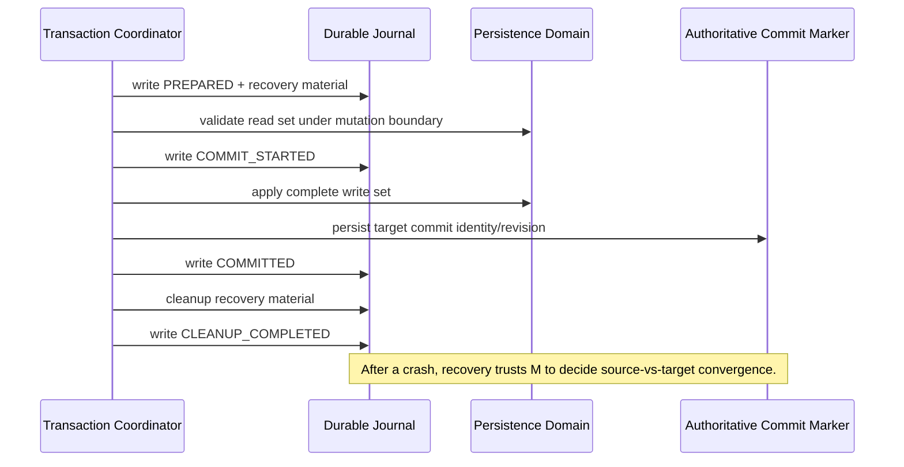

# Application Component Persistence and Transaction Specification

## I. Scope

This specification defines the generic AAC persistence/concurrency contract for mutable persisted state. It is technology-neutral and applies to Core-owned state and to provider/store persistence contracts that participate in AAC optimistic concurrency.

Immutable distribution/content documents such as component descriptors, capability contracts, catalog documents and signed entitlement documents are not mutable persistence records merely because they may be cached locally. A cache record may be mutable; the immutable document inside it remains content data.

## II. Persistent record model

Every mutable AAC persisted record MUST expose a persistence-owned `record_revision` together with its component/Core-owned payload.

The revision is metadata of the persistence envelope, not a field owned by the component payload. Components MUST NOT need to understand or increment it.

The representation type and semantics of `record_revision` are declared by the record schema or persistence contract. They are not repeated as type metadata in each record.

AAC baseline revision representations are:

```text
MONOTONIC_INTEGER
OPAQUE_STRING
```

Core-owned filesystem persistence SHOULD use `MONOTONIC_INTEGER`. External providers MAY use `OPAQUE_STRING`, for example to carry an HTTP ETag, database row token, Git object identifier or another provider-defined concurrency token.

AAC treats a revision as an opaque equality token at the generic API boundary. Generic Core code MUST NOT assume that an arbitrary provider revision supports arithmetic, ordering, timestamps or wall-clock comparison.

## III. Optimistic concurrency

A mutable record read returns conceptually:

```text
payload + record_revision
```

A conditional write supplies the revision against which the new value was computed:

```text
write(expected_record_revision, new_payload)
```

A provider/store MUST reject the mutation without changing the record if the expected revision no longer matches the authoritative revision.

Creation is the analogous compare-with-absence operation. A caller that requires a record to remain absent until commit MUST express that expectation explicitly rather than relying on a stale earlier read.

Deletion of an existing mutable record MUST likewise be conditional on the revision observed by the caller when correctness depends on the prior value.

## IV. Persistence capabilities

A persistence domain declares the strongest mutation semantics it actually guarantees. AAC baseline capabilities are:

```text
READ
SINGLE_RECORD_CAS
MULTI_RECORD_TRANSACTION
```

`READ` exposes records and their revisions.

`SINGLE_RECORD_CAS` guarantees conditional mutation of one record against its expected revision.

`MULTI_RECORD_TRANSACTION` guarantees that one mutation may validate an entire read set and atomically commit its complete write set within that persistence domain, or change nothing.

A read-only provider exposes only `READ`.

A product/Core MUST NOT infer multi-record or multi-provider atomicity from several independent `SINGLE_RECORD_CAS` operations.

## V. Read set and write set

A transaction may depend on records it does not itself change. Therefore AAC transactions distinguish:

```text
read set
write set
```

Each read-set entry identifies a record and either:

- the `record_revision` that MUST still be current at commit time; or
- an explicit expectation that the record remains absent.

Before the first authoritative mutation, the transaction implementation MUST revalidate every read-set expectation under the persistence-domain mutation lock/transaction boundary. If any expectation fails, the transaction MUST abort without applying any member of its write set.

The write set defines the records created, replaced or deleted by the transaction. Writes MUST use the same conditional-concurrency semantics and MUST NOT silently overwrite a newer revision.

This allows a transaction such as:

```text
read A@7
read B@12
read C@4

write A -> next revision
write C -> next revision
```

where B is not changed but the result is valid only if B is still revision 12.

## VI. Short-lived mutation locking

Core-owned filesystem persistence SHOULD use a short-lived inter-process mutation lock for each Core persistence domain. The product supplies/configures the durable Core state root; the recommended baseline lock file is `core.lock` under that state root.

Long-running work SHOULD occur outside the lock, including:

```text
download
solver search
schema/contract loading
migration calculation
preflight validation
user interaction
```

The writer acquires the mutation lock only for the actual revalidation and commit/cutover interval:

```text
compute from observed revisions
    ↓
acquire mutation lock
    ↓
reread/revalidate complete read set
    ↓
commit complete write set or abort
    ↓
release mutation lock
```

The same lock MAY be reentrant inside one process so nested Core persistence operations participate in the already-held domain lock rather than deadlocking themselves.

Lock acquisition alone is not concurrency validation. Revisions MUST still be revalidated after the lock is acquired because another process may have changed records after the caller originally read them.

## VII. Durable file replacement

A Core-owned file that represents one authoritative record/set SHOULD be replaced durably using host-platform primitives equivalent to:

```text
write temporary file
flush/fsync temporary file
atomic replace temporary -> authoritative path
fsync parent directory metadata
```

The temporary and target files MUST reside on a filesystem where the chosen replacement primitive provides the documented atomicity guarantee.

A reader MUST observe either the previous complete representation or the new complete representation, not a partially rewritten document.

Technology profiles MUST document weaker host/filesystem guarantees where exact durability is unavailable.

## VIII. Durable multi-record transaction journal

When one logical Core-owned transaction spans state that cannot be represented by one atomically replaceable file, Core SHOULD use the generic durable AAC transaction journal.

A transaction has an opaque unique `transaction_id` (a UUID/GUID is suitable), a transaction type, a read set, a write set, optional transaction metadata and recovery material.

The UUID is a correlation identity only. It is not a revision, ordering value or component version.

Journal phases MUST be coarse and recovery-safe. The baseline phases are:

```text
PREPARED
COMMIT_STARTED
COMMITTED
CLEANUP_COMPLETED
ABORTED
```

The journal records intent and recovery material. It does not by itself define the authoritative commit point. Each transaction type MUST identify an authoritative durable commit marker/record whose revision/identity determines whether recovery proceeds backward to the source or forward to the committed target.

Recovery MUST prefer that authoritative marker over a possibly stale journal phase when a crash occurred between durability points.

The journal and authoritative commit marker play different roles in a crash-safe transaction:



The journal explains intent and recovery progress; the authoritative marker determines whether recovery proceeds backward or completes forward.

## IX. Startup recovery

An unfinished Core-owned transaction MUST be recovered before conflicting mutation of the same persistence domain proceeds.

Recovery MUST be idempotent. Re-running recovery after another abrupt stop MUST converge to the same source or committed target state.

If the authoritative commit marker still represents the source revision/state, the target was not committed and source recovery MAY restore required Core-owned recovery material.

If the authoritative marker represents the transaction's target revision/identity, the target remains committed and recovery MUST finish cleanup forward rather than compensating back merely because a later journal-phase write was interrupted.

Recovery-only snapshots that contain Core-owned sensitive data SHOULD be deleted after they are no longer required. Products MAY retain a smaller non-sensitive audit record according to policy.

## X. Package replacement as a specialization

Component/package replacement uses this generic persistence model; it does not define a parallel concurrency system.

The active package-set manifest is one mutable persistent record. Its `record_revision` is the concurrency revision of the complete selected package set. Package selection uses the common persistence revision terminology and does not define a separate package-specific concurrency counter.

A package replacement journal is a specialization of the generic durable transaction journal. Its read set includes the active package-set revision and any other Core-owned records on which cutover depends. Its target active-set record is the authoritative commit marker together with the transaction identity recorded in that target.

The actual replacement may hold the Core mutation lock across the short commit/cutover interval so another process cannot observe or mutate Core-owned state in the middle of a logically atomic multi-record cutover. Download, solver work and preflight remain outside that lock and are revalidated before cutover begins.

## XI. Configuration and Data Entities

Configuration providers and Data Entity storage providers use the same revision-token/CAS principles, but they remain distinct semantic APIs.

The generic Data Entity envelope carries `uid`, `schema_id`, `schema_version`, `record_revision`, `state` and `payload`. Schema version describes payload meaning; `record_revision` describes storage concurrency. `ACTIVE`/`TOMBSTONE` is logical record state and is likewise independent from revision.

AAC standardizes physical Data Entity access through loading/storing/storage-support capabilities and provider-specific physical backup/restore through `create-storage-backup`, `inspect-storage-backup`, and `restore-storage-backup`. Their request/result contracts are defined by the canonical capability/schema resources; this persistence specification supplies the concurrency and transaction principles those operations MUST preserve rather than defining a second persistence API. One concrete provider instance may implement several or all of these capabilities; it is not split into one provider per capability. In particular, `apply-direct-record-changes` is an atomic provider mutation boundary and replace/delete changes use the caller's expected `record_revision` as their optimistic-concurrency precondition.

Every Data Entity operation is explicitly bound to one provider instance. A provider-instance `READ_ONLY` access mode forbids Core from invoking mutation/provisioning operations through that instance even if the implementation class technically implements them. `READ_WRITE` allows mutation only where the concrete capability is present.

One direct changeset MUST be executable wholly inside the selected provider instance's atomic persistence domain. Core MUST NOT split one `apply-direct-record-changes` invocation across provider instances, and the baseline defines no distributed transaction coordinator. If a compatibility/migration operation needs to update several logical Data Entities atomically, those records must be supported by the same target provider instance or the operation is not representable as one baseline atomic changeset.

A filesystem implementation may use monotonic integer revisions; an HTTP/database implementation may expose opaque tokens. Provider-specific tables, indexes, foreign keys or file layouts MUST NOT become part of the generic Data Entity contract. `retire-storage-support` marks physical support as no longer required for future writes and MUST NOT be interpreted as an implicit destructive drop/purge operation. A physical backup MUST represent one provider-consistent committed state; restore MUST either target an empty store or use an explicit replacement mode and MUST be recoverable within that provider persistence domain. Physical backup/restore is distinct from logical cross-provider Data Entity export/import.

Backup inspection MAY expose a cheaper physical/container `INTEGRITY` level and a more expensive semantic `FULL` level. `FULL` means the provider validates enough provider-specific metadata and persisted records to establish that the backup is a usable provider state, including stored canonical-schema/record consistency where the provider format carries that information. Restore MUST perform or rely on a sufficiently strong semantic validation before the restored state becomes authoritative. Large semantic validation is expected to be O(backup content) or more expensive and SHOULD use generic Operation Interaction progress/cancellation rather than provider-specific UI hooks.

### XI.1 Stored representation versus runtime view

The schema version in a raw Data Entity envelope is the physically stored representation. It is independent from the consumer runtime view and from the current implementation's canonical write version. `get-record` therefore has no requested schema-version parameter. `query-records` may optionally constrain physical inventory through `stored_schema_version_filter`, primarily for migration and diagnostics.

Core may materialize an older stored envelope into a current polymorphic implementation through that stored version's codec, expose the object through another supported historical/current view, and later persist it through the implementation's canonical codec. Persistence providers see only raw canonical envelopes and do not participate in language-level view negotiation.

# XII. Schema requirements

Every canonical JSON Schema in AAC MUST explicitly declare `x-aac-schema-id` and `x-aac-schema-version`. Identity is never inferred from a filename.

Schemas for mutable persistence envelopes/contracts must define the representation of `record_revision` where that representation is fixed by the persistence domain. Data Entity payload schemas do not own `record_revision`; it belongs to the generic Data Entity envelope.

Field-level Data Entity relationships are declared in payload schemas using `x-aac-data-entity-reference` with the target `schema_id`. Physical referential-integrity enforcement is provider-specific.

Schemas for immutable documents do not acquire `record_revision` merely for uniformity. If such a document is stored inside a mutable cache/index record, the cache/index envelope carries the revision.

## XIII. Baseline invariants

1. Every mutable persisted AAC record has a persistence-owned concurrency revision.
2. Revision representation is schema/contract-defined and generic AAC treats the token as opaque.
3. A writer revalidates the complete read set after acquiring the relevant mutation/transaction boundary and before the first authoritative mutation.
4. Revision conflict aborts the affected atomic mutation; silent overwrite is forbidden.
5. Core-owned multi-record mutations are all-or-nothing within their persistence domain.
6. Cross-process locks are short-lived commit serialization mechanisms, not substitutes for optimistic revision checking.
7. Durable transaction journals are generic AAC infrastructure; component replacement is one specialization.
8. External providers declare the transaction strength they actually guarantee; Core does not invent distributed atomicity across independent domains.
9. Payload schema version and persistence record revision are independent concepts.
10. Immutable distribution/content documents are not mutable persistence records merely because they can be cached.
