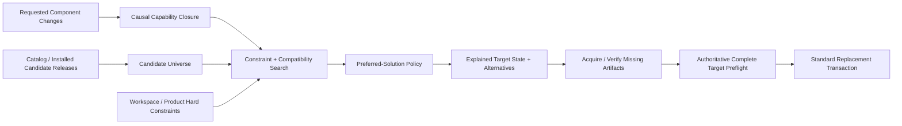

# Application Component Target-State Solver Specification

**Status:** Draft public specification  
**Scope:** Technology-neutral automatic selection of compatible component-version target states from the active component population and catalog/package candidates  
**Audience:** Core implementers, package/catalog implementers, administration-UI authors, product-profile authors, and component authors  
**Companion documents:** `Application-Component-Catalog-Specification.md`, `Application-Component-Upgrade-Transaction-Specification.md`, `Application-Component-Capability-Contract-Specification.md`, `Application-Component-Readiness-Specification.md`, `Application-Component-Context-Configuration-and-Entitlement-Specification.md`

---

# I. Purpose

The target-state solver helps a user move one or more already active components to requested releases when those changes require coordinated version changes of other active components. It searches for complete compatible target component sets rather than attempting one component upgrade at a time.

The solver does not replace the ordinary replacement validator. Catalog/package metadata is used to search candidate states before every artifact is downloaded, but downloaded artifact descriptors and the normal complete target-state preflight remain authoritative before activation.

The baseline solver is intentionally conservative about topology. It changes versions of component identities already present in the active component population. Automatically adding a previously absent component identity/provider topology is outside this baseline and MAY be introduced by a later product/profile extension.

# II. Requests

A solver request identifies a component plus one of these logical constraints:

```text
EXACT
    use exactly one specified release

ONE_OF
    use one release from an explicit allowed set

LATEST_COMPATIBLE
    choose a compatible release not older than the currently active release
```

An explicit request is a hard constraint. A solver MUST NOT silently keep another release merely because that would reduce the number of changes.

Product/workspace component requirements and workspace locks are also hard constraints. If they make the request unsatisfiable, the solver reports the blocking requirement rather than silently relaxing it.

# III. Candidate universe and causal closure

The candidate universe MAY include:

```text
currently active release
installed inactive releases
downloaded releases
obsolete releases
catalog releases in the active (product_id, technology_id) scope
```

The solver derives a **causal capability closure** from explicitly requested component identities. The closure contains active component identities whose releases can become relevant because mandatory capability requirements of requested/causally included releases may need those identities as providers.

The baseline solver MUST NOT upgrade unrelated components merely because newer releases exist. A non-requested version change is admissible only when reverting that component to its current release would make the target state incompatible under the same hard constraints.

# IV. Compatibility authority

A candidate target state is technically compatible only when the same AAC compatibility semantics used by ordinary replacement preflight can be satisfied. At minimum the solver accounts for mandatory capability requirements and finite provided/required contract versions represented in catalog/package metadata.

The solver is a planning layer. Before cutover Core MUST still:

1. obtain and verify required artifacts;
2. compare catalog metadata with authoritative artifact descriptors;
3. build the ordinary complete target descriptor/contract state;
4. run the standard replacement preflight;
5. use the standard crash-safe multi-component replacement transaction for activation.

A solver result MUST NOT create a second activation mechanism.

The solver is a planning layer around, not a replacement for, ordinary AAC validation:



The search may use catalog summaries, but the downloaded artifacts and the normal replacement preflight remain authoritative before cutover.

# V. Preferred solution policy

The baseline preference policy is designed to keep the causally affected branch current without turning every request into a global update operation.

For technically valid solutions Core SHOULD apply the following ordering:

1. satisfy all explicit requests and hard product/workspace constraints;
2. prefer solutions containing **no component downgrade**;
3. inside the actual causal closure, prefer the newest compatible stable releases available under the current catalog/version model;
4. reject version changes that are not required for compatibility;
5. between otherwise equivalent solutions, prefer the target with better statically predictable operational readiness;
6. use deterministic component/version/source ordering as a final tie-breaker.

Therefore a newer provider branch that requires another causally related component upgrade may be preferred over an older provider release merely because the older branch changes one fewer component. Conversely, components outside the causal closure are not upgraded merely to make the entire installation newer.

# VI. Downgrade alternatives

General AAC replacement can be more permissive than automatic solving. A manually requested downgrade may tolerate unsupported newer persisted contributions through normal fallback/`UNDEFINED` semantics.

The automatic solver applies a stricter rule: a downgrade MUST NOT be a recommended/primary solution.

A downgrade MAY be offered only as an explicitly selected alternative when persistent-data schema shape is not downgraded. In the baseline, source and downgrade-target releases MUST expose exactly the same set of relevant persistent schema identities and target write versions for:

```text
component configuration
provider-instance configuration for every declared capability provider definition
generic Data Entity support
```

For provider configuration, `provider_id` is part of the persistent-schema identity. For `DATA_ENTITY`, `schema_id` is the identity and the summary additionally compares readable versions, writable versions and preferred write version. `COMPONENT_CONFIGURATION` has no provider selector.

If either side lacks sufficient persistent-schema metadata while the other declares such metadata, the automatic solver MUST treat the downgrade as unsafe and MUST NOT offer it.

A downgrade-only result is not labeled recommended. UI MUST require an explicit user choice/confirmation before applying such an alternative.

# VII. Catalog persistent-schema summary

Catalog metadata used for downgrade-safety evaluation contains a release-level persistent-schema summary. Each item identifies:

```text
kind
provider_id for PROVIDER_CONFIGURATION
entity_type_id for ENTITY_EXTENSION
schema_id
write_version
```

The summary is discovery/solver metadata, not authority. After the artifact is downloaded, Core MUST compare the summary with the actual descriptor. A mismatch blocks installation/admission of that candidate.

# VIII. Explanations

Every automatic non-requested change SHOULD carry structured causality metadata sufficient for UI and diagnostics. A typical explanation states:

```text
requested component/release
consumer component/release
mandatory capability requirement
provider component/release selected to satisfy it
```

Explanation records SHOULD use stable machine-readable codes plus human-readable messages. They MAY form a graph rather than a strict tree because one changed provider can satisfy several consumers.

An unsatisfied request SHOULD explain the strongest available reason, for example:

```text
no requested release exists
mandatory capability has no compatible provider release
workspace lock excludes the required provider release
downgrade alternative rejected because persistent schema versions differ
search space exceeded configured safety limit
```

# IX. Alternative solutions

The solver MAY produce multiple non-equivalent solutions, but MUST bound their number. Returning every combinatorial solution is neither useful nor required.

A baseline UI SHOULD expose one recommended no-downgrade solution when available and a small number of alternatives. Alternatives differ in meaningful component-version choices, not merely in duplicate catalog-source representation of identical artifacts.

Downgrade solutions, if admissible under section VI, belong only among alternatives.

# X. Entitlement diagnostics

Entitlement availability is not the same property as technical component compatibility.

A candidate solution MUST NOT be discarded solely because a capability permission with `possible_licensing_scopes` is not currently granted. Instead the solver SHOULD report structured entitlement diagnostics including:

```text
component
capability/version
permission
possible licensing scopes (using declared display metadata where available)
current grant availability
entitlement_info_url when provided by catalog metadata
```

The product/UI may then expose entitlement information/remediation separately from technical compatibility.

# XI. Readiness diagnostics

Operational `READY / DEGRADED / NOT_READY` is not a generic hard solver constraint. Statically predictable readiness impacts SHOULD be reported as diagnostics and MAY be used as a tie-breaker among otherwise equivalent technically compatible solutions.

Runtime-only readiness cannot necessarily be predicted before candidate activation. The solver MUST NOT claim stronger readiness guarantees than the available static/runtime evidence supports.

# XII. Package preparation and application

A selected solver solution distinguishes version planning from artifact preparation. Each changed selection may indicate whether the target artifact is already installed, must be restored from obsolete storage, must be installed from downloaded storage, or must first be downloaded from a catalog locator.

Download/install preparation MAY occur before the cutover transaction. The actual active-set change MUST use the ordinary complete replacement transaction and its durable commit/crash-recovery rules.

# XIII. Administration UI

A solver-aware package UI SHOULD clearly separate:

```text
Requested changes
Automatically required changes
Unchanged components
Packages requiring download/install
Entitlement diagnostics
Readiness diagnostics
Alternative solutions
```

Downgrades MUST be visually explicit. An alternative containing a downgrade MUST NOT be applied without explicit user selection/confirmation.

The UI SHOULD allow users to inspect causal explanations for every automatically required change and the reason why no recommended solution exists.

# XIV. Baseline invariants

1. Explicit solver requests and workspace/product locks are hard constraints.
2. Solver compatibility uses the AAC target-state model; it does not define a competing activation model.
3. The baseline solver changes versions of active component identities and does not automatically expand component topology.
4. Unrelated component upgrades are not introduced merely to maximize global version freshness.
5. Inside the required causal closure, newer compatible no-downgrade releases are preferred over unnecessarily old branches.
6. Automatic downgrade is never recommended.
7. A downgrade may be offered only as an explicit alternative when all relevant persistent schema identities/write versions are unchanged.
8. Catalog metadata is planning metadata and is verified against the downloaded artifact descriptor before use.
9. Missing entitlement produces diagnostics rather than generic technical incompatibility.
10. Readiness is diagnostic/tie-breaking information unless a product profile explicitly defines a stricter deployment policy.
11. Solver alternatives are bounded and explainable.
12. Applying a solver result uses the ordinary crash-safe component replacement transaction.
