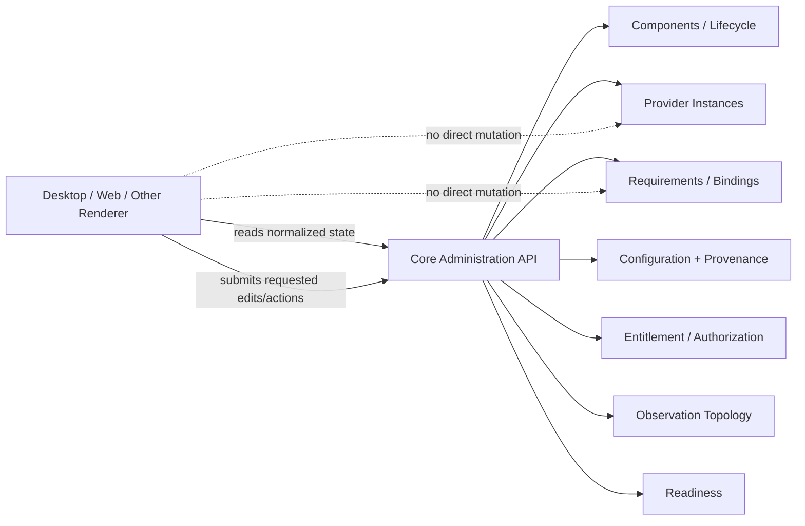

# Application Component UI Specification

## I. Scope

This specification defines technology-neutral administration and configuration UI semantics for Application Components. It does not prescribe a desktop or web toolkit. Core owns component-target configuration, provider-instance-target configuration, provider-instance identity, binding topology, observation topology, package/replacement transactions, validation, and lifecycle state; a UI is a view/editor over that Core-owned model. Replacement semantics are defined by `Application-Component-Upgrade-Transaction-Specification.md`.

The baseline reusable implementation is Algites Application Components (AAC). AAC public framework identities use `_AAC.*` where a stable architectural identity is required. Python artifacts `aac/uiintf` and `aac/uiqt` are implementation artifacts, not capability IDs.

## II. Architectural rules

1. UI toolkit objects MUST NOT be required by `uiintf` or cross process/interpreter boundaries.
2. Extension components SHOULD describe configuration through canonical schemas and normalized metadata rather than private toolkit widgets.
3. UI edits MUST be applied through Core-owned administration APIs. A renderer MUST NOT mutate provider state, persisted bindings, or observation topology directly.
4. Binding editors MUST reference provider instances by immutable provider-instance ID, never by mutable display name.
5. An administration UI MUST be capable of representing unresolved requirements as well as resolved bindings. Otherwise first-time binding configuration would be impossible.
6. Configuration submission is not authoritative validation. Core MUST revalidate and normalize submitted values against the registered schema before persistence.
7. Products own the concrete event loop, window/shell, authentication/authorization policy, and placement of administration surfaces.
8. Configuration UI MUST preserve configuration-scope/configuration-provider/policy provenance instead of editing only an opaque merged value.
9. Entitlement UI represents Core-validated permission context and remediation actions; it MUST NOT manufacture entitlement state locally.
 It SHOULD expose effective permissions grouped by component/capability version, entitlement licensing scope subject, issuer/evidence provenance, effective expiry, next known transition, and verification/issuer-trust diagnostics where available.

The administration UI is therefore a renderer/controller over Core-owned models rather than an alternate authority:



All mutation arrows terminate at Core administration APIs, which revalidate and persist the authoritative state.

## III. Baseline administration model

A generic AAC administration surface SHOULD expose at least:

```text
Components
Provider Instances
Bindings / Requirements
Observation Topology
```

### III.1 Components

For each admitted component the UI can show component identity/version, capability provider definitions, permission metadata/possible entitlement licensing scope types grouped by provided capability/version, effective entitlement state made available by Core, and diagnostic/lifecycle information.

### III.2 Provider instances

Provider-instance administration includes stable GUID, mutable name, component/provider-definition identity, provided capability and versions, state, and configuration. Creating a new instance creates a new Core-managed identity. Removing an instance MUST respect Core reference checks.

### III.3 Configuration forms

A registered provider configuration schema is converted to a normalized logical form. The baseline logical field vocabulary includes:

```text
STRING
INTEGER
NUMBER
BOOLEAN
ENUM
MULTILINE
JSON
SECRET_REFERENCE
FILE
DIRECTORY
INSTANCE_REFERENCE
CAPABILITY_REFERENCE
```

Renderers MAY support additional presentation hints. Complex values not covered by a specialized renderer MAY be edited as normalized JSON. Schema defaults, constraints and final validity remain Core/schema concerns.

### III.4 Requirements and bindings

The UI operates primarily over consumer requirements, not only the already-resolved graph. For each requirement it can show:

```text
consumer provider-instance ID/name
requirement ID
capability ID
acceptable contract versions
cardinality
mandatory/optional state
currently selected provider-instance IDs
compatible provider choices
```

Editing writes Core-owned binding preferences. Resolution remains a separate Core operation and the final resolved graph MUST satisfy the instance-DAG invariant.

### III.5 Authorization requests and grants

For consumer requirements whose negotiated capability declares authorization permissions, UI SHOULD expose:

```text
requested authorization permissions
granted authorization permissions
permission name/description
approval/provenance where available
```

An installation/admission or administration UI MAY allow an authorized administrator to approve a subset of requested permissions. It MUST NOT grant a permission the component did not request or one the negotiated capability contract does not declare.

Operation-level `all_of`/`any_of` expressions are canonical contract data and generally need not be edited by administrators; they may be shown diagnostically to explain why an invocation is denied.

### III.6 Presentation metadata, display text and display content

Every human-facing AAC name, description, label, choice caption and similar short presentation string MUST use the common `AIcDisplayText` model rather than parallel `*_resource_key` fields or renderer-specific strings. `AIcDisplayText` contains direct/fallback `text` and an optional `resource_key`; products MAY resolve that key through their own localization resources. AAC does not prescribe a localization engine.

Configuration fields MAY use `x-aac-name` and `x-aac-description` with the same text/resource-key shape, falling back to JSON Schema `title` and `description` when canonical display metadata is unavailable.

Longer or formatted display bodies use `AIcDisplayContent`, which is deliberately distinct from short `AIcDisplayText`. The baseline formats are:

```text
PLAIN_TEXT
MARKDOWN
HTML
```

`PLAIN_TEXT` may be multi-line. `MARKDOWN` and `HTML` describe presentation content, not executable component UI. A renderer/host that renders HTML MUST apply its own sanitization and active-content policy; declaring HTML content never grants script/code execution.

The technology-neutral UI model includes display blocks and panels/containers. A panel may have `AIcDisplayText` title/description and may contain display content, forms and nested panels. The model describes semantic UI composition; it does not prescribe `QWidget`, DOM, terminal or other toolkit classes.

### III.7 Observation topology

Observation configuration identifies an observer provider instance and one or more selectors containing capability pattern, optional versions, optional operations and PRE/POST phases. This topology is Core-owned and separate from the observer provider's own configuration.

### III.8 Running operations and Operation Interaction

A product UI MAY attach an Operation Interaction controller to any Core-mediated capability invocation. The UI consumes provider-to-caller messages and sends caller-to-provider interaction state; the provider never receives a toolkit/UI object.

The provider-to-caller direction includes Core-owned execution state, result revisions, optional operation-specific state-result payloads, and zero or more structured `STATUS`, `PROGRESS`, `DETAIL`, and `DIAGNOSTIC` events. One message may contain several events so a renderer can update related progress indicators atomically. Progress identifiers may form parent/child hierarchies.

The caller-to-provider direction contains user/host choices such as cooperative cancellation, detail/reporting preferences, selected state-result delivery mode and the latest result revision accepted by the caller. UI code MUST NOT assume that result revisions are cumulative deltas; whether gaps matter is defined by the operation. The caller may use result revisions to avoid comparing/serializing large result payloads merely to discover whether a logical result changed.

`FOREGROUND` and `BACKGROUND` are interaction modes of the same running operation. Moving an invocation to `BACKGROUND` does not detach it, terminate reporting or change provider execution semantics. The host SHOULD retain it in a visible running-operations/task model (for example a status/task area), continue showing relevant state/progress, permit unrelated application interaction where product policy allows it, and allow the same invocation to be brought back to a foreground presentation.

Asynchronous execution and background presentation are independent. A UI normally starts a potentially long operation asynchronously while initially presenting it in `FOREGROUND`; choosing "Run in background" changes only the interaction mode. A caller that needs no live interaction can instead use the ordinary synchronous invocation and receive only the final output.

Concrete presentation remains host-owned. A Qt renderer may use a dialog plus task area, a web renderer may use an activity drawer, and a CLI may print periodic status while returning control according to its own execution model. AAC standardizes semantic interaction, revisions and delivery modes, not visual placement.


## IV. Contextual configuration and entitlement

### IV.1 Configuration-profile-aware configuration

The logical UI model MUST NOT hard-code an `ORGANIZATION` or other closed configuration-scope enum. AAC defines well-known configuration-scope types `SYSTEM`, `USER`, and `WORKSPACE`; an active configuration profile may add types such as `CUSTOMER`, `CUSTOMER_GROUP`, `ORGANIZATION`, `TEAM`, `TENANT`, or others.

`REMOTE` is not a configuration-scope. Local/remote/filesystem/HTTP/etc. are configuration-provider provenance.

For every effective field the UI SHOULD be able to represent:

```text
effective value
value source kind: explicit / policy lock / policy default / schema default / undefined
source configuration-scope type/id
source configuration-provider
active policy-modes and provenance
shadowed contributions
allowed edit configuration-scopes
policy conflict/violation diagnostics
unsupported/unavailable provider contributions
fallback/default/UNDEFINED diagnostics
```

A renderer MUST NOT infer filesystem paths, VCS behavior, or network location from configuration-scope type. `WORKSPACE` configuration may be Git-backed, remote-project-service-backed, or another product-defined persistence mapping.

### IV.2 Editing layered values

The UI SHOULD expose the active configuration profile and ordered configuration-scope chain when useful for administration. It SHOULD allow a user to choose an allowed edit target configuration-scope and SHOULD provide an explicit action to remove/reset an override at that configuration-scope.

Configuration editing MUST also identify the configuration target (`COMPONENT` or a concrete immutable `PROVIDER_INSTANCE` ID) and the selected configuration-provider. Read-only providers/scopes SHOULD remain visible for provenance, but editing controls MUST be enabled only where provider mutation capability and Core authorization permit the requested value/policy mutation. A UI SHOULD submit one normalized atomic change set for a multi-property form where the selected provider supports atomic mutation.

Removing an override reveals the next effective ordinary value or default; it does not copy the inherited value into the removed layer.

A policy `DEFAULT` MUST be visibly distinguishable from an explicitly configured value. `LOCK`, `MIN`, `MAX`, `IN_SET`, and `NOT_IN_SET` restrictions SHOULD be explainable with provenance sufficient to tell the user which configuration-scope/configuration-provider imposed them.

Workspace-targeted edits SHOULD be visibly distinguishable because they may modify portable project semantics, but the UI MUST NOT assume that all `WORKSPACE` values are physically stored in VCS.

The edit-target selector SHOULD show both the concrete configuration-scope and configuration-provider. Read-only targets remain visible for provenance, but value/policy editors and commit actions MUST be enabled only for the intersection of provider mutation capability and Core authorization. Revision/ETag SHOULD be retained while the form is open so a concurrent modification produces an explicit conflict instead of an overwrite.

Authentication failures SHOULD be shown as provider connectivity/authentication diagnostics. The UI MUST NOT display resolved secret bytes merely to explain an authentication profile; it should identify the authentication profile and secret-reference source where appropriate.

### IV.3 Entitlement state

The UI SHOULD expose effective permission sets grouped by provided capability ID/version and their provenance without becoming the authority for validity. It may display capability-supplied permission names/descriptions, entitlement licensing-scope subject type/id, entitlement-provider source, source entitlement document/bundle, each permission's effective expiry/validity, and Core-managed remediation actions.

For discovery and explanation, the UI MUST obtain licensing-scope **name and description metadata from the component/catalog licensing-scope declarations**, falling back to the raw type identifier only when no display text is available. Actual concrete subject identities come from Core licensing-scope resolution. The UI MUST NOT treat the configuration-scope chain as licensing-scope vocabulary and MUST NOT offer an undeclared type merely because a resolver exists.

A component may remain active in free/degraded mode with an empty/minimal permission set.

### IV.4 Permission remediation

When the Core invocation bridge reports `PERMISSION_DENIED`, a product UI may offer login, purchase, refresh, grant acceptance, or other entitlement remediation through Core/entitlement-provider APIs. Component code does not directly own product purchase/account UI in the baseline model.

### IV.5 Data Entity sections

A product MAY render component-contributed logical sections/actions for Data Entities. Core discovers semantic support from `data_entity_support` and discovers concrete relationships from `x-aac-data-entity-reference` annotations in canonical schemas.

The renderer remains product/toolkit-owned. The component receives only normalized Data Entity/context inputs for which it has declared compatible schema support and appropriate authorization. Unsupported records remain preserved and are presented as unavailable/read-only rather than being guessed at or rewritten. `TOMBSTONE` is an explicit logical state that UI may represent separately from ACTIVE data.

## V. Python AAC artifacts

### V.1 `aac/uiintf`

`uiintf` depends only on the public AAC Core interface artifact. It defines normalized DTO/view models and `AIiAacUiController`, including forms/fields/choices, `AIcUiDisplay`, and nested `AIcUiPanel` composition. Human-facing model fields use `AIcDisplayText`; longer bodies use `AIcDisplayContent`. It contains no PySide6 dependency.

### V.2 `aac/uiqt`

`uiqt` is the baseline PySide6 implementation. It provides a Core-backed controller and reusable administration widgets. The product owns `QApplication` and the Qt event loop. Extension components do not contribute arbitrary `QWidget` instances in the baseline profile.

The baseline administration model also includes package/replacement state exposed through Core-owned APIs. A concrete renderer MAY provide package download/install/update controls, but those controls remain views/controllers over Core target-state validation and replacement transactions rather than directly mutating package/runtime state.

## VI. Future renderers

A web renderer or another desktop toolkit may implement the same technology-neutral contract. The same Core-owned configuration and topology semantics MUST remain authoritative regardless of renderer technology.


# Package-management and replacement UI expectations

Package-management and replacement-transaction state is Core-owned. A product UI SHOULD distinguish downloaded artifacts, installed/staged candidates, explicitly obsolete artifacts, and the single active/selected artifact for each component identity in the current Core-managed runtime/package-selection domain. Physical presence of two versions during staging MUST NOT be presented as concurrent activation.

Catalog browsing is also Core-mediated. A package UI SHOULD query catalog providers through the AAC Catalog SPI using mandatory `product_id` and `technology_id` scope and MAY add text, component, capability, category, tag, or version filters. Browse results SHOULD expose component name/description/publisher, release version, provides/requires summaries, entitlement permission/possible-scope summaries, catalog-source provenance and artifact availability. Catalog metadata is discovery information; UI MUST NOT present it as stronger trust than the verified downloaded descriptor.

Download/install actions from Browse MAY store and verify an artifact without activating it. Missing external entitlement MUST NOT be presented as a universal download/install blocker; included/scope-free permissions remain usable and externally grantable permissions are handled by the ordinary entitlement/remediation path. `entitlement_info_url` is informational and does not make the catalog a licensing service.

The UI SHOULD expose package provenance (source, exact artifact URI, digest, verifier/signer where available), workspace requirement/lock status, and the reason an automatic action was blocked by update, authentication/download, verification, entitlement, migration, or target-graph policy.

A package/replacement UI SHOULD permit an administrator to select multiple component replacements as one transaction. Before commit it SHOULD offer a side-effect-free **Validate target state** action using the same Core validator used by activation. Validation diagnostics SHOULD identify all known affected components, missing/incompatible providers, capability-version intersections, contract conflicts, provider-instance problems, and persisted-data interpretation/readiness effects when practical. The UI SHOULD distinguish `DIRECT`, `TRANSFORMED`, and `UNSUPPORTED` contributions. `UNSUPPORTED` is presented as unavailable input with fallback/default/`UNDEFINED` consequences; it is not automatically presented as a target-state blocker.

After validation, applying the selected set submits the same complete target state as one transaction. The UI MUST NOT implement component upgrades by sequentially activating each selected version or require intermediate states to be valid. It SHOULD expose component-transaction progress, commit/rollback result, and the resulting retirement/obsolete state of superseded artifacts.

Persistence convergence MUST be presented separately from component replacement. After a successful cutover the UI MAY show:

```text
runtime interpretation: DIRECT / TRANSFORMED / UNSUPPORTED
at target write representation: yes / no
persistence convergence: NOT_NEEDED / SUPPORTED / NOT_SUPPORTED
last convergence attempt: SUCCEEDED / FAILED_RETRYABLE
```

A `DIRECT` old representation may remain stored indefinitely. A read-only/no-CAS provider may legitimately report convergence `NOT_SUPPORTED`. Such states MUST NOT be presented as component-upgrade failure.

A later downgrade/restore action is presented as a new replacement transaction, not as reopening a persistent rollback group. Automatic solvers MAY propose additional component replacements, but proposals remain subject to the same target-state validation.


# Readiness UI expectations

Administration surfaces SHOULD display lifecycle state and operational readiness as separate fields. At minimum, components/provider instances with evaluated runtime state SHOULD expose `READY`, `DEGRADED`, or `NOT_READY` plus structured human-readable reasons. A renderer SHOULD preserve stable machine-readable reason codes when available.

A component that is `ACTIVE` but has one `NOT_READY` capability MUST NOT automatically be rendered as a failed or inactive component. The UI SHOULD show the narrow affected scope and allow independent ready functionality to remain visible.

Package/replacement validation SHOULD display statically projected readiness warnings together with target compatibility diagnostics. `DEGRADED`/`NOT_READY` readiness is a warning by default, visually distinct from a target-state blocker; an explicit product minimum-readiness policy may classify a specific readiness condition as blocking.


## Automatic target-state solver UI

A package/catalog administration surface that exposes automatic target-state solving SHOULD distinguish at least:

```text
Requested changes
Automatically required changes
Unchanged components
Packages that must be downloaded/installed
Entitlement diagnostics
Readiness diagnostics
Alternative solutions
```

Every automatically required change SHOULD expose its causal capability/dependency explanation. A recommended solution MUST NOT contain a downgrade. Downgrade solutions, when the solver can prove unchanged relevant persistent schema identities/write versions, MUST be labeled as alternatives and MUST require explicit user selection/confirmation before application.

The UI MUST NOT present missing entitlement as generic technical incompatibility. It SHOULD show the affected capability/permission, possible entitlement licensing scopes and `entitlement_info_url` where available. Likewise, predicted `DEGRADED`/`NOT_READY` states remain readiness diagnostics unless product policy explicitly promotes them to a deployment blocker.
