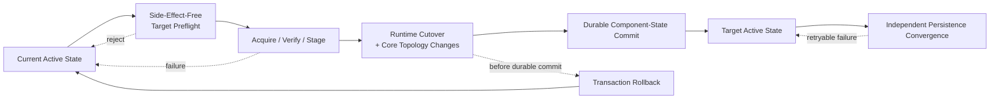

# Application Component Upgrade Transaction Specification

**Status:** Draft public specification  
**Scope:** Technology-neutral component replacement, complete target-state validation, multi-component cutover, crash-safe commit/recovery, persisted-data compatibility, post-upgrade convergence, artifact retirement, and rollback semantics for AAC component systems  
**Audience:** Core implementers, package-manager authors, component/plugin authors, SDK authors, UI authors, product architects, and technology-profile authors  
**Companion documents:** `Application-Component-Architecture-Governance.md`, `Application-Component-Lifecycle-and-Provisioning-Specification.md`, `Application-Component-Capability-Contract-Specification.md`, `Application-Component-Context-Configuration-and-Entitlement-Specification.md`, `Application-Component-UI-Specification.md`

---

# I. Replacement Transaction Model

## I.1 Complete active state

An **upgrade/replacement transaction** is a requested transformation from one complete active AAC component state to another complete active AAC component state. It may replace one component or many components. A one-component upgrade is only the one-replacement case of the same model.

```text
CURRENT ACTIVE COMPONENT STATE
        |
        | one logical replacement transaction
        v
TARGET ACTIVE COMPONENT STATE
```

The stable component identity does not change merely because its package version or artifact digest changes. A replacement candidate normally has the same component ID as the component it replaces. Component addition/removal may participate only when the product models those lifecycle changes explicitly and validates the resulting complete target state.

## I.2 Single active version invariant

Within one Core-managed runtime/package-selection domain, at most one artifact version of a component identity may be active/selected. A replacement is not concurrent activation of old and new versions.

Different package versions may exist physically at the same time for download, staging, verification, diagnostics, or rollback retention. That physical coexistence has no graph semantics until Core selects/adopts one target artifact. Products that need different active versions for different workspaces/applications must isolate them into separate runtime/package-selection domains.

## I.3 Complete target-state semantics

Compatibility MUST be evaluated against the **complete target state** after every requested replacement has been applied. Intermediate states implied by an arbitrary sequential installation order need not be valid.

Example:

```text
current: A/1 consumes X/v1
         B/1 provides X/v1

target:  A/2 consumes X/v2
         B/2 provides X/v2
```

Neither `A/2 + B/1` nor `A/1 + B/2` is valid, but the transaction `{A:1->2, B:1->2}` is valid if the complete target graph is valid. Core MUST NOT reject such a transaction merely because no one-at-a-time upgrade order yields valid intermediate states.

## I.4 Component cutover and persisted-data convergence are different operations

The replacement transaction controls the active component/runtime state. It MUST NOT require a distributed atomic transaction across independent configuration providers or Data Entity stores.

Persisted configuration and Data Entity schema compatibility are **inputs** to target-state evaluation. Their stored schema version does not have to match the target component's preferred write version. A target component may:

- read a stored representation directly;
- normalize it in memory through an explicit transformation path; or
- be unable to interpret that contribution.

An uninterpretable contribution is not automatically a fatal component-replacement error. It is treated as **unavailable input** and preserved unchanged. Normal configuration/context resolution may continue through other usable contributions, schema defaults, and ultimately an `UNDEFINED` result. Stored Data Entities that cannot be interpreted remain preserved and unavailable to incompatible component functionality; they are not implicitly rewritten or tombstoned.

The architecture therefore distinguishes:

```text
TARGET-STATE PREFLIGHT
    determine target graph
    classify persisted contributions
    resolve effective target inputs
    assess resulting readiness/degradation

COMPONENT REPLACEMENT TRANSACTION
    atomically/logically switch active component state

PERSISTENCE CONVERGENCE
    independently rewrite non-target persisted representations
    when an explicit transformation and safe provider write are available
```

A failed persistence-convergence write MUST NOT retroactively invalidate or roll back an already successful component replacement.

The phase boundary is easier to see as one cutover transaction followed by independent convergence:



Persistence convergence starts only after the target component state is authoritative; its later failure is diagnosed/retried independently rather than undoing a successful component transaction.

# II. Side-Effect-Free Target Preflight

## II.1 Target component set

Before deactivating the current runtime or mutating authoritative active component state, Core MUST construct the hypothetical target component set by replacing all selected component artifacts simultaneously in the current component map. Components not changed by the transaction remain in the target set.

Static descriptors and other preflight metadata SHOULD be read without executing arbitrary candidate business implementation code.

## II.2 Target active contract catalog

Core MUST rebuild the target active contract catalog from:

```text
Core/built-in canonical contracts
+ canonical contract bundles supplied by every component in the target set
```

The target catalog MUST NOT be computed by simply adding candidate bundles to the current active catalog. A contract supplied only by a replaced/removed current component is absent from the target catalog unless another target source supplies the same canonical definition. Canonical conflicts remain fatal.

## II.3 Target capability graph

Core MUST resolve the target provider/consumer graph using the same authoritative rules as ordinary activation. A valid negotiated version remains selected from:

```text
consumer supported versions
    ∩ provider supported versions
    ∩ target Core active contract catalog versions
    ∩ lifecycle-allowed versions
```

Mandatory requirements MUST resolve. Explicit provider-instance selections, qualifiers, instance restrictions, binding preferences, ambiguity policy, graph acyclicity, and other ordinary AAC rules remain in force. Preflight MUST NOT invent a weaker compatibility checker.

## II.4 Provider-instance reconciliation

Core MUST determine whether existing persistent provider instances remain valid under the target capability provider definitions. If a target removes or incompatibly changes a capability provider definition referenced by persistent instances/bindings, the transaction MUST either include an explicit supported provider-instance reconciliation/removal path or be rejected.

Provider-instance reconciliation that changes Core-owned topology is part of the component replacement transaction. External component configuration persistence is not.

## II.5 Persisted configuration compatibility

Persisted representation compatibility MUST be modeled as independent properties rather than one combined compatibility state.

For every relevant configuration contribution, Core evaluates at least these independent facts:

```text
stored_schema_version
target_write_schema_version
at_target_write_version: true / false

runtime_interpretation:
    DIRECT
        target component can interpret the stored representation as-is

    TRANSFORMED
        target component cannot interpret it directly, but an explicit
        side-effect-free transformation path succeeds in memory

    UNSUPPORTED
        no safe interpretation is available to this target component

migration_path:
    present / absent

persistence_convergence:
    NOT_NEEDED
        stored representation already equals the target write representation

    SUPPORTED
        an explicit transformation to the target write representation exists
        and the owning provider/store exposes a safe conditional/atomic write

    NOT_SUPPORTED
        Core cannot safely persist convergence through this provider/store
        or no suitable transformation path exists
```

`DIRECT` is independent of migration availability. For example, a component may directly read schema `3`, prefer to write schema `5`, and also provide a `3 -> 5` migration. Runtime interpretation is still `DIRECT`; the migration is relevant only to optional persistence convergence.

For `TRANSFORMED`, Core MUST execute the transformation in side-effect-free/in-memory mode and validate the resulting representation. Provider writability is irrelevant to runtime interpretation.

For `UNSUPPORTED`, Core MUST preserve the stored contribution unchanged and MUST NOT guess, partially parse, truncate, implicitly downgrade, or overwrite it. The contribution is treated as unavailable to this target component rather than automatically making the entire component/runtime invalid.

## II.6 Effective configuration validation across multiple providers

After classifying all active configuration contributions, Core SHOULD run the ordinary target configuration resolution.

Only `DIRECT` and successfully `TRANSFORMED` contributions participate. `UNSUPPORTED` contributions do not contribute ordinary values or policy directives because their semantics are not known to the target component.

Conceptually:

```text
provider/scope contributions
        |
        | DIRECT / TRANSFORMED / UNSUPPORTED
        v
usable normalized contributions
        |
        | unsupported contributions are unavailable
        v
ordinary scope/provider/policy resolution
        |
        +--> explicit usable contribution
        +--> applicable default
        +--> schema default
        +--> UNDEFINED
        v
effective target configuration + provenance
```

AAC defines schema `default` as a runtime-resolution fallback annotation. Merely using a schema default MUST NOT by itself write that value into a provider.

If no usable contribution/default exists, the effective value is `UNDEFINED`. `UNDEFINED` is a Core resolution result, not a persisted JSON/YAML value and not equivalent to `null`.

A component MUST NOT assume that a context-dependent/configuration property is always available merely because one provider normally supplies it or because a concrete payload schema marks it `required`. Components MUST define safe behavior for unavailable/undefined inputs. That behavior may include reduced functionality or `NOT_READY` status for an affected operation/capability/provider instance.

An unsupported contribution therefore does not by itself prevent Core startup or component activation. Preflight SHOULD report the resulting degradation/readiness state. A product profile MAY require a fully ready target for a particular operation, but this is a readiness policy, not a rule that every stored contribution must be interpretable.

Preflight MUST NOT persist normalized representations.

## II.7 Data Entity compatibility

Target preflight evaluates the target component descriptors' `data_entity_support` against the target canonical schema registry.

For every Data Entity schema/version that a target component claims to read or write, the corresponding canonical schema definition must be available in the target schema environment. Mandatory `data_entity_requirements` must have at least one compatible target version available through the target component/schema set.

Concrete Data Entity records are not mutated during preflight. Existing stored representations remain a datasource concern. When a Data Entity storage provider is available, preflight MAY use `inspect-storage-support` to compare the provider's physical support state with the target semantic support graph. Inspection is read-only; any required `ensure-storage-support`, `retire-storage-support`, or record mutation remains part of the explicit lifecycle/upgrade execution plan rather than tentative target activation.

Target-state compatibility SHOULD account for the runtime Data Entity view model separately from physical storage versions. A current implementation may explicitly implement several versioned view interfaces over one internal state, so a consumer requiring view 2 can remain compatible with a canonical implementation/storage version 4 without forcing the record to be persisted as version 2. Conversely, numeric schema ordering does not imply view compatibility; only registered/supported view interfaces count.

Preflight therefore distinguishes at least stored schema inventory, current implementation canonical version, and required consumer view versions. Physical `stored_schema_version_filter` queries may be used to identify records that still require convergence before a historical decoder/view can safely be retired.

Data Entity migration is semantic and side-effect-free: Core may determine whether a representation is `DIRECT`, `TRANSFORMED` or `UNSUPPORTED`, but it does not physically rewrite records as part of tentative target activation.

`TOMBSTONE` is record lifecycle state and is independent from schema compatibility. An unsupported record is not automatically tombstoned.

## II.8 Failure and remediation ownership

Target-state preflight MUST reject the replacement for structural/runtime reasons such as an invalid target capability graph, canonical contract conflict, irreconcilable Core-owned provider topology, failing transformation that is required to obtain a usable input, or a target readiness rule that the product explicitly requires for commit.

An individual `UNSUPPORTED` persisted contribution is not by itself such a blocker. Core records it as unavailable input and continues ordinary resolution.

If a target component requires a value/function that resolves to `UNDEFINED` or otherwise becomes not ready, the diagnostic SHOULD identify the missing effective input and its provenance/fallback history. Remediation may require:

- selecting another target component version;
- upgrading a central/shared configuration through its owning authority;
- adding a usable contribution in another allowed configuration scope;
- repairing malformed legacy data;
- or accepting degraded/not-ready functionality where product policy permits it.

Lack of caller write permission is not itself an incompatibility. Read-only old data may remain in place indefinitely when runtime interpretation remains safe.

## II.9 Diagnostics

If preflight rejects the target state, current live state MUST remain unchanged. Diagnostics SHOULD report all known blockers and degradation when practical, including:

```text
affected component
unsatisfied mandatory capability requirement
missing provider
consumer/provider/target-catalog version sets
canonical contract conflict
provider-instance incompatibility
persisted schema identity/version
runtime interpretation: DIRECT / TRANSFORMED / UNSUPPORTED
migration path presence/failure
convergence support
ignored unsupported provider contribution
fallback/default/UNDEFINED result
affected readiness/capability/operation
owning provider/scope/store
policy/entitlement condition relevant to activation
```

Preflight/administration surfaces SHOULD distinguish at least:

```text
VALID
    target can be activated with expected ordinary readiness

VALID_WITH_DEGRADATION
    target can be activated, but unsupported/unavailable inputs cause
    fallback, UNDEFINED values, or reduced readiness

INVALID
    target component graph/cutover/readiness policy cannot be satisfied
```

These labels are diagnostic categories, not required persisted state-machine values.

The user or planner MAY add further component replacements, repair or upgrade persisted data through the appropriate authority, add alternative configuration contributions, or select another target version and validate again.

# III. Staging and Component Cutover

## III.1 Staging is non-active

Candidate artifacts MAY be downloaded, verified, unpacked, promoted to an immutable installed/staging area, and statically inspected before commit. None of those operations make the candidate an active component participant.

Physical coexistence of old and new artifacts in an installed/staging store does not violate the single-active-version invariant.

## III.2 Persisted data is read-only during tentative target activation

During replacement preflight and tentative target activation, Core MUST suppress automatic schema write-back/convergence. Target runtime construction may consume normalized configuration and Data Entity representations, but it MUST NOT make external persisted-data mutation part of the success/failure boundary of the component transaction.

This rule prevents an activation failure from leaving a remote provider in a schema state that the restored old component cannot read.

## III.3 Logical atomicity

Implementation steps may be sequential, but the component replacement transaction is logically atomic from the managed runtime/package-selection perspective. A typical commit sequence is:

```text
stage/verify target artifacts
complete target-state preflight
suppress persistence convergence
deactivate/suspend affected runtime
admit target descriptors/contracts/schemas
switch/reconcile Core-owned provider-instance/binding topology
construct/wire target runtime using on-the-fly normalized data
activate complete target graph
verify target readiness
commit active package/component selection
retire superseded artifacts
re-enable persistence convergence
```

No partial intermediate component set becomes the authoritative steady state.

## III.4 Durable commit marker and crash recovery

A replacement implementation that persists package/component selection MUST remain deterministic across abrupt process termination, host failure, or power loss during cutover. Normal exception compensation alone is insufficient.

Component replacement MUST use the generic AAC persistence/transaction contract rather than defining a package-specific concurrency mechanism. Core SHOULD maintain a durable generic transaction journal in a product-supplied Core state area that is separate from immutable package artifact bytes. The transaction descriptor records a unique transaction identity, a read set with expected record revisions/absence expectations, a write set, the complete source/target active selections needed for recovery, required Core-owned recovery material, and a coarse recovery phase.

The transaction identity MAY be a UUID/GUID. It is an opaque correlation identity, not a persistence revision, component version, or ordering mechanism.

The authoritative **active component/package-set manifest** is one mutable persisted record for the managed selection domain. Its `record_revision` is the ordinary AAC concurrency revision of the whole active set. The complete manifest is atomically replaced; replacement planning records the source revision and planned target revision/transaction identity and revalidates the source read set after the short-lived Core mutation lock has been acquired.

The durable replacement of the complete active-set record is the **crash-recovery commit boundary**. Startup recovery MUST therefore distinguish only these authoritative cases:

```text
source active-set record_revision still authoritative
    -> target was not durably committed
    -> restore source Core-owned state
    -> keep staged target artifacts inactive

target record_revision + transaction identity authoritative
    -> target was durably committed
    -> do not compensate back to the source merely because cleanup was incomplete
    -> idempotently finish artifact retirement/other post-commit cleanup
```

A crash MUST NOT leave an authoritative mixed active set assembled from a subset of the replacement group. Atomic active-set replacement is therefore preferred over sequential per-component selection updates.

Journal phases use the generic persistence transaction vocabulary: `PREPARED`, `COMMIT_STARTED`, `COMMITTED`, `CLEANUP_COMPLETED`, and `ABORTED`. Recovery MUST infer commit from the authoritative active-set record when journal-phase persistence itself was interrupted immediately after the commit boundary.

Durable state-file writes SHOULD use the strongest atomic-replacement and durability primitives available to the host platform (for example write-temp, flush/fsync, atomic replace, and directory metadata sync where supported). Technology profiles MUST document weaker platform guarantees when exact filesystem durability cannot be provided.

Completed recovery-only snapshots that may contain Core-owned configuration/topology state SHOULD be removed once rollback recovery is no longer needed. Products MAY retain a smaller non-sensitive transaction audit record according to policy.

## III.5 Migration ownership

Components MAY supply pure migration/transformation code. Core owns invocation and validation and MUST prevent component migration code from directly mutating Core-managed or provider-owned persistence as an upgrade side channel.

Migration code used during preflight answers only:

> Can the current persisted representation be safely interpreted by the target component state?

It does not itself authorize or require write-back.

---

# IV. Component Transaction Rollback and Artifact Retirement

## IV.1 Rollback scope

If component cutover fails before successful commit, Core MUST attempt restoration of the previous complete valid **component/runtime state**. Depending on the profile, rollback includes as applicable:

```text
active package selections and package lifecycle
component descriptors
admitted contracts/schemas
provider-instance definitions/reconciliation
Core-owned bindings/topology
runtime instances, wiring, and activation
Python/VM/module/classloader cutover state where applicable
```

Configuration-provider contributions and Data Entity records SHOULD normally require no rollback because the transaction MUST NOT have rewritten them.

## IV.2 Superseded artifacts

Core SHOULD retain the previous active artifact until the replacement is known to have committed successfully. After successful replacement, the superseded artifact is non-active and SHOULD be moved/marked `obsolete` according to product retention policy. It remains excluded from ordinary automatic selection.

After a successful transaction, Core does not retain transaction-specific state solely to preserve a future downgrade path.

A later recovery/downgrade MAY reuse an artifact retained in `obsolete`, but it is submitted as a new replacement target and evaluated against the then-current component graph and available configuration/context data using the ordinary rules. Unsupported persisted contributions may yield fallback or degraded readiness rather than automatically blocking the downgrade.

## IV.3 Immediate rollback versus later downgrade

Immediate rollback of a **failed, not-yet-committed cutover** is distinct from a later request to return to an older component version.

Once a replacement has committed, the original multi-component replacement group has no continuing transactional identity. A later downgrade is simply another replacement transaction, which may itself contain one or many component replacements.

Newer persisted data do not automatically make that downgrade impossible. The older target classifies current contributions using the same `DIRECT / TRANSFORMED / UNSUPPORTED` rules:

```text
newer contribution understood directly
    -> use it

newer contribution transformable
    -> normalize in memory and use it

newer contribution unsupported
    -> preserve it, treat it as unavailable, continue fallback/default/UNDEFINED
```

The downgrade is rejected only if the resulting target graph/cutover/readiness requirements are genuinely invalid. Retaining old package bytes in `obsolete` therefore does not guarantee an identical historical runtime state, but neither does newer configuration automatically forbid use of the older component.

## IV.4 Rollback failure

If Core cannot restore a valid previous component/runtime state, it MUST report both the original transaction failure and rollback failure as a high-severity diagnostic. Core MUST NOT falsely report the old state as healthy. Product-specific recovery/safe-mode behavior MAY then apply.

---

# V. Post-Upgrade Persistence Convergence

## V.1 Independent convergence

After successful component cutover, Core MAY independently converge persisted representations toward the active component's target write representation. This is **not part of the component replacement transaction**.

Convergence is driven by persistence facts, not by runtime interpretation names:

- if `at_target_write_version == true`, convergence is `NOT_NEEDED`;
- if an explicit transformation to the target write representation exists and the provider/store offers safe conditional/atomic replacement, convergence is `SUPPORTED`;
- otherwise convergence is `NOT_SUPPORTED`.

A `DIRECT` representation may therefore remain stored indefinitely even when it is not the target write version. The existence of a migration path does not make migration mandatory for runtime use.

Each persisted payload/provider is an independent convergence unit. Failure for one provider/component MUST NOT roll back successful convergence of another provider/component and MUST NOT roll back the active component set.

## V.2 Configuration providers

For a configuration provider with `SUPPORTED` convergence, Core SHOULD use the provider's ordinary atomic full-payload replacement capability plus optimistic concurrency/revision checks.

Conceptually:

```text
stored representation
      |
      | transform to target write representation + validate
      v
candidate converged representation
      |
      | conditional/atomic provider replace
      +---- success -> convergence attempt SUCCEEDED
      |
      +---- failure -> convergence attempt FAILED_RETRYABLE
                      stored state remains authoritative
```

A read-only/no-CAS provider normally reports convergence `NOT_SUPPORTED`; this is not a runtime error. Its `DIRECT` or safely `TRANSFORMED` representation may remain stored indefinitely.

If write-back fails because of network loss, authorization change, revision conflict, provider outage, or another transient/permanent condition, runtime reads continue through `DIRECT` or validated in-memory `TRANSFORMED` interpretation where possible.

## V.3 Data Entity convergence

AAC defines generic capability boundaries for physical Data Entity convergence. Reads use `get-record` / `query-records`; direct atomic record changes use `apply-direct-record-changes`; physical schema-support inventory and reconciliation use `inspect-storage-support`, `ensure-storage-support` and `retire-storage-support`. Core remains responsible for schema compatibility, validation, pure migration planning and policy, while the selected storage provider remains responsible for physical representation, atomic mutation and revision/CAS enforcement.

Each convergence operation is directed at one concrete provider instance. A provider may implement several of these capability interfaces on the same runtime object. AAC does not split one direct changeset across providers and does not define a distributed transaction coordinator in the baseline; all records in one atomic changeset must be supported by the selected provider instance.

Successful component replacement MUST NOT manipulate Data Entity storage through legacy extension stores or product-specific persistence paths. When the upgrade plan requires physical convergence, it MUST use the generic storage capabilities and re-read/revalidate provider state at the applicable mutation boundary. `CREATE_RECORD`, `REPLACE_RECORD` and `DELETE_RECORD` may be grouped in one atomic direct changeset; replace/delete use the expected storage revision. Logical tombstoning is represented by replacing a record with state `TOMBSTONE`, while `DELETE_RECORD` is physical deletion. Physical support retirement is deliberately non-destructive: `retire-storage-support` MUST NOT be treated as an implicit schema/table/file purge. Complex indirect split/merge mutation remains reserved for a future explicit capability.

## V.4 Retry policy

Convergence MAY be retried:

- on a later normal read;
- during later startup/activation;
- through an explicit administrative convergence action;
- through a product-specific maintenance job.

Retries MUST re-read/revalidate current provider state and MUST NOT assume the preflight snapshot is still authoritative.

## V.5 Convergence diagnostics

Convergence failures are operational diagnostics, not component-upgrade rollback conditions. UI/administration surfaces SHOULD distinguish:

```text
component replacement committed successfully

runtime interpretation:
    DIRECT / TRANSFORMED / UNSUPPORTED

at target write representation:
    yes / no

persistence convergence:
    NOT_NEEDED / SUPPORTED / NOT_SUPPORTED

last convergence attempt when applicable:
    SUCCEEDED / FAILED_RETRYABLE
```

`UNSUPPORTED` runtime input and `NOT_SUPPORTED` convergence are different concepts. For example, a read-only schema-3 payload may be `DIRECT` for a schema-5 component while persistence convergence is `NOT_SUPPORTED`.

# VI. Package Planning and Automatic Updates

## VI.1 Explicit multi-component transactions

The baseline requires validation of an explicitly requested replacement set. The user or package policy may choose several candidate versions and submit them as one target-state transaction.

## VI.2 Optional automatic solution search

AAC does not require Core to search the package-version combination space automatically. A package planner MAY propose additional replacements needed to make a requested upgrade valid. Any proposal MUST still pass through the same authoritative complete target-state validator and transaction path.

Example:

```text
requested:
    A/1 -> A/2

suggested transaction:
    A/1 -> A/2
    B/1 -> B/2
    D/5 -> D/6
```

The solver MUST NOT establish a second, weaker compatibility path.

---

# VII. Administration UI

A package/component administration UI SHOULD permit selecting several replacements into one transaction and SHOULD offer **Validate target state** before commit.

It SHOULD expose at least:

```text
current version
requested target version
candidate provenance/verification state
target graph compatibility
affected components/capabilities
persisted contribution interpretation: DIRECT / TRANSFORMED / UNSUPPORTED
fallback/default/UNDEFINED diagnostics
expected target readiness/degradation
component transaction result / immediate rollback result
post-upgrade persistence-convergence support/outcome
```

The UI MUST NOT present an unsupported provider contribution as if Core itself had failed. It SHOULD explain which contribution was ignored, what fallback/default was selected, or which value/functionality remains `UNDEFINED`/`NOT_READY`.

The UI MUST NOT present convergence failure as if the component replacement itself had failed when the target runtime is active.

# VIII. Conformance Expectations

Conformance tests SHOULD cover at least:

- single-component replacement through the general transaction primitive;
- multi-component replacement where no one-at-a-time intermediate state is valid;
- target contract removal/conflict;
- mandatory capability version mismatch with useful diagnostics;
- directly readable older representation where a migration path also exists (`DIRECT`, migration optional);
- old representation requiring successful in-memory transformation (`TRANSFORMED`);
- unsupported newer configuration contribution being preserved/ignored while fallback/default succeeds;
- unsupported contribution leading to `UNDEFINED` and reduced component/capability readiness rather than Core failure;
- schema `default` participating in resolution without automatic provider write;
- transformation failure causing the affected contribution to be unavailable or causing target invalidity only when target readiness truly requires it;
- effective target configuration validation across multiple providers/scopes;
- target activation failure with no persisted schema write-back having occurred;
- abrupt termination before durable active-set commit restoring source Core-owned state on next startup;
- abrupt termination after durable active-set commit but before artifact retirement recovering forward and finishing cleanup without reverting the committed target;
- interrupted journal-phase update immediately after active-set commit being resolved from the authoritative target `record_revision`/transaction identity;
- successful component replacement followed by configuration write-back failure without component rollback;
- retry of convergence after provider recovery;
- Data Entity `UNSUPPORTED` preservation;
- ensuring only one component version is active after success;
- ensuring failed preflight changes no live state;
- later downgrade using the same resolution rules and succeeding in degraded mode when newer contributions are unsupported but adequate fallback exists;
- later downgrade being rejected for a genuine target graph/readiness incompatibility.

# IX. Architectural Invariants

1. **One Core/runtime selection domain has at most one active version of a component identity.**
2. **One transaction may replace multiple components; arbitrary sequential intermediate states need not be valid.**
3. **Target compatibility is evaluated against the complete target component/contract/provider graph.**
4. **Stored representation version, runtime interpretability, migration availability, and persistence convergence are independent properties.**
5. **Runtime interpretation is `DIRECT`, `TRANSFORMED`, or `UNSUPPORTED`; an available migration path does not make migration mandatory when direct reading is supported.**
6. **An `UNSUPPORTED` persisted contribution is preserved and treated as unavailable input; it does not by itself fail Core startup or component activation.**
7. **Configuration resolution continues through usable contributions, applicable defaults, schema defaults, and finally `UNDEFINED`. Components must define safe behavior for unavailable/undefined context-dependent data.**
8. **The component replacement transaction MUST NOT depend on distributed rollback across independent persistence providers.**
9. **Persistent schema write-back is an independent, retryable convergence process after successful cutover and may be unsupported by a provider without making runtime use invalid.**
10. **After successful replacement, later downgrade is a new replacement transaction evaluated against current state using the same interpretation/fallback/readiness rules; the prior transaction does not remain open as a long-lived rollback state.**
11. **Crash-safe replacement uses one authoritative complete active-set commit marker; recovery chooses source or target from that marker rather than from partially completed sequential operations.**
12. **A transaction journal records generic read/write-set recovery metadata and coarse idempotent phases, but journal phase is subordinate to the authoritative active-set record revision/transaction identity when a crash occurs between those durable writes.**


# Readiness during target-state replacement

Replacement preflight evaluates the readiness that Core can determine from target descriptors, effective target configuration and target context after normal fallback/default/`UNDEFINED` resolution. The baseline readiness states and aggregation rules are defined by `Application-Component-Readiness-Specification.md`.

Readiness diagnostics do not replace structural target-state compatibility. In AAC baseline, projected `DEGRADED` or `NOT_READY` functionality is a non-blocking diagnostic: the target graph may still be valid and safely activatable. A product profile MAY declare an explicit minimum-readiness deployment policy and promote selected readiness conditions to blockers.

Dynamic readiness that requires a live target runtime MUST NOT be guessed during static preflight. It is evaluated during tentative/committed activation through the normal runtime readiness mechanism and reported separately from contract/provider graph compatibility.


## Relationship to automatic target-state solving

`Application-Component-Target-State-Solver-Specification.md` defines how Core may search catalog/package candidates before a replacement. Solver output is a plan only. Artifact retrieval/verification, descriptor validation, complete target-state preflight and the durable replacement transaction defined here remain mandatory.

The solver intentionally applies a stricter downgrade policy than this transaction mechanism: manual replacement may tolerate unsupported newer persisted contributions, while automatic downgrade alternatives require unchanged relevant persistent schema identities/write versions.

## Operation-parameter configuration migration

Capability-provider operation parameters have no independent schema/version number. Their definitions belong to a concrete component version. Therefore, if a target component version changes an operation-parameter value schema, removes/renames a parameter, changes an enum domain, or changes semantics in a way that can invalidate persisted component/provider-instance values, the upgrade plan MUST treat migration of those values as component-owned configuration migration work.

The target implementation MUST NOT become active while persisted required operation-parameter configuration is invalid under the target definition. Compatible unchanged definitions may retain older persisted values; persisted provenance SHOULD retain the component version that wrote each value so migration tooling and diagnostics can distinguish carried-forward configuration from values written by the target component version.

